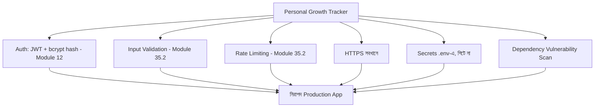

# ৩৬.২২ Security Best Practices for Fullstack Application

আমাদের Personal Growth Tracker যাত্রার শেষ ধাপে পৌঁছেছি — পরিকল্পনা, AI-সহায়ক ডেভেলপমেন্ট, বিল্ড, deploy, monitoring, performance, error handling — সব হয়ে গেছে। এই শেষ লেসনে আমরা পুরো অ্যাপ্লিকেশনটার উপর একটা নিরাপত্তার চাদর বিছিয়ে দেবো, যাতে এই এতদিনের পরিশ্রম কোনো সহজ আক্রমণে ভেঙে না পড়ে।

নিরাপত্তাকে ভাবা যায় একটা বাড়ির শেষ ধাপের মতো — দেয়াল-ছাদ (ফিচার) তৈরির পর তালা, গ্রিল, সিকিউরিটি ক্যামেরা বসানো। এগুলো বাড়ির "মূল কাজ" মনে না হলেও, এগুলো ছাড়া বাড়িতে থাকা নিরাপদ না।



পাসওয়ার্ড কখনো plain text-এ সংরক্ষণ করা উচিত না — bcrypt দিয়ে hash করা, যেটা Module ১২-তে শেখা হয়েছিলো:

```javascript
const bcrypt = require('bcrypt');

async function registerUser(email, password) {
  const passwordHash = await bcrypt.hash(password, 12);
  return User.create({ email, passwordHash });
}

async function verifyPassword(plain, hash) {
  return bcrypt.compare(plain, hash);
}
```

Module ৩৫.২-এ শেখা middleware guard এখানে পূর্ণাঙ্গভাবে প্রয়োগ হয় — প্রতিটা sensitive route rate limiting আর input validation দিয়ে ঘেরা:

```javascript
const helmet = require('helmet');
app.use(helmet()); // সাধারণ HTTP security header বসিয়ে দেয় (XSS, clickjacking সুরক্ষা)

app.use('/api/auth/login', rateLimit({ windowMs: 15 * 60 * 1000, max: 5 })); // ব্রুটফোর্স আক্রমণ ঠেকাতে
```

আরেকটা গুরুত্বপূর্ণ অভ্যাস — third-party package-এর মধ্যে পরিচিত নিরাপত্তা দুর্বলতা আছে কিনা নিয়মিত পরীক্ষা করা:

```bash
npm audit
npm audit fix
```

আর CI/CD পাইপলাইনে (Module ৩৬.১৮) এই audit-টা একটা automatic ধাপ হিসেবে যোগ করা যায়, যাতে দুর্বল dependency নিয়ে কেউ ভুলবশত deploy না করে ফেলে।

সবশেষে, `.env` ফাইল কখনো গিট রিপোজিটরিতে কমিট না হওয়া নিশ্চিত করা (`.gitignore`-এ থাকা), আর production-এ সবসময় HTTPS ব্যবহার করা, যাতে client আর server-এর মধ্যে ডেটা কেউ মাঝপথে পড়ে ফেলতে না পারে।

এখানেই আমাদের Personal Growth Tracker-এর যাত্রা সম্পূর্ণ হলো — পরিকল্পনা থেকে শুরু করে একটা নিরাপদ, পর্যবেক্ষিত, স্বয়ংক্রিয়ভাবে deploy হওয়া production অ্যাপ্লিকেশন পর্যন্ত। এই বাইশটা লেসনে আমরা যে প্যাটার্নটা অনুশীলন করলাম — পরিকল্পনা, বিল্ড, পর্যবেক্ষণ, উন্নতি, সুরক্ষা — এটাই যেকোনো বাস্তব সফটওয়্যার প্রজেক্টের জীবনচক্র। পরের মডিউলে আমরা এই কোডকে টিমের সাথে ভাগাভাগি করে কাজ করার হাতিয়ার — Git আর GitHub-এর গভীরে প্রবেশ করবো।
