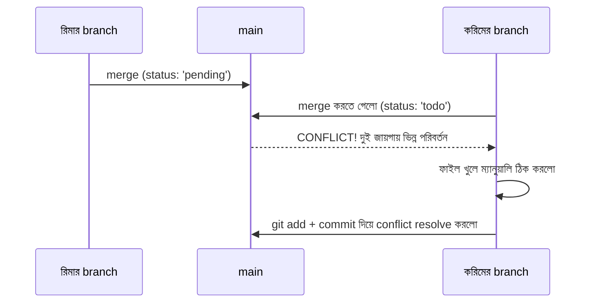

# ৩৭.৪ Resolving Merge Conflicts

আগের লেসনের শেষে আমরা একটা প্রশ্ন রেখেছিলাম — দুইজন ডেভেলপার একই লাইনে ভিন্ন পরিবর্তন করলে কী হয়? ধরো TaskFlow API-তে দুইজন ডেভেলপার, রিমা আর করিম, একই সময়ে `task.js` ফাইলের `status` ফিল্ডের ডিফল্ট মান বদলাতে গিয়েছে — রিমা `'pending'` করেছে, করিম `'todo'` করেছে। যখন করিম রিমার branch merge করতে যায়, Git থেমে যায় আর বলে "আমি বুঝতে পারছি না কোনটা রাখবো, তুমি সিদ্ধান্ত নাও।"

এটা ভাবা যায় দুইজন সম্পাদকের মতো, যারা একই বাক্য একইসাথে ভিন্নভাবে সংশোধন করেছে — একজন তৃতীয় ব্যক্তিকে (তোমাকে) এসে ঠিক করতে হবে কোন সংশোধনটা টিকবে, নাকি দুটোর মিশ্রণ কিছু হবে।



Conflict হলে ফাইলে Git নিজে থেকে বিশেষ চিহ্ন বসিয়ে দেয়:

```javascript
<<<<<<< HEAD
status: 'todo',
=======
status: 'pending',
>>>>>>> feature-rima-status
```

`<<<<<<< HEAD` থেকে `=======` পর্যন্ত তোমার বর্তমান branch-এর ভার্সন, আর `=======` থেকে `>>>>>>>` পর্যন্ত অন্য branch-এর ভার্সন। ডেভেলপারকে ম্যানুয়ালি ঠিক করতে হবে কোনটা রাখবে, বা দুটো মিলিয়ে একটা তৃতীয় সমাধান লিখবে:

```javascript
status: 'pending', // টিমে আলোচনা করে ঠিক করা হলো
```

চিহ্নগুলো মুছে ফেলার পর, স্বাভাবিক প্রক্রিয়ায় resolve সম্পন্ন করা হয়:

```bash
git add task.js
git commit -m "resolve conflict: status ডিফল্ট মান 'pending' রাখা হলো"
```

Conflict এড়ানোর সবচেয়ে ভালো উপায় হলো ঘন ঘন ছোট commit করা আর নিয়মিত `main`-এর পরিবর্তন নিজের branch-এ নিয়ে আসা (পরের লেসনে আমরা remote থেকে পরিবর্তন আনার প্রক্রিয়া দেখবো), যাতে দুইজনের কাজ বেশিদিন আলাদা হয়ে না থাকে।

এতক্ষণ আমরা একটা মাত্র কম্পিউটারে (local repository) branch আর merge নিয়ে কাজ করেছি। কিন্তু বাস্তব টিমওয়ার্কে কোড শেয়ার করতে হয় একটা কেন্দ্রীয় জায়গায় — পরের লেসনে আমরা remote repository-র জগতে প্রবেশ করবো।
