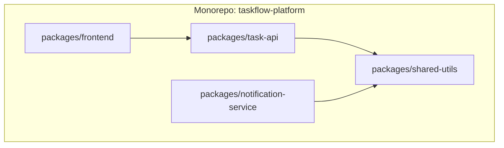

# ৩৭.১৭ Introduction to Monorepos

আগের লেসনে আমরা দেখলাম submodule দিয়ে একাধিক রিপোজিটরি একসাথে যুক্ত রাখা কতটা জটিল হতে পারে। ধরো TaskFlow API-এর টিম ঠিক করলো — এই জটিলতা এড়াতে, `taskflow-api`, `shared-utils`, আর `notification-service` — তিনটাকেই একটাই রিপোজিটরিতে রাখবে। এই পদ্ধতিকে বলে **monorepo** (mono = একক, repo = রিপোজিটরি)।

এটা ভাবা যায় একটা পরিবারের সব সদস্যকে একই বাড়িতে রাখার মতো, প্রত্যেকের আলাদা বাড়ির (আলাদা repository) বদলে। একই বাড়িতে থাকলে জিনিসপত্র শেয়ার করা সহজ (কমন কোড ব্যবহার), সবাই একসাথে যোগাযোগ করা সহজ, কিন্তু বাড়িটাও বড় আর জটিল হয়ে যায়।



Monorepo-তে ফোল্ডার স্ট্রাকচার এরকম হতে পারে:

```
taskflow-platform/
├── packages/
│   ├── task-api/
│   ├── notification-service/
│   ├── shared-utils/
│   └── frontend/
├── package.json          # workspace configuration
└── turbo.json             # (ঐচ্ছিক) build orchestration টুল
```

`shared-utils`-এর কোনো পরিবর্তন এখন একই commit-এ `task-api`-র সাথে সাথে দেখা যায় আর টেস্ট করা যায় — Module ৩৭.১৬-এর মতো আলাদা করে submodule আপডেট করার প্রয়োজন নেই। npm/yarn workspaces বা Nx/Turborepo-এর মতো টুল ব্যবহার করে একটা কমান্ডে সব প্যাকেজ বিল্ড/টেস্ট করা যায়:

```bash
npm install          # সব প্যাকেজের dependency একসাথে ইনস্টল
npm run test --workspaces   # সব প্যাকেজে টেস্ট চালানো
```

Monorepo-র সুবিধা — কোড শেয়ারিং সহজ, atomic commit (একই commit-এ একাধিক প্যাকেজ বদলানো যায়), একক CI/CD পাইপলাইন। অসুবিধা — রিপোজিটরির আকার বড় হয়ে যায়, আর সব টিমের জন্য পুরো কোডবেসের অ্যাক্সেস দরকার হয়, যেটা বড় organization-এ নিরাপত্তা প্রশ্ন তুলতে পারে।

Monorepo বনাম আলাদা রিপোজিটরি (polyrepo)-র সিদ্ধান্ত টিমের আকার আর কোড শেয়ারিং-এর প্রয়োজনের উপর নির্ভর করে। এখন প্রজেক্টের গঠন নিয়ে আলোচনা শেষে, পরের লেসনে আমরা দেখবো কীভাবে Git নিজে থেকে নির্দিষ্ট মুহূর্তে স্বয়ংক্রিয় কাজ চালাতে পারে — Git hooks।
