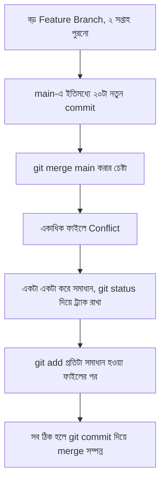

# ৩৭.২৩ Handling Complex Merge Conflicts

Module ৩৭.৪-এ আমরা একটা সহজ merge conflict দেখেছিলাম — একই লাইনে দুইজনের ভিন্ন পরিবর্তন। কিন্তু বাস্তব প্রজেক্টে conflict অনেক বেশি জটিল হতে পারে — একাধিক ফাইলে, structural পরিবর্তনে (কেউ একটা ফাইল rename করেছে, আরেকজন সেই একই ফাইলে edit করেছে), অথবা অনেকগুলো commit জমে যাওয়ার পর। এই লেসনে আমরা এই জটিল পরিস্থিতি সামলানোর কৌশল দেখবো।

এটা ভাবা যায় দুইজন লেখক একই বইয়ের একাধিক অধ্যায় নিয়ে আলাদাভাবে অনেকদিন কাজ করার পর একত্রিত করার চেষ্টা করছে — যত বেশি সময় আলাদা থাকে, তত বেশি জায়গায় সংঘর্ষ হওয়ার সম্ভাবনা।



জটিল conflict সামলানোর কার্যকর প্রক্রিয়া:

```bash
git status   # কোন কোন ফাইলে conflict আছে দেখা
# both modified: models/task.js
# both modified: routes/tasks.js
# added by us: utils/validator.js
```

`git status` প্রতিটা conflicted ফাইলের ধরন দেখায় — শুধু "উভয়ে পরিবর্তন করেছে" না, "একজন যোগ করেছে অন্যজন মুছে ফেলেছে" ধরনের জটিলতাও থাকতে পারে। প্রতিটা ফাইল আলাদাভাবে পরীক্ষা করে ঠিক করতে হয়:

```bash
git diff models/task.js       # conflict মার্কারসহ দেখা
# ম্যানুয়ালি ঠিক করার পর
git add models/task.js
```

যদি conflict এতটাই জটিল মনে হয় যে বুঝতে কষ্ট হচ্ছে, একটা কার্যকর কৌশল হলো Module ৩৭.৮-এর rebase ব্যবহার করে, ছোট ছোট commit ধরে ধরে conflict সমাধান করা, একবারে বিশাল merge-এর বদলে:

```bash
git rebase main
# প্রতিটা commit replay হওয়ার সময় আলাদা করে conflict আসবে, ছোট আকারে
# প্রতিটা ধাপে:
git add <resolved-files>
git rebase --continue
```

যদি পুরো প্রক্রিয়া খুব জটিল হয়ে যায় আর মনে হয় ভুল হয়ে যাচ্ছে, নিরাপদে থামিয়ে দেয়া যায়:

```bash
git merge --abort     # merge বাতিল, আগের অবস্থায় ফিরে যাওয়া
git rebase --abort    # rebase বাতিল
```

জটিল conflict এড়ানোর সবচেয়ে ভালো উপায় প্রতিরোধ — Module ৩৭.১১-এর GitHub Flow-এর মতো ছোট, স্বল্পস্থায়ী branch ব্যবহার করা, আর নিয়মিত `main`-এর পরিবর্তন নিজের branch-এ নিয়ে আসা, যাতে দুই সপ্তাহ ধরে branch আলাদা হয়ে থাকার পরিস্থিতিই তৈরি না হয়।

এখন আমরা Git-এর প্রায় সব গুরুত্বপূর্ণ কৌশল জানি — branch থেকে জটিল conflict পর্যন্ত। এই মডিউলের শেষ লেসনে আমরা দেখবো কীভাবে এই সব একসাথে করে, Git থেকে সরাসরি একটা প্রজেক্ট deploy করা যায়।
