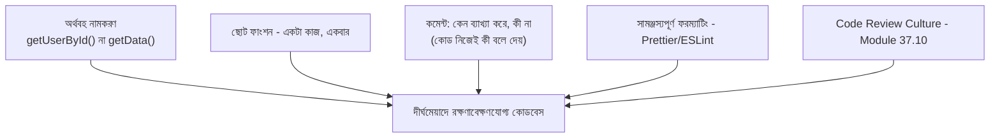

# ৩৮.৫ Clean Code and Code Smell Principles

আগের লেসনে আমরা বড় স্কেলের বিতরণকৃত সিস্টেমের ট্রেড-অফ দেখলাম। এই মডিউলের শেষ লেসনে আমরা আবার ফিরে আসছি সবচেয়ে ছোট, দৈনন্দিন স্কেলে — প্রতিদিনের কোড লেখার অভ্যাসে। Module ৩৮.৩-এ আমরা নির্দিষ্ট structural সমস্যা (God Object, Long Method) দেখেছিলাম; এই লেসনে আমরা একটু ভিন্ন কোণ থেকে দেখবো — নামকরণ, ফাংশনের আকার, কমেন্ট, আর টিমের কোডিং কালচার।

Clean code-কে ভাবা যায় একটা পরিষ্কার, গোছানো রান্নাঘরের মতো — প্রতিটা জিনিস তার প্রত্যাশিত জায়গায় আছে, লেবেল স্পষ্ট, আর যে কেউ ঢুকলেই বুঝে যায় কোথায় কী পাওয়া যাবে। অগোছালো রান্নাঘরেও রান্না হয়, কিন্তু প্রতিটা কাজে বাড়তি সময় আর ভুলের ঝুঁকি লাগে।



নামকরণের একটা উদাহরণ — খারাপ বনাম ভালো:

```javascript
// খারাপ: অস্পষ্ট নাম, কী করছে বোঝা যাচ্ছে না
function calc(t, d) {
  return t.filter(x => x.d < d).length;
}

// ভালো: নাম নিজেই ব্যাখ্যা করছে
function countOverdueTasks(tasks, currentDate) {
  return tasks.filter(task => task.deadline < currentDate).length;
}
```

দ্বিতীয় ভার্সনে কোনো কমেন্টের দরকার নেই — কোড নিজেই তার উদ্দেশ্য বলে দিচ্ছে। এটাই clean code-এর একটা মূল দর্শন: "কমেন্ট দিয়ে খারাপ কোড ব্যাখ্যা করার বদলে, কোডকেই এত স্পষ্ট করো যে কমেন্টের প্রয়োজন কমে যায়।" কমেন্ট তখনই দরকার যখন **কেন** একটা সিদ্ধান্ত নেয়া হয়েছে সেটা কোড নিজে বলতে পারে না:

```javascript
// bcrypt-এর cost factor 12 রাখা হয়েছে, কারণ আমাদের লোড টেস্টে
// (Module 31.3) দেখা গেছে এটা নিরাপত্তা আর response time-এর ভালো ভারসাম্য দেয়
const SALT_ROUNDS = 12;
```

টিম পর্যায়ে clean code বজায় রাখার একটা গুরুত্বপূর্ণ হাতিয়ার হলো automated linting — ESLint আর Prettier-এর মতো টুল, যেগুলো Module ৩৭.১৮-এ শেখা Git hooks-এর সাথে যুক্ত করে প্রতিটা commit-এ স্বয়ংক্রিয়ভাবে ফরম্যাট আর স্টাইল যাচাই করা যায়, যাতে "ভালো কোড" শুধু ব্যক্তিগত ইচ্ছার উপর নির্ভর না করে, সিস্টেমের অংশ হয়ে যায়।

এতদিন আমরা কোড আর ডিজাইনের ভেতরের চিন্তাভাবনা নিয়ে কথা বলেছি — OOP থেকে clean code পর্যন্ত। এই মডিউলের সবগুলো নীতি একসাথে একটা লক্ষ্যে কাজ করে: কোড যেন শুধু "কাজ করে" তা না, বরং ছয় মাস পরে অন্য কেউ (বা তুমি নিজেই) সহজে বুঝে পরিবর্তন করতে পারে। পরের মডিউলে আমরা একটা ভিন্ন ভাষা আর ফ্রেমওয়ার্কের দিকে যাবো — Python-এর FastAPI, যেখানে আমরা এই একই নীতিগুলো একটা নতুন প্রেক্ষাপটে প্রয়োগ করে দেখবো।
