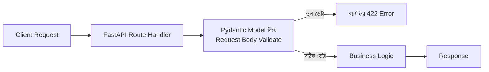

# ৩৯.১ REST API with FastAPI

Module ৪-এ আমরা প্রথমবার দেখেছিলাম FastAPI আর Express.js কতটা মিল — দুটোই route define করে, request/response সামলায়, middleware ব্যবহার করে। এখন এতদিনের Node.js অভিজ্ঞতার পর, আমরা সেই মিলটাকে সত্যিকারের Python কোড লিখে যাচাই করবো। এই মডিউলে আমরা Python-এর জনপ্রিয় ব্যাকএন্ড ফ্রেমওয়ার্ক FastAPI দিয়ে কয়েকটা বাস্তব প্রজেক্ট বানাবো।

FastAPI-কে ভাবা যায় Express-এর একজন "টাইপ-সচেতন" আত্মীয় হিসেবে — Express-এ আমরা যেভাবে ইচ্ছামতো যেকোনো ডেটা req.body-তে পাঠাতে পারতাম, FastAPI শুরু থেকেই জোর দেয় প্রতিটা ডেটার একটা নির্দিষ্ট গঠন (schema) থাকার উপর, Pydantic মডেল ব্যবহার করে।



একটা সাধারণ টাস্ক ম্যানেজমেন্ট API, TaskFlow-এর ধারণার সাথে সামঞ্জস্যপূর্ণ, কিন্তু এবার Python-এ:

```python
from fastapi import FastAPI, HTTPException
from pydantic import BaseModel
from typing import Optional

app = FastAPI()

class Task(BaseModel):
    title: str
    priority: str = "medium"
    completed: bool = False

tasks_db = {}
next_id = 1

@app.post("/tasks", status_code=201)
def create_task(task: Task):
    global next_id
    task_id = next_id
    tasks_db[task_id] = task
    next_id += 1
    return {"id": task_id, **task.dict()}

@app.get("/tasks/{task_id}")
def get_task(task_id: int):
    if task_id not in tasks_db:
        raise HTTPException(status_code=404, detail="Task পাওয়া যায়নি")
    return tasks_db[task_id]

@app.get("/tasks")
def list_tasks():
    return [{"id": k, **v.dict()} for k, v in tasks_db.items()]
```

লক্ষ্য করো `class Task(BaseModel)` অংশটা — এখানে `title: str` লেখা মানে FastAPI স্বয়ংক্রিয়ভাবে নিশ্চিত করবে `title` একটা string, আর না হলে ব্যবহারকারীকে একটা স্পষ্ট 422 error দেখাবে, আমাদের কোনো ম্যানুয়াল validation কোড ছাড়াই — যেটা আমরা Express-এ `express-validator` (Module ৩৫.২) দিয়ে আলাদা করে করতাম।

আরেকটা চমৎকার ফিচার — FastAPI স্বয়ংক্রিয়ভাবে interactive API ডকুমেন্টেশন তৈরি করে (`/docs` route-এ), যেটা Module ৩৬.১২-এ AI দিয়ে ম্যানুয়ালি Swagger বানানোর কাজটাই এখানে ফ্রেমওয়ার্ক নিজে থেকেই করে দেয়।

```bash
uvicorn main:app --reload   # Development সার্ভার চালু, Express-এর nodemon-এর মতো
```

এখন আমাদের একটা কাজ করা REST API আছে Python-এ। পরের লেসনে আমরা এই একই ভিত্তির উপর দাঁড়িয়ে, একটা AI-চালিত ফিচার যোগ করবো — OpenAI ব্যবহার করে একটা চ্যাটবট এন্ডপয়েন্ট।
