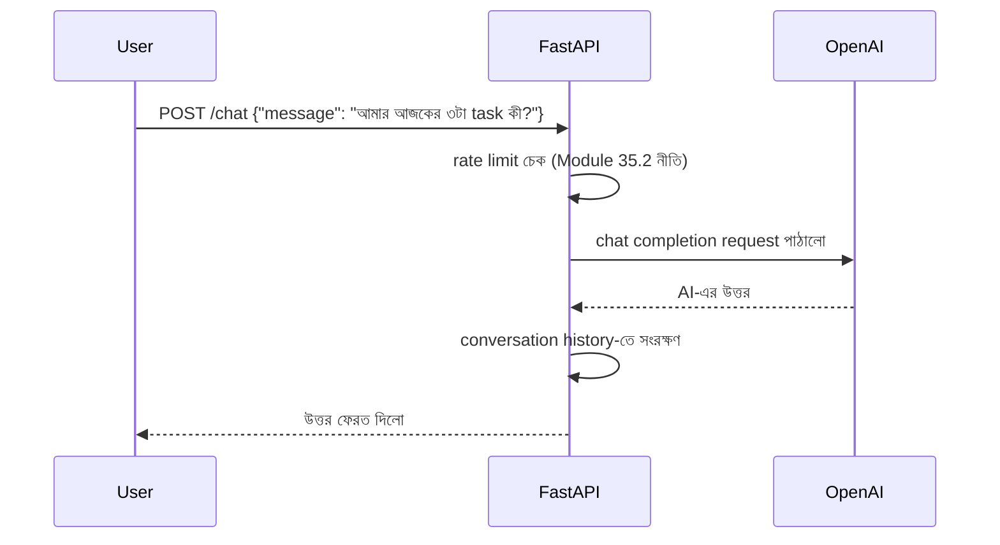

# ৩৯.২ AI Chatbot with OpenAI + FastAPI

আগের লেসনে আমরা একটা সাধারণ REST API বানালাম। এখন Module ৩৬.১৩-এ শেখা "LLM API সরাসরি কল করা" ধারণাটা Python-এ প্রয়োগ করবো — একটা AI চ্যাটবট এন্ডপয়েন্ট বানিয়ে, যেটা FastAPI-এর মাধ্যমে OpenAI-এর API-কে "মোড়ক" (wrap) দিয়ে ব্যবহারকারীর কাছে উপস্থাপন করবে।

এটা ভাবা যায় একটা দোভাষীর মতো — ব্যবহারকারী আমাদের API-কে সাধারণ ভাষায় প্রশ্ন করে, আমাদের সার্ভার সেটা OpenAI-এর কাছে পাঠায়, উত্তর নিয়ে আসে, আর ব্যবহারকারীকে ফেরত দেয় — মাঝখানে আমরা নিজেদের ব্যবসায়িক নিয়ম (rate limit, history সংরক্ষণ) যোগ করতে পারি।



```python
from fastapi import FastAPI, HTTPException
from pydantic import BaseModel
from openai import OpenAI

app = FastAPI()
client = OpenAI()  # OPENAI_API_KEY environment variable থেকে নেয়া হয়

class ChatMessage(BaseModel):
    message: str
    conversation_id: str

conversations = {}  # সহজ in-memory history, বাস্তবে Redis/DB ব্যবহার হবে

@app.post("/chat")
def chat(payload: ChatMessage):
    history = conversations.get(payload.conversation_id, [])
    history.append({"role": "user", "content": payload.message})

    try:
        response = client.chat.completions.create(
            model="gpt-4o-mini",
            messages=[
                {"role": "system", "content": "তুমি একজন সহায়ক টাস্ক ম্যানেজমেন্ট সহকারী।"},
                *history,
            ],
        )
    except Exception as e:
        raise HTTPException(status_code=502, detail=f"AI সার্ভিস ব্যর্থ: {str(e)}")

    reply = response.choices[0].message.content
    history.append({"role": "assistant", "content": reply})
    conversations[payload.conversation_id] = history

    return {"reply": reply}
```

লক্ষ্য করো `try-except`-এর ব্যবহার — Module ৩৬.২১-এ শেখা error handling নীতি এখানেও প্রযোজ্য: বহিরাগত সার্ভিস (OpenAI) ব্যর্থ হতে পারে, আর সেটা একটা স্পষ্ট, নিয়ন্ত্রিত error-এ রূপান্তর করা উচিত, পুরো সার্ভার ক্র্যাশ করার বদলে।

`conversation_id` দিয়ে প্রতিটা ব্যবহারকারীর আলাদা কথোপকথনের ইতিহাস ধরে রাখা হচ্ছে, যাতে AI আগের প্রসঙ্গ মনে রাখতে পারে — এটা ঠিক Module ৩৬.১৩-এ শেখা "প্রেক্ষাপট দেয়া" নীতিরই একটা প্রয়োগ, তবে conversation-লেভেলে।

একটা গুরুত্বপূর্ণ production বিবেচনা — Module ৩৫.২-এ শেখা rate limiting এখানে অত্যন্ত গুরুত্বপূর্ণ, কারণ প্রতিটা OpenAI কল টাকা খরচ করে, তাই কেউ অতিরিক্ত request পাঠিয়ে অপ্রত্যাশিত বিল তৈরি করতে না পারে।

এখন আমরা একটা কথোপকথনমূলক AI ফিচার বানালাম। পরের লেসনে আমরা AI-এর একটা সম্পূর্ণ ভিন্ন ব্যবহার দেখবো — টেক্সট না, বরং ভিডিও ফাইল প্রসেস করার একটা প্র্যাকটিক্যাল অটোমেশন টুল।
