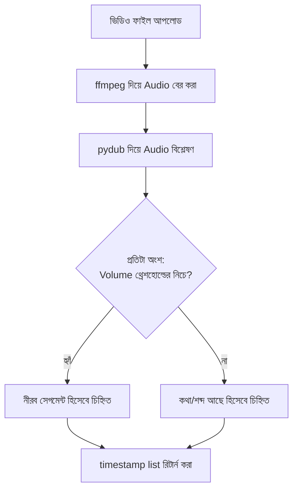

# ৩৯.৩ AI Video Silence Detector

আগের দুই লেসনে আমরা টেক্সট-ভিত্তিক API বানিয়েছি। এই লেসনে আমরা সম্পূর্ণ ভিন্ন ধরনের একটা প্র্যাকটিক্যাল প্রজেক্ট বানাবো — একটা ভিডিও ফাইলে কোথায় কোথায় নীরবতা (silence) আছে সেটা স্বয়ংক্রিয়ভাবে খুঁজে বের করার একটা সার্ভিস। এটা ভিডিও এডিটরদের জন্য অত্যন্ত কাজের একটা টুল, কারণ ম্যানুয়ালি পুরো ভিডিও দেখে নীরব অংশ খুঁজে কেটে ফেলা সময়সাপেক্ষ।

Python এখানে বিশেষভাবে উপযোগী, কারণ এর সমৃদ্ধ audio/video processing লাইব্রেরি ইকোসিস্টেম আছে (`pydub`, `ffmpeg`) — এটা এমন একটা কাজ যেখানে Python-এর ডেটা/মিডিয়া প্রসেসিং শক্তি Node.js-এর চেয়ে সুবিধাজনক।



```python
from fastapi import FastAPI, UploadFile, File
from pydub import AudioSegment
from pydub.silence import detect_silence
import subprocess
import tempfile
import os

app = FastAPI()

@app.post("/detect-silence")
async def detect_silence_endpoint(video: UploadFile = File(...)):
    with tempfile.NamedTemporaryFile(suffix=".mp4", delete=False) as video_temp:
        video_temp.write(await video.read())
        video_path = video_temp.name

    audio_path = video_path.replace(".mp4", ".wav")
    # ffmpeg দিয়ে ভিডিও থেকে অডিও বের করা
    subprocess.run(["ffmpeg", "-i", video_path, "-y", audio_path], check=True)

    audio = AudioSegment.from_wav(audio_path)
    silent_ranges = detect_silence(
        audio,
        min_silence_len=1000,   # কমপক্ষে ১ সেকেন্ড নীরব হলে গণনা হবে
        silence_thresh=-40,     # -40 dB-এর নিচে "নীরব" ধরা হবে
    )

    os.remove(video_path)
    os.remove(audio_path)

    return {
        "silent_segments": [
            {"start_ms": start, "end_ms": end} for start, end in silent_ranges
        ]
    }
```

এই এন্ডপয়েন্ট একটা ভিডিও ফাইল নেয়, অডিও বের করে, আর নীরব অংশের timestamp তালিকা ফেরত দেয়। ফ্রন্টএন্ড বা একটা ভিডিও এডিটিং টুল এই তালিকা ব্যবহার করে স্বয়ংক্রিয়ভাবে সেই অংশগুলো কেটে দিতে পারে।

লক্ষ্য করো `tempfile` ব্যবহার — বড় ফাইল প্রসেস করার সময়, Module ৩২.৫-এ শেখা storage ব্যবস্থাপনার মতোই, অস্থায়ী ফাইল কাজ শেষে পরিষ্কার করে ফেলা জরুরি, নাহলে ডিস্ক ভরে যাবে। এই ধরনের ভারী প্রসেসিং কাজ, Module ৩৫.১-এ শেখা queueing নীতি অনুযায়ী, সরাসরি request-response চক্রে না রেখে একটা background job হিসেবে চালানো ভালো অভ্যাস, বিশেষ করে বড় ভিডিও ফাইলের ক্ষেত্রে।

ভিডিও প্রসেসিং থেকে এবার আমরা আরেকটা কনটেন্ট-সংক্রান্ত AI টুলের দিকে যাবো — পরের লেসনে YouTube ভিডিওর জন্য AI দিয়ে ট্যাগ আর টাইটেল জেনারেট করা।
