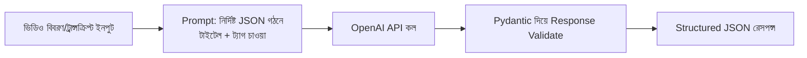

# ৩৯.৪ YouTube Tag & Title Generator

আগের লেসনে আমরা ভিডিওর অডিও প্রসেস করেছি। এই লেসনে আমরা ভিডিও কনটেন্ট প্রকাশের আরেকটা বাস্তব সমস্যা সমাধান করবো — একটা ভিডিওর জন্য আকর্ষণীয়, SEO-বান্ধব টাইটেল আর ট্যাগ বাছাই করা, যেটা প্রায়ই কনটেন্ট ক্রিয়েটরদের জন্য সময়সাপেক্ষ আর অনুমান-নির্ভর একটা কাজ। আমরা Module ৩৯.২-এর মতোই একটা LLM-ভিত্তিক এন্ডপয়েন্ট বানাবো, কিন্তু এবার output-এর গঠন আরও কঠোরভাবে নিয়ন্ত্রিত।

ভাবো একজন সম্পাদক, যাকে একটা প্রবন্ধের সারাংশ দিলে সে সাথে সাথে কয়েকটা আকর্ষণীয় শিরোনাম প্রস্তাব করে। আমরা এখানে সেই কাজটা LLM-কে দিয়ে করাচ্ছি, ভিডিওর একটা সংক্ষিপ্ত বিবরণ ইনপুট হিসেবে দিয়ে।



Pydantic-এর একটা শক্তিশালী ব্যবহার এখানে — শুধু ইনপুট validate না, আউটপুটের গঠনও নিশ্চিত করা:

```python
from fastapi import FastAPI
from pydantic import BaseModel
from typing import List
from openai import OpenAI
import json

app = FastAPI()
client = OpenAI()

class VideoInfo(BaseModel):
    description: str
    category: str = "technology"

class TitleTagSuggestion(BaseModel):
    titles: List[str]
    tags: List[str]

@app.post("/generate-metadata", response_model=TitleTagSuggestion)
def generate_metadata(video: VideoInfo):
    prompt = f"""নিচের ভিডিও বিবরণের জন্য ৫টা আকর্ষণীয় YouTube টাইটেল
এবং ১০টা SEO-বান্ধব ট্যাগ প্রস্তাব করো, শুধু নিচের JSON গঠনে উত্তর দাও:
{{"titles": ["...", ...], "tags": ["...", ...]}}

ক্যাটাগরি: {video.category}
বিবরণ: {video.description}
"""
    response = client.chat.completions.create(
        model="gpt-4o-mini",
        messages=[{"role": "user", "content": prompt}],
        response_format={"type": "json_object"},
    )

    result = json.loads(response.choices[0].message.content)
    return TitleTagSuggestion(**result)
```

লক্ষ্য করো `response_model=TitleTagSuggestion` — FastAPI নিশ্চিত করে যে আমাদের API সবসময় এই নির্দিষ্ট গঠনেই response দেয়, ভুলবশত ভিন্ন কিছু ফেরত দিলে সেটা ধরা পড়বে। এই "structured output" প্যাটার্ন Module ৩৬.৮-এ শেখা AI-assisted development-এর একটা গুরুত্বপূর্ণ কৌশল — LLM-কে মুক্ত টেক্সট না, নির্দিষ্ট গঠনে উত্তর দিতে বাধ্য করা, যাতে সেটা সরাসরি প্রোগ্রামে ব্যবহার করা যায়, মানুষ পড়ে বুঝে টাইপ করার দরকার না পড়ে।

এই ধরনের ছোট, নির্দিষ্ট-উদ্দেশ্যের AI মাইক্রো-সার্ভিস (silence detector, metadata generator) — প্রতিটা একটা নির্দিষ্ট সমস্যা সমাধান করে, আর সহজেই আলাদা আলাদাভাবে deploy আর scale করা যায়। এতদিন আমরা এই Python সার্ভিসগুলো আলাদাভাবে দেখেছি — পরের ও শেষ লেসনে আমরা দেখবো কীভাবে এগুলোকে আমাদের মূল Node.js membership/backend অ্যাপ্লিকেশনের সাথে একসাথে কাজ করাতে হয়।
