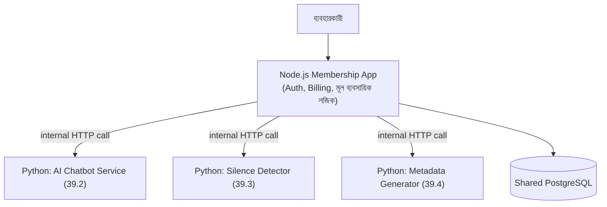

# ৩৯.৫ Connecting Python Products with Node.js Membership App

এই মডিউলে আমরা চারটা স্বতন্ত্র Python/FastAPI সার্ভিস বানিয়েছি — একটা REST API, একটা চ্যাটবট, একটা ভিডিও প্রসেসিং টুল, আর একটা মেটাডেটা জেনারেটর। কিন্তু বাস্তবে, আমাদের মূল প্রজেক্ট (যেমন Module ৩৬-এর Personal Growth Tracker বা একটা membership-ভিত্তিক অ্যাপ) সাধারণত Node.js/Express-এ লেখা। এই শেষ লেসনে আমরা দেখবো কীভাবে এই দুই জগৎ — Node.js আর Python — একসাথে কাজ করে একটা সম্পূর্ণ সিস্টেম গঠন করে।

Module ৪.৮-এ আমরা প্রথম দেখেছিলাম FastAPI আর Express কতটা কাঠামোগতভাবে মিল। এখন আমরা সেই মিলটাকে ব্যবহারিক সুবিধায় রূপান্তর করবো — দুটো ভিন্ন ভাষার সার্ভিসকে একটাই সিস্টেমের অংশ বানিয়ে, প্রতিটাকে তার সবচেয়ে শক্তিশালী জায়গায় ব্যবহার করে (Node.js সাধারণ ব্যবসায়িক API-এর জন্য, Python AI/ডেটা-ভারী কাজের জন্য)।



Node.js membership app থেকে একটা Python সার্ভিস কল করা, ঠিক যেভাবে Module ৪.৭-এ আমরা "backend as client" ধারণা শিখেছিলাম:

```javascript
// Node.js membership app-এর একটা route
const axios = require('axios');

app.post('/api/videos/:id/analyze', authMiddleware, async (req, res, next) => {
  try {
    // membership যাচাই - এটা Node.js-এর দায়িত্ব
    if (req.user.plan === 'free') {
      return res.status(403).json({ error: 'এই ফিচার শুধু প্রিমিয়াম সদস্যদের জন্য' });
    }

    // ভারী AI/ভিডিও কাজ Python সার্ভিসে পাঠানো
    const response = await axios.post('http://python-service:8000/detect-silence', {
      video_url: req.body.videoUrl,
    });

    res.json(response.data);
  } catch (err) {
    next(err); // Module 36.21-এ শেখা centralized error handling
  }
});
```

লক্ষ্য করো দায়িত্বের স্পষ্ট বিভাজন — membership/plan যাচাই, authentication, billing — এগুলো Node.js app-এর দায়িত্ব থেকে যাচ্ছে, কারণ এটাই মূল ব্যবসায়িক সিস্টেম। Python সার্ভিস শুধু তার নির্দিষ্ট, ভারী কাজটা (AI/ভিডিও প্রসেসিং) করছে, membership নিয়ে কিছু জানারই দরকার নেই। এই বিভাজন Module ৩৮.২-এ শেখা Single Responsibility নীতির-ই একটা সিস্টেম-লেভেল প্রয়োগ।

উভয় সার্ভিস একসাথে চালানোর জন্য Docker Compose ব্যবহার করা যায়, যাতে ডেভেলপমেন্ট পরিবেশে দুটোই সহজে একসাথে চলে:

```yaml
services:
  node-app:
    build: ./membership-app
    ports: ["3000:3000"]
  python-service:
    build: ./ai-services
    ports: ["8000:8000"]
```

এই আর্কিটেকচার প্যাটার্ন — একাধিক ভাষা/ফ্রেমওয়ার্কের সার্ভিস, প্রতিটা তার নিজের শক্তিশালী দিকে কাজ করছে, একটা কমন নেটওয়ার্কে যোগাযোগ করছে — আসলে একটা বৃহত্তর স্থাপত্য দর্শনের অংশ, যাকে বলে **microservices**। পরের ও শেষ মডিউলে আমরা ঠিক এই ধরনের স্থাপত্য প্যাটার্নগুলো নিয়ে বিস্তারিত আলোচনা করবো — monolith থেকে microservices, event-driven architecture, আর আরও অনেক কিছু।
