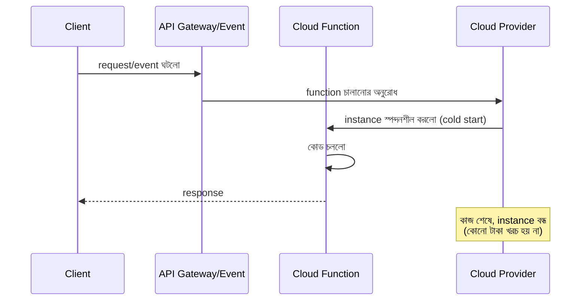

# ৪০.৩ Serverless Architecture (Function-as-a-Service, FaaS)

আগের দুই লেসনে আমরা monolith আর microservices দেখলাম — দুটোই ধরে নেয় সার্ভার ২৪ ঘণ্টা চালু থাকবে, request-এর অপেক্ষায় "শুনছে" (listening, Module ২.৬-এর ভাষায়)। কিন্তু ধরো Module ৩৯.৩-এর ভিডিও silence-detector সার্ভিসটা দিনে মাত্র কয়েকবার ব্যবহৃত হয় — তাহলে বাকি সময় সার্ভার চালু রেখে টাকা খরচ করার কী দরকার? এই প্রশ্নের উত্তর দেয় **serverless architecture**।

"Serverless" নামটা কিছুটা ভুল বোঝায় — সার্ভার আসলে থাকে, কিন্তু তুমি সেটা পরিচালনা করো না। এটা ভাবা যায় ট্যাক্সি ভাড়া করার মতো, নিজের গাড়ি কেনার বদলে — তোমার যখন প্রয়োজন, একটা গাড়ি আসে, কাজ শেষে চলে যায়, আর তুমি শুধু ব্যবহারের সময়টুকুর জন্য টাকা দাও। প্ল্যাটফর্ম (AWS Lambda, Google Cloud Functions) সার্ভার পরিচালনা, scaling, সব নিজে সামলায়।



Module ৩৯.৩-এর silence detector একটা AWS Lambda function হিসেবে:

```python
def lambda_handler(event, context):
    video_url = event['video_url']
    # ffmpeg/pydub দিয়ে একই প্রসেসিং লজিক
    silent_ranges = process_video(video_url)
    return {
        'statusCode': 200,
        'body': json.dumps({'silent_segments': silent_ranges})
    }
```

এই function-টা শুধুমাত্র তখনই চলে যখন কেউ কল করে — মাসে ৫ বার কল হলে, মাসে ৫ বারের জন্যই টাকা লাগে, বাকি সময় শূন্য খরচ। Module ৩৫.১-এর horizontal scaling-ও এখানে স্বয়ংক্রিয় — একসাথে ১০০০ জন ভিডিও আপলোড করলে, প্ল্যাটফর্ম নিজে থেকেই ১০০০টা function instance চালু করে দেয়, কোনো PM2 বা load balancer কনফিগার করতে হয় না।

সুবিধার পাশাপাশি সীমাবদ্ধতাও আছে — **cold start** (প্রথমবার function চালু হতে কিছুটা দেরি হয়, কারণ instance স্পন্দনশীল করতে সময় লাগে), function-এর সর্বোচ্চ চলার সময় সীমিত (সাধারণত কয়েক মিনিট, তাই দীর্ঘ ভিডিও প্রসেসিং এখানে উপযুক্ত না), আর একটা function অন্য function-এর সাথে state শেয়ার করে না (প্রতিটা কল সম্পূর্ণ স্বাধীন, তাই Module ৩৯.২-এর `conversations` dictionary-র মতো in-memory স্টেট এখানে কাজ করবে না, বাইরের ডেটাবেজ লাগবে)।

Serverless সবচেয়ে ভালো কাজ করে অনিয়মিত, ছোট, স্বল্পস্থায়ী কাজের জন্য — ইমেইল পাঠানো, ছবি resize করা, ওয়েবহুক প্রসেস করা। কিন্তু যখন একটা সিস্টেমের বিভিন্ন অংশকে সরাসরি request-response-এর বদলে ঘটনা (event)-ভিত্তিকভাবে যোগাযোগ করাতে হয়, তখন একটা ভিন্ন প্যাটার্ন দরকার হয় — পরের লেসনে আমরা event-driven architecture নিয়ে আলোচনা করবো।
