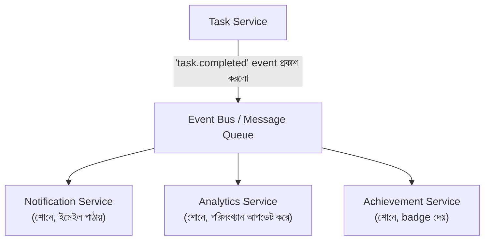

# ৪০.৪ Event-Driven Architecture

Module ৪০.২-এ আমরা microservices দেখেছিলাম যেখানে সার্ভিসগুলো সরাসরি একে অপরকে HTTP কল করে (request-response)। কিন্তু এই সরাসরি যোগাযোগের একটা সমস্যা আছে — যদি `Task Service`-কে সরাসরি `Notification Service`, `Analytics Service`, আর ভবিষ্যতে আরও পাঁচটা সার্ভিস কল করতে হয়, `Task Service`-এর কোড এই সবগুলোর অস্তিত্ব সম্পর্কে জানতে হয়। **Event-driven architecture** এই "টাইট কাপলিং" সমস্যার সমাধান দেয়।

এটা ভাবা যায় একটা রেডিও স্টেশনের মতো — সম্প্রচারক (broadcaster) জানে না ঠিক কে কে শুনছে, সে শুধু সম্প্রচার করে। যে কেউ চাইলে "টিউন ইন" করতে পারে, নতুন শ্রোতা যোগ হলে সম্প্রচারকের কিছু বদলাতে হয় না।



TaskFlow API-তে একটা task সম্পন্ন হলে, সরাসরি প্রতিটা সার্ভিস কল করার বদলে, একটা event প্রকাশ করা:

```javascript
// Task Service — কে শুনছে জানার দরকার নেই
const { publishEvent } = require('./eventBus');

app.post('/tasks/:id/complete', async (req, res) => {
  const task = await Task.update(req.params.id, { completed: true });
  await publishEvent('task.completed', { taskId: task.id, userId: task.userId });
  res.json(task);
});
```

```javascript
// Notification Service — স্বাধীনভাবে event শোনে
eventBus.subscribe('task.completed', async (data) => {
  await sendEmail(data.userId, 'অভিনন্দন! একটা টাস্ক সম্পন্ন করেছো।');
});

// Achievement Service — একই event, সম্পূর্ণ ভিন্ন প্রতিক্রিয়া
eventBus.subscribe('task.completed', async (data) => {
  await checkAndAwardBadge(data.userId);
});
```

লক্ষ্য করো, `Task Service`-এর কোডে `Notification` বা `Achievement`-এর কোনো উল্লেখ নেই — এটাই **loose coupling**। ভবিষ্যতে একটা নতুন `SlackAlertService` যোগ করতে চাইলে, `Task Service`-এর একটা লাইনও বদলাতে হবে না, শুধু নতুন সার্ভিস `task.completed` event শুনতে শুরু করবে।

এই প্যাটার্ন বাস্তবায়নে ব্যবহৃত হয় message broker — RabbitMQ, Kafka, বা AWS SNS/SQS। মূল ধারণা — একটা producer event পাঠায়, একাধিক consumer স্বাধীনভাবে সেই event প্রক্রিয়া করে, একে অপরের অস্তিত্ব সম্পর্কে না জেনেই।

তবে এই স্বাধীনতার একটা মূল্য আছে — debugging কঠিন হয়ে যায় (একটা event কে কে শুনছে, ট্রেস করা কঠিন), আর "eventual consistency" মেনে নিতে হয় (event প্রসেস হতে কিছুটা দেরি হতে পারে, Module ৩৮.৪-এর CAP theorem-এর Availability-focused চিন্তার মতোই)।

এখন আমরা মৌলিক event-driven ধারণা বুঝেছি। কিন্তু ইভেন্ট-ভিত্তিক সিস্টেমে ডেটা পড়া (read) আর লেখা (write)-এর চাহিদা প্রায়ই খুব ভিন্ন হয় — পরের লেসনে আমরা এই সমস্যার সমাধান, CQRS প্যাটার্ন নিয়ে আলোচনা করবো।
