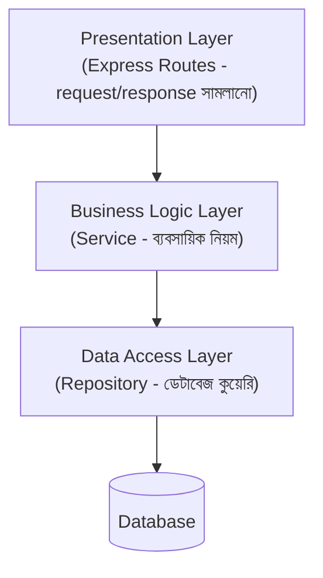

# ৪০.৬ Layered (n-Tier) Architecture

আগের চারটা লেসনে আমরা সিস্টেম-লেভেল স্থাপত্য (monolith, microservices, serverless, event-driven, CQRS) দেখেছি — এগুলো ঠিক করে সার্ভিসগুলো একে অপরের সাথে কীভাবে সাজানো থাকবে। এখন আমরা একটা মাত্র সার্ভিসের **ভেতরের** সংগঠন নিয়ে কথা বলবো — **layered architecture**, যেটা আমরা আসলে এই পুরো কোর্স জুড়ে প্রতিটা Express প্রজেক্টে ব্যবহার করেছি, নাম না বলেই।

এটা ভাবা যায় একটা তিন-তলা ভবনের মতো — নিচতলায় অভ্যর্থনা (কাস্টমারের সাথে সরাসরি যোগাযোগ), মাঝের তলায় সিদ্ধান্ত নেয়ার অফিস (ব্যবসায়িক নিয়ম), আর সবচেয়ে ভেতরের তলায় আর্কাইভ (ডেটা সংরক্ষণ)। প্রতিটা তলা শুধু তার ঠিক পাশের তলার সাথে কথা বলে, সরাসরি নিচতলা থেকে আর্কাইভে ঢুকে যায় না।



TaskFlow API-তে এই তিন স্তর কোডে:

```javascript
// Presentation Layer (routes/tasks.js) — শুধু HTTP সামলায়
app.post('/tasks', async (req, res, next) => {
  try {
    const task = await taskService.createTask(req.user.id, req.body);
    res.status(201).json(task);
  } catch (err) { next(err); }
});

// Business Logic Layer (services/taskService.js) — নিয়ম প্রয়োগ করে
class TaskService {
  async createTask(userId, data) {
    if (data.priority === 'high' && !data.deadline) {
      throw new ValidationError('High priority task-এর deadline আবশ্যক');
    }
    return taskRepository.save({ userId, ...data });
  }
}

// Data Access Layer (repositories/taskRepository.js) — শুধু ডেটাবেজ নিয়ে কাজ করে
class TaskRepository {
  async save(task) {
    return db.query('INSERT INTO tasks (...) VALUES (...) RETURNING *', [...]);
  }
}
```

এই বিভাজন Module ৩৮.২-এ শেখা Single Responsibility নীতির সরাসরি প্রয়োগ — প্রতিটা স্তরের একটাই কাজ। এর সুবিধা প্রমাণিত হয় testing-এ (Module ৩৮.২-এর Dependency Inversion মনে করো) — `TaskService`-কে টেস্ট করতে আসল ডেটাবেজ লাগে না, একটা fake `TaskRepository` বসিয়ে দিলেই চলে।

আরেকটা সুবিধা — presentation layer বদলালে (যেমন REST API-এর পাশাপাশি একটা GraphQL API যোগ করলে) business logic layer একই থাকে, শুধু নতুন একটা presentation layer সেই একই `TaskService` কল করবে।

একটা সাধারণ ভুল — স্তরগুলো এড়িয়ে সরাসরি route থেকে ডেটাবেজ কল করা (`app.post` হ্যান্ডলারের ভেতরেই SQL query লেখা, Module ৩৫.৫-এর উদাহরণের মতো)। ছোট প্রজেক্টে এটা দ্রুত মনে হতে পারে, কিন্তু প্রজেক্ট বড় হলে ব্যবসায়িক নিয়ম কোডের এদিক-ওদিক ছড়িয়ে যায়, রক্ষণাবেক্ষণ কঠিন হয়ে পড়ে।

Layered architecture-এর একটা জনপ্রিয় বিশেষ রূপ আছে, যেটা বিশেষভাবে ব্যবহারকারী-মুখী অ্যাপ্লিকেশনে (ওয়েব/মোবাইল UI-সহ) ব্যবহৃত হয় — পরের লেসনে আমরা সেই প্যাটার্ন, MVC নিয়ে আলোচনা করবো।
