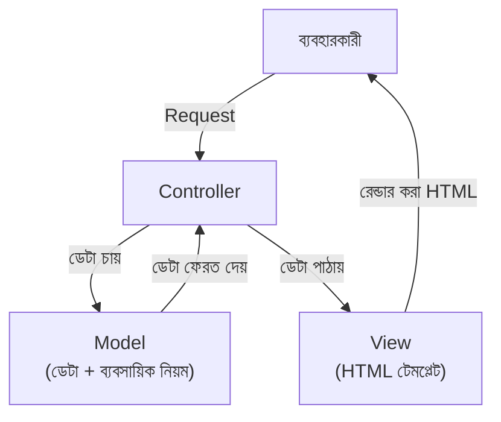

# ৪০.৭ Model-View-Controller (MVC) Architecture

আগের লেসনে আমরা layered architecture দেখলাম — presentation, business logic, data access। **MVC (Model-View-Controller)** এই একই ধারণার একটা বিশেষ, ঐতিহাসিকভাবে খুব জনপ্রিয় রূপ, বিশেষ করে যেসব ফ্রেমওয়ার্কে সার্ভার নিজেই HTML রেন্ডার করে (Ruby on Rails, Django, বা Express + EJS/Pug)।

MVC-কে ভাবা যায় একটা থিয়েটার প্রোডাকশনের মতো — **Model** হলো গল্পের তথ্য (চরিত্র, ঘটনা), **View** হলো মঞ্চায়ন (দর্শক যা দেখে), আর **Controller** হলো পরিচালক, যে গল্প থেকে তথ্য নিয়ে ঠিক করে মঞ্চে কী দেখানো হবে।



Express + EJS দিয়ে TaskFlow API-এর একটা ওয়েব ড্যাশবোর্ড, MVC প্যাটার্নে:

```javascript
// Model (models/Task.js) — ডেটা ও নিয়ম
class Task {
  static async findByUser(userId) {
    return db.query('SELECT * FROM tasks WHERE user_id = $1', [userId]);
  }
}

// Controller (controllers/taskController.js) — Model আর View-এর মাঝে সমন্বয়
exports.showDashboard = async (req, res) => {
  const tasks = await Task.findByUser(req.user.id);
  const overdueCount = tasks.filter(t => new Date(t.deadline) < new Date()).length;
  res.render('dashboard', { tasks, overdueCount }); // View-কে ডেটা পাঠানো
};

// Route
app.get('/dashboard', authMiddleware, taskController.showDashboard);
```

```html
<!-- View (views/dashboard.ejs) — শুধু presentation, কোনো ব্যবসায়িক লজিক না -->
<h1>তোমার Task Dashboard</h1>
<p>মেয়াদোত্তীর্ণ Task: <%= overdueCount %></p>
<ul>
  <% tasks.forEach(task => { %>
    <li><%= task.title %></li>
  <% }) %>
</ul>
```

লক্ষ্য করো — View-তে (`dashboard.ejs`) কোনো ডেটাবেজ কল বা জটিল হিসাব নেই, শুধু ইতিমধ্যে প্রস্তুত ডেটা প্রদর্শন করা হচ্ছে। এই বিভাজন একই কারণে গুরুত্বপূর্ণ যে কারণে Module ৩৫.৪-এ আমরা frontend সমস্যা আলাদা করে চিনতে শিখেছিলাম — যখন ডেটা আর প্রদর্শন আলাদা থাকে, সমস্যা কোথায় সেটা বোঝা সহজ হয়।

আধুনিক API-প্রধান আর্কিটেকচারে (যেখানে React/Vue-এর মতো আলাদা frontend, Module ৩৬.১৬-এর মতো), View-এর ভূমিকা মূলত frontend framework নিয়ে নেয়, আর ব্যাকএন্ড শুধু Model + Controller (JSON API) হিসেবে কাজ করে — এটাকে অনেকে "MVC-এর API সংস্করণ" বলে থাকে।

এখন আমরা একটা মাত্র সার্ভিসের ভেতরের সংগঠন নিয়ে যথেষ্ট আলোচনা করেছি। যেহেতু Module ৪০.২-এ আমরা microservices দেখেছি যেখানে একাধিক সার্ভিস থাকে, তাদের সবাইকে ব্যবহারকারীর সামনে একটা একক প্রবেশদ্বার দিয়ে উপস্থাপন করার একটা প্রয়োজন তৈরি হয় — পরের লেসনে আমরা সেই সমাধান, API Gateway নিয়ে আলোচনা করবো।
