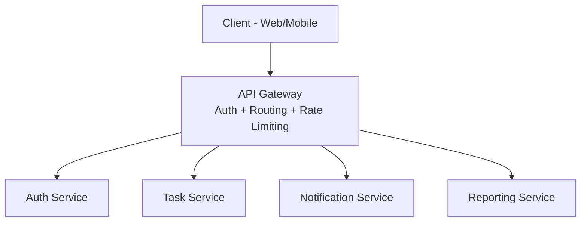

# ৪০.৮ API Gateway Implementation

আগের লেসনে আমরা দেখলাম MVC-তে একটা সার্ভিসের ভেতরে কীভাবে Model, View, Controller সংগঠিত হয়। কিন্তু Module ৪০.২-এ আমরা যে microservices দেখেছিলাম, সেখানে একটা সমস্যা তৈরি হয় — ক্লায়েন্ট (মোবাইল অ্যাপ, ওয়েব ফ্রন্টএন্ড) যদি সরাসরি প্রতিটা সার্ভিসের সাথে আলাদা আলাদা যোগাযোগ করে, তাহলে ক্লায়েন্টকে জানতে হয় প্রতিটা সার্ভিসের ঠিকানা, প্রতিটার নিজস্ব auth লজিক, আর নেটওয়ার্কে অনেকগুলো আলাদা রাউন্ড-ট্রিপ লাগে। এই সমস্যার সমাধান হলো **API Gateway**।

একটা অফিস ভবনের রিসেপশনিস্টের কথা ভাবা যাক। ভবনে দশটা আলাদা ডিপার্টমেন্ট আছে (accounting, HR, IT, legal), কিন্তু ভিজিটর সরাসরি কোনো ডিপার্টমেন্টে ঢুকতে পারে না — সবাইকে প্রথমে রিসেপশনে আসতে হয়। রিসেপশনিস্ট ভিজিটরের পরিচয় যাচাই করে (auth), তারপর সঠিক ডিপার্টমেন্টে পাঠিয়ে দেয় (routing)। API Gateway ঠিক এই রিসেপশনিস্টের ভূমিকা পালন করে — সব ক্লায়েন্ট রিকোয়েস্ট একটা মাত্র প্রবেশদ্বার দিয়ে ঢোকে, আর Gateway সেটাকে সঠিক microservice-এ পাঠিয়ে দেয়।



একটা Gateway সাধারণত একইসাথে কয়েকটা দায়িত্ব পালন করে — **routing** (কোন পাথ কোন সার্ভিসে যাবে), **authentication** (Module ১২-এর JWT যাচাই একবার Gateway-তে করলে প্রতিটা সার্ভিসে আলাদা করে করতে হয় না), **rate limiting** (Module ৭.৬-এর মতো, কিন্তু এখন কেন্দ্রীভূতভাবে পুরো সিস্টেমের জন্য), আর **request aggregation** (একাধিক সার্ভিসের ডেটা মিলিয়ে একটা রেসপন্স বানানো)।

Express দিয়ে একটা সরল Gateway-এর কাঠামো দেখা যাক, যেখানে `http-proxy-middleware` ব্যবহার করে রিকোয়েস্ট ফরওয়ার্ড করা হচ্ছে:

```javascript
const express = require('express');
const { createProxyMiddleware } = require('http-proxy-middleware');
const jwt = require('jsonwebtoken');

const app = express();

// কেন্দ্রীভূত auth middleware — একবার এখানে যাচাই হলে সব সার্ভিস নিশ্চিন্ত
function verifyToken(req, res, next) {
  const token = req.headers.authorization?.split(' ')[1];
  try {
    req.user = jwt.verify(token, process.env.JWT_SECRET);
    next();
  } catch {
    res.status(401).json({ error: 'Invalid token' });
  }
}

// রাউটিং রুল — কোন পাথ কোন সার্ভিসে যাবে
app.use('/api/tasks', verifyToken, createProxyMiddleware({
  target: 'http://task-service:4001',
  changeOrigin: true,
}));

app.use('/api/notifications', verifyToken, createProxyMiddleware({
  target: 'http://notification-service:4002',
  changeOrigin: true,
}));

// auth সার্ভিসে টোকেন যাচাই লাগে না, লগইন করার জন্যই তো টোকেন চাওয়া হচ্ছে
app.use('/api/auth', createProxyMiddleware({
  target: 'http://auth-service:4000',
  changeOrigin: true,
}));

app.listen(8080, () => console.log('API Gateway running on port 8080'));
```

লক্ষ্য করো — `task-service` বা `notification-service`-এর কোডে আর আলাদা করে JWT verify করার প্রয়োজন নেই, কারণ Gateway সেটা আগেই করে ফেলেছে এবং `req.user` হেডারের মাধ্যমে পাস করে দিতে পারে। এটা Module ৩৮.২-এর Single Responsibility নীতিরই একটা স্থাপত্য-স্তরের প্রয়োগ — প্রতিটা সার্ভিস শুধু তার নিজের ব্যবসায়িক লজিক নিয়ে চিন্তা করে, ক্রস-কাটিং কনসার্ন (auth, logging, rate limiting) Gateway-এর দায়িত্ব।

তবে সাবধান থাকা দরকার — Gateway যদি ভেঙে পড়ে, পুরো সিস্টেম অনুপলব্ধ হয়ে যায়, কারণ এটা এখন একটা **single point of failure**। তাই বাস্তব প্রোডাকশনে Gateway-কে সবসময় একাধিক ইনস্ট্যান্স হিসেবে চালানো হয়, লোড ব্যালান্সারের পেছনে (Module ৪০.১২-তে আমরা এই লোড ব্যালান্সিং নিয়ে বিস্তারিত আলোচনা করবো)।

এই লেসনে আমরা Gateway কীভাবে কাজ করে সেটার মূল ধারণা আর নিজে-লেখা বাস্তবায়ন দেখলাম। পরের লেসনে আমরা দেখবো Gateway-এর পেছনে থাকা সার্ভিসগুলো নিজেদের মধ্যে কীভাবে কথা বলে — সেটাই Inter-Service Communication।
