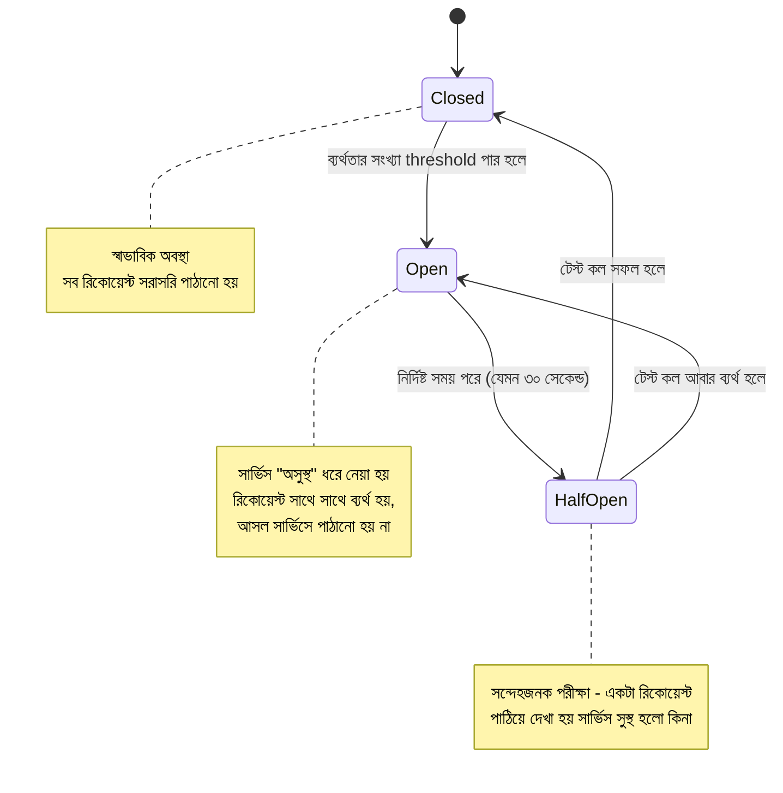

# ৪০.১০ Circuit Breaker Pattern

আগের লেসনের শেষে আমরা cascading failure-এর কথা বলেছিলাম — একটা সার্ভিস ডাউন হলে সেটার উপর নির্ভরশীল অন্য সার্ভিসগুলোও একের পর এক ব্যর্থ হতে থাকে। ধরো Notification Service ডাউন হয়ে গেছে, কিন্তু Task Service প্রতিটা নতুন task-এ বারবার Notification Service-কে কল করেই যাচ্ছে, প্রতিটা কল টাইমআউট হওয়ার জন্য কয়েক সেকেন্ড অপেক্ষা করছে। ফলাফল — Task Service নিজেও ধীর হয়ে যায়, তার থ্রেড/কানেকশন পুল ভরে যায়, আর একটা সার্ভিসের সমস্যা পুরো সিস্টেমে ছড়িয়ে পড়ে।

এই সমস্যার সমাধান দেয় **Circuit Breaker Pattern**, যেটার নামই এসেছে বাসার বৈদ্যুতিক সার্কিট ব্রেকার থেকে। বাসায় যখন শর্ট-সার্কিট হয়, ব্রেকার নিজে থেকে বিদ্যুৎ সংযোগ বিচ্ছিন্ন করে দেয় — পুরো বাসা পুড়ে যাওয়া থেকে বাঁচায়। সফটওয়্যারে Circuit Breaker একইভাবে কাজ করে — একটা সার্ভিস বারবার ব্যর্থ হতে থাকলে, Circuit Breaker "সার্কিট খুলে দেয়" এবং সাথে সাথে সাথে ব্যর্থতা রিটার্ন করে, ব্যর্থ সার্ভিসে নতুন কল পাঠানো বন্ধ করে দেয়।

Circuit Breaker-এর তিনটা অবস্থা থাকে:



একটা সহজ Circuit Breaker নিজে হাতে বানিয়ে দেখা যাক, যাতে ধারণাটা স্পষ্ট হয়:

```javascript
class CircuitBreaker {
  constructor(fn, { failureThreshold = 3, resetTimeout = 30000 } = {}) {
    this.fn = fn;
    this.failureThreshold = failureThreshold;
    this.resetTimeout = resetTimeout;
    this.state = 'CLOSED';
    this.failureCount = 0;
    this.nextAttempt = Date.now();
  }

  async call(...args) {
    if (this.state === 'OPEN') {
      if (Date.now() < this.nextAttempt) {
        throw new Error('Circuit is OPEN — সার্ভিসে কল পাঠানো হচ্ছে না');
      }
      this.state = 'HALF_OPEN'; // পরীক্ষা করার সময় এসেছে
    }

    try {
      const result = await this.fn(...args);
      this.onSuccess();
      return result;
    } catch (err) {
      this.onFailure();
      throw err;
    }
  }

  onSuccess() {
    this.failureCount = 0;
    this.state = 'CLOSED';
  }

  onFailure() {
    this.failureCount++;
    if (this.failureCount >= this.failureThreshold) {
      this.state = 'OPEN';
      this.nextAttempt = Date.now() + this.resetTimeout;
    }
  }
}

// ব্যবহার — Notification Service-কে কল করা এখন সুরক্ষিত
const notifyBreaker = new CircuitBreaker(
  (userId, msg) => axios.post('http://notification-service:4002/notify', { userId, msg }),
  { failureThreshold: 3, resetTimeout: 30000 }
);

async function createTask(taskData) {
  const task = await db.tasks.create(taskData);
  try {
    await notifyBreaker.call(task.userId, `নতুন Task: ${task.title}`);
  } catch (err) {
    // নোটিফিকেশন ব্যর্থ হলেও task তৈরি ব্যর্থ হবে না
    console.warn('Notification পাঠানো যায়নি, পরে retry হবে');
  }
  return task;
}
```

লক্ষ্য করো, যখন সার্কিট `OPEN` অবস্থায় থাকে, `notifyBreaker.call()` তাৎক্ষণিকভাবে ব্যর্থ হয় — Notification Service-এ কোনো নেটওয়ার্ক কলই যায় না, তাই Task Service অপেক্ষা করে সময় নষ্ট করে না। এটা Module ৩৪-এ শেখা production debugging নীতিরই একটা প্রতিরক্ষামূলক প্রয়োগ — সমস্যা হওয়ার আগেই তার প্রভাব সীমিত করে ফেলা।

এই লেসনে আমরা concept আর নিজে-লেখা বাস্তবায়ন দেখলাম। মডিউলের পরের ধাপে আমরা আরও কিছু নতুন প্যাটার্ন (Service Discovery, Load Balancing) দেখবো, আর তারপর ফিরে আসবো এই তিনটা প্যাটার্নেরই (API Gateway, Inter-Service Communication, Circuit Breaker) গভীর সংস্করণে — পরের লেসনে প্রথমে দেখবো Service Discovery & Registry, যেটা জানায় কোন সার্ভিস আসলে কোথায় চলছে।
