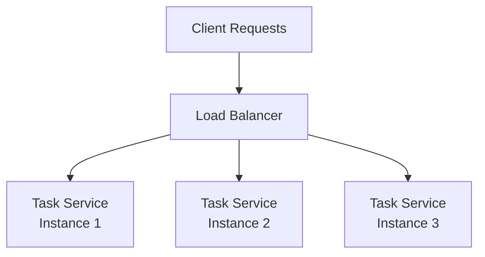

# ৪০.১২ Load Balancing Strategies

আগের লেসনে আমরা দেখলাম Service Discovery কীভাবে একটা সার্ভিসের একাধিক ইনস্ট্যান্স খুঁজে বের করে। কিন্তু একটা প্রশ্ন খোলাই ছিল — একাধিক ইনস্ট্যান্স থাকলে, নির্দিষ্ট একটা রিকোয়েস্ট **কোনটাতে** পাঠানো হবে? এই সিদ্ধান্ত নেয়ার কাজটাই **Load Balancer**-এর।

Load Balancer-কে ভাবা যায় সুপারমার্কেটের ক্যাশ কাউন্টার সামলানো ম্যানেজারের মতো — একসাথে পাঁচটা কাউন্টার খোলা আছে, ম্যানেজার নতুন কাস্টমারকে দেখে বলে দেন কোন কাউন্টারে যেতে হবে, যাতে কোনো একটা কাউন্টারে লম্বা লাইন না জমে আর বাকিগুলো খালি না বসে থাকে।



সবচেয়ে সহজ কৌশল হলো **Round Robin** — প্রতিটা নতুন রিকোয়েস্ট পালাক্রমে পরের ইনস্ট্যান্সে পাঠানো হয় (১, ২, ৩, ১, ২, ৩...)। এটা নিজে হাতে লিখলে দেখতে এমন হবে:

```javascript
class RoundRobinBalancer {
  constructor(instances) {
    this.instances = instances;
    this.currentIndex = 0;
  }

  getNextInstance() {
    const instance = this.instances[this.currentIndex];
    this.currentIndex = (this.currentIndex + 1) % this.instances.length;
    return instance;
  }
}

const balancer = new RoundRobinBalancer([
  { address: '10.0.1.1', port: 4001 },
  { address: '10.0.1.2', port: 4001 },
  { address: '10.0.1.3', port: 4001 },
]);

async function routeRequest(req) {
  const target = balancer.getNextInstance();
  return axios.post(`http://${target.address}:${target.port}${req.path}`, req.body);
}
```

Round Robin সহজ, কিন্তু একটা সীমাবদ্ধতা আছে — এটা ধরে নেয় প্রতিটা ইনস্ট্যান্স সমান কাজ করতে পারে, আর প্রতিটা রিকোয়েস্ট সমান ভারী। বাস্তবে যদি একটা ইনস্ট্যান্স আগে থেকেই ব্যস্ত থাকে (দীর্ঘ একটা রিপোর্ট জেনারেট করছে), Round Robin তারপরও তার পালা অনুযায়ী সেখানে নতুন রিকোয়েস্ট পাঠাবে, যেটা অন্যায্য। এই কারণে আরও উন্নত কৌশল আছে, যেমন **Least Connections** (যে ইনস্ট্যান্সে এই মুহূর্তে সবচেয়ে কম active connection আছে, সেখানে পাঠানো) — এই অ্যালগরিদমগুলো নিয়ে আমরা ৪০.২০-তে বিস্তারিত তুলনা করবো।

Load Balancing শুধু কোন ইনস্ট্যান্স বেছে নেয়া তা নয়, এটা **health check**-এর সাথেও জড়িত — যদি কোনো ইনস্ট্যান্স স্বাস্থ্য-পরীক্ষায় ব্যর্থ হয়, Load Balancer তাকে সাময়িকভাবে তালিকা থেকে বাদ দিয়ে দেয়, ঠিক যেমন Service Discovery-তে মৃত ইনস্ট্যান্স সরানো হয়:

```javascript
class HealthAwareBalancer extends RoundRobinBalancer {
  constructor(instances) {
    super(instances);
    setInterval(() => this.checkHealth(), 5000);
  }

  async checkHealth() {
    for (const instance of this.instances) {
      try {
        await axios.get(`http://${instance.address}:${instance.port}/health`, { timeout: 2000 });
        instance.healthy = true;
      } catch {
        instance.healthy = false; // অসুস্থ চিহ্নিত করা, বাদ দেয়া না — পরে সুস্থ হতে পারে
      }
    }
  }

  getNextInstance() {
    const healthyInstances = this.instances.filter(i => i.healthy !== false);
    // healthy তালিকা থেকে round robin
    const instance = healthyInstances[this.currentIndex % healthyInstances.length];
    this.currentIndex++;
    return instance;
  }
}
```

বাস্তব প্রোডাকশনে Load Balancer সাধারণত নিজে লিখতে হয় না — Nginx, HAProxy, বা ক্লাউড প্রোভাইডারের ম্যানেজড লোড ব্যালান্সার (AWS ELB) ব্যবহার করা হয়, যেগুলো Module ৪০.৮-এর API Gateway-এর সাথেও প্রায়ই একত্রে কাজ করে — Gateway রাউটিং আর auth সামলায়, Load Balancer ঠিক করে কোন নির্দিষ্ট ইনস্ট্যান্সে যাবে।

এই পর্যন্ত আমরা microservices জগতের মূল বিল্ডিং ব্লকগুলো (Gateway, Inter-Service Communication, Circuit Breaker, Service Discovery, Load Balancing) একে একে দেখলাম। এখন আমরা এই একই তিনটা টপিকে (Gateway, Inter-Service Communication, Circuit Breaker) আরও গভীরে যাবো — পরের লেসনে API Gateway-এর বাস্তব প্রোডাক্ট তুলনা (Kong, Nginx, AWS API Gateway) দিয়ে শুরু করছি।
