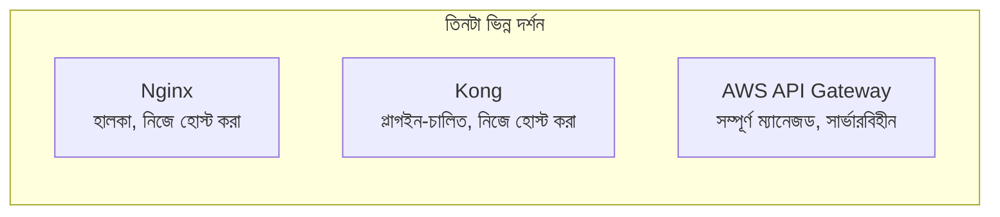

# ৪০.১৩ API Gateway Implementation — Deep Dive: বাস্তব প্রোডাক্ট তুলনা

৪০.৮-এ আমরা নিজে হাতে Express দিয়ে একটা ছোট API Gateway লিখেছিলাম, যাতে ভেতরের প্রক্রিয়াটা বোঝা যায়। কিন্তু বাস্তব প্রোডাকশন সিস্টেমে প্রায় কেউই সম্পূর্ণ নিজে-লেখা Gateway ব্যবহার করে না — কারণ rate limiting, retries, circuit breaking, SSL termination, plugin ইকোসিস্টেম — এই সবকিছু নিজে বানিয়ে প্রোডাকশন-গ্রেড করা অনেক শ্রমসাধ্য। এই লেসনে আমরা তিনটা জনপ্রিয় বাস্তব সমাধান তুলনা করবো — **Nginx**, **Kong**, আর **AWS API Gateway**।



**Nginx** মূলত একটা সাধারণ ওয়েব সার্ভার/রিভার্স প্রক্সি, যেটা Gateway হিসেবেও ব্যবহার করা যায়। এটা অত্যন্ত হালকা আর দ্রুত, কিন্তু "বুদ্ধিমান" ফিচার (যেমন JWT validation, rate limiting per-user) কনফিগারেশন ফাইলে লিখে বা Lua স্ক্রিপ্ট (OpenResty) দিয়ে বানাতে হয়:

```nginx
# nginx.conf — সাধারণ রিভার্স প্রক্সি + সিম্পল রাউটিং
http {
    upstream task_service {
        server 10.0.1.1:4001;
        server 10.0.1.2:4001;  # একাধিক ইনস্ট্যান্স - built-in load balancing
    }

    server {
        listen 8080;

        location /api/tasks {
            proxy_pass http://task_service;
            limit_req zone=api_limit burst=20;  # rate limiting
        }
    }
}
```

**Kong** একটা "Gateway-as-a-platform" — এটা Nginx-এর উপরেই বানানো, কিন্তু plugin architecture দেয় যাতে auth, rate limiting, logging সবকিছু কনফিগারেশন বা admin API দিয়ে যোগ করা যায়, কোড না লিখে:

```bash
# Kong Admin API দিয়ে একটা সার্ভিস আর রুট যোগ করা
curl -X POST http://kong:8001/services \
  --data "name=task-service" \
  --data "url=http://task-service:4001"

curl -X POST http://kong:8001/services/task-service/routes \
  --data "paths[]=/api/tasks"

# JWT auth plugin যোগ করা — কোনো কোড লিখতে হচ্ছে না
curl -X POST http://kong:8001/services/task-service/plugins \
  --data "name=jwt"

# Rate limiting plugin
curl -X POST http://kong:8001/services/task-service/plugins \
  --data "name=rate-limiting" \
  --data "config.minute=100"
```

লক্ষ্য করো — Kong-এ পুরো auth আর rate limiting যোগ করতে আমাদের ৪০.৮-এর মতো middleware কোড লিখতে হয়নি, শুধু plugin সংযুক্ত করেছি। এটা একটা গুরুত্বপূর্ণ trade-off বোঝায় — কম কোড, কিন্তু Kong-এর নিজস্ব infrastructure (এবং database, সাধারণত PostgreSQL বা Cassandra) চালানো ও রক্ষণাবেক্ষণ করতে হয়।

**AWS API Gateway** সম্পূর্ণ ভিন্ন দর্শন — কোনো সার্ভার তোমাকে চালাতে হয় না, এটা সম্পূর্ণ ম্যানেজড সার্ভিস, প্রায়শই ৪০.৩-এ শেখা Serverless (Lambda) ফাংশনের সাথে একত্রে ব্যবহার হয়:

```yaml
# AWS SAM template — API Gateway + Lambda সংযুক্ত করা
Resources:
  TaskApi:
    Type: AWS::Serverless::Api
    Properties:
      StageName: prod
      Auth:
        DefaultAuthorizer: JwtAuthorizer
        Authorizers:
          JwtAuthorizer:
            JwtConfiguration:
              issuer: https://taskflow.auth.example.com

  CreateTaskFunction:
    Type: AWS::Serverless::Function
    Properties:
      Handler: createTask.handler
      Events:
        CreateTask:
          Type: Api
          Properties:
            RestApiId: !Ref TaskApi
            Path: /tasks
            Method: post
```

তিনটার তুলনা একটা টেবিলে দেখা যাক:

| বৈশিষ্ট্য | Nginx | Kong | AWS API Gateway |
|---|---|---|---|
| হোস্টিং | নিজে চালাতে হয় | নিজে চালাতে হয় | সম্পূর্ণ ম্যানেজড |
| Plugin ইকোসিস্টেম | সীমিত (Lua লিখতে হয়) | সমৃদ্ধ, রেডিমেড | AWS সার্ভিসের সাথে গভীর ইন্টিগ্রেশন |
| খরচের মডেল | ইনফ্রা খরচ | ইনফ্রা + লাইসেন্স (Enterprise) | পে-পার-রিকোয়েস্ট |
| সবচেয়ে উপযুক্ত | সরল, উচ্চ-পারফরম্যান্স রাউটিং | মাঝারি-বড় microservices, custom plugin দরকার হলে | পুরোপুরি serverless/AWS-native স্ট্যাক |

কোনটা "সেরা" তা নির্ভর করে টিমের আকার আর অবকাঠামোর উপর — ছোট টিম যারা AWS-এ আছে, তাদের জন্য AWS API Gateway ঝামেলাহীন; যারা নিজস্ব ডেটা সেন্টার বা multi-cloud চালায়, তাদের জন্য Kong একটা শক্তিশালী পছন্দ।

পরের লেসনে আমরা Inter-Service Communication-এর গভীরে যাবো — synchronous REST/gRPC বনাম asynchronous মেসেজিং, বাস্তব ট্রেড-অফ সহ।
