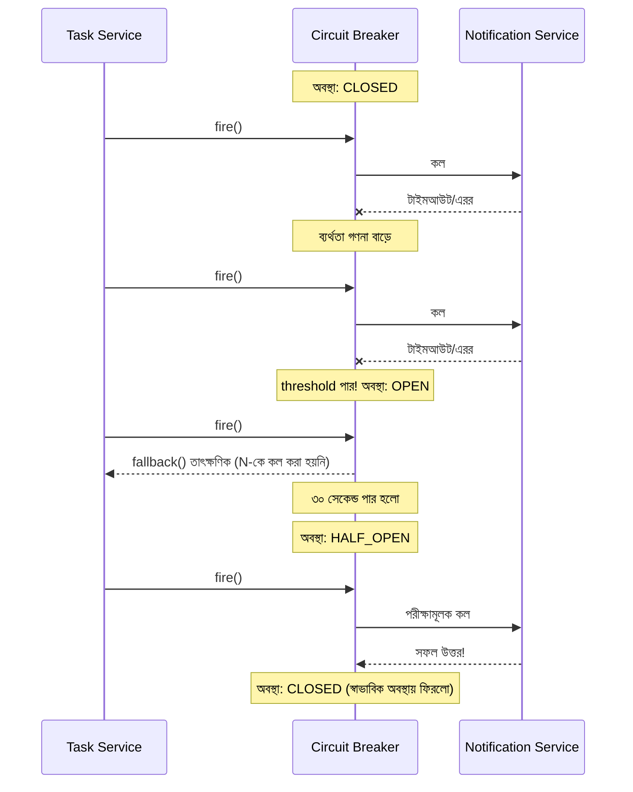

# ৪০.১৫ Circuit Breaker Pattern — Deep Dive: লাইব্রেরি দিয়ে বাস্তবায়ন

৪০.১০-এ আমরা নিজে হাতে একটা সরল Circuit Breaker লিখেছিলাম, যাতে concept-টা স্বচ্ছ থাকে। কিন্তু বাস্তব প্রোডাকশনে নিজের লেখা Circuit Breaker-এ সহজেই সূক্ষ্ম বাগ থেকে যায় — race condition, ভুল timeout হিসাব, বা অসম্পূর্ণ মেট্রিক্স। তাই বাস্তব প্রজেক্টে Node.js ইকোসিস্টেমের জনপ্রিয় লাইব্রেরি **`opossum`** ব্যবহার করাই সাধারণ চর্চা।

```javascript
const CircuitBreaker = require('opossum');

// যে ফাংশনটাকে সুরক্ষিত করতে চাই
async function callNotificationService(userId, message) {
  return axios.post('http://notification-service:4002/notify', { userId, message });
}

const options = {
  timeout: 3000,              // ৩ সেকেন্ডের বেশি লাগলে ব্যর্থ ধরে নেয়া
  errorThresholdPercentage: 50, // ৫০% রিকোয়েস্ট ব্যর্থ হলে সার্কিট খুলবে
  resetTimeout: 30000,          // ৩০ সেকেন্ড পর HALF_OPEN-এ চেষ্টা করবে
  rollingCountTimeout: 10000,   // ১০ সেকেন্ডের উইন্ডোতে ব্যর্থতার হার হিসাব হয়
};

const breaker = new CircuitBreaker(callNotificationService, options);

// fallback — সার্কিট খোলা থাকলে কী করা হবে
breaker.fallback(() => {
  console.warn('Notification Service অনুপলব্ধ, পরে retry queue-তে রাখা হচ্ছে');
  return { queued: true };
});

// ইভেন্ট শোনা — পর্যবেক্ষণযোগ্যতার (Module ৩২) জন্য গুরুত্বপূর্ণ
breaker.on('open', () => console.log('🔴 Circuit OPEN — Notification Service ব্যর্থ হচ্ছে বারবার'));
breaker.on('halfOpen', () => console.log('🟡 Circuit HALF_OPEN — পরীক্ষামূলক কল পাঠানো হচ্ছে'));
breaker.on('close', () => console.log('🟢 Circuit CLOSED — সার্ভিস স্বাভাবিক হয়েছে'));

// ব্যবহার
async function createTask(taskData) {
  const task = await db.tasks.create(taskData);
  await breaker.fire(task.userId, `নতুন Task: ${task.title}`);
  return task;
}
```

লক্ষ্য করো `opossum` `timeout`, `errorThresholdPercentage`, আর `rollingCountTimeout` — এই তিনটা প্যারামিটার একসাথে মিলিয়ে সার্কিট কখন খুলবে সেটা ঠিক করে, যেটা আমাদের ৪০.১০-এর সরল "৩ বার ব্যর্থ হলেই খুলবে" যুক্তির চেয়ে অনেক বেশি বাস্তবসম্মত — কারণ এটা একটা সময়-উইন্ডোর ভেতরের **শতকরা** হার দেখে, একক ব্যর্থতার সংখ্যা নয়।

স্টেট ট্রানজিশনগুলো আরও গভীরভাবে দেখা যাক, বাস্তব টাইমলাইন সহ:



একটা গুরুত্বপূর্ণ ডিজাইন সিদ্ধান্ত হলো `fallback()` কী করবে — শুধু এরর থ্রো করা যথেষ্ট না, বরং ব্যবসায়িক দৃষ্টিকোণ থেকে চিন্তা করতে হয়। উদাহরণে আমরা fallback-এ নোটিফিকেশনকে একটা retry queue-তে রেখে দিচ্ছি (Module ৪০.৯-এর asynchronous পদ্ধতির সাথে সংযুক্ত করে), যাতে Notification Service সুস্থ হলে বাকি কাজ পরে সম্পন্ন হয় — এটা "graceful degradation"-এর একটা ভালো উদাহরণ, সিস্টেম পুরোপুরি ভেঙে না পড়ে আংশিকভাবে কাজ চালিয়ে যাচ্ছে।

Circuit Breaker-কে Module ৩২-এর logging আর Module ৩৩-এর alerting-এর সাথে যুক্ত করাও প্রোডাকশনে অত্যন্ত গুরুত্বপূর্ণ — `breaker.on('open', ...)` ইভেন্টে একটা alert পাঠানো উচিত, কারণ সার্কিট খোলা মানে একটা ডাউনস্ট্রিম সার্ভিসে সত্যিকারের সমস্যা হচ্ছে যেটা মানুষের নজরে আনা দরকার।

এই তিনটা গভীর-বিশ্লেষণী লেসন (Gateway, Communication, Circuit Breaker) শেষ করে আমরা এখন সম্পূর্ণ নতুন দুইটা প্যাটার্নে যাবো — পরের লেসনে Multi-Tenant Architecture, যেখানে আমরা দেখবো একটা মাত্র সিস্টেম কীভাবে একাধিক আলাদা গ্রাহক (tenant)-কে নিরাপদে সার্ভ করতে পারে।
