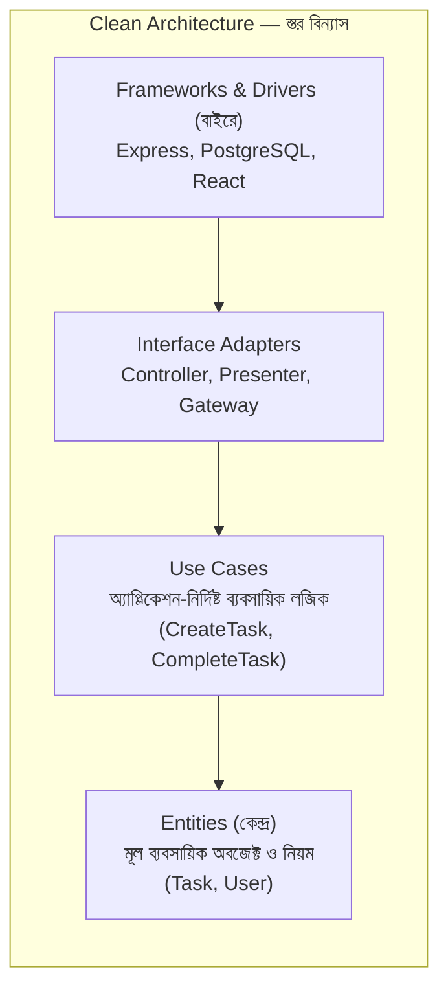

# ৪০.১৭ Clean Architecture

আগের লেসনে আমরা দেখলাম কীভাবে একটা সিস্টেম একাধিক tenant-কে সার্ভ করতে পারে। এখন আমরা ফিরে যাই একটা মাত্র সার্ভিসের **ভেতরের** সংগঠনে — কিন্তু এবার MVC (৪০.৭)-এর চেয়েও গভীরভাবে চিন্তা করবো। প্রশ্নটা হলো — যদি আগামীকাল তুমি PostgreSQL থেকে MongoDB-তে সরে যাও, বা Express থেকে NestJS-এ (Module ২৩) মাইগ্রেট করো, তোমার ব্যবসায়িক লজিক (business logic) কি অক্ষত থাকবে, নাকি পুরো অ্যাপ্লিকেশন নতুন করে লিখতে হবে?

**Clean Architecture** (রবার্ট সি. মার্টিন / "Uncle Bob"-এর প্রস্তাবিত) এই প্রশ্নের একটা কঠোর উত্তর দেয় — **ব্যবসায়িক নিয়ম কখনো ফ্রেমওয়ার্ক, ডেটাবেজ, বা UI-এর উপর নির্ভরশীল হবে না; বরং নির্ভরতা সবসময় বাইরে থেকে ভেতরে যাবে**। এটাকে ভাবা যায় পেঁয়াজের স্তরের মতো — কেন্দ্রে থাকে সবচেয়ে গুরুত্বপূর্ণ, স্থিতিশীল জিনিস (ব্যবসায়িক নিয়ম), আর বাইরের স্তরগুলোতে থাকে পরিবর্তনশীল টুকরা (ডেটাবেজ, ফ্রেমওয়ার্ক, UI)।



মূল নিয়ম — **নির্ভরতার তীর সবসময় কেন্দ্রের দিকে যাবে**। `Entities` কখনো জানে না Express বা PostgreSQL-এর কথা। `Use Cases` জানে `Entities`-এর কথা, কিন্তু জানে না ডেটা আসলে কোথা থেকে আসছে — সেটা একটা **interface** দিয়ে বিমূর্ত (abstract) করা হয়, ঠিক যেমন Module ১৪-এ আমরা Interface দিয়ে বাস্তবায়ন থেকে চুক্তিকে আলাদা করতে শিখেছিলাম।

```typescript
// --- কেন্দ্র: Entity — বিশুদ্ধ ব্যবসায়িক অবজেক্ট, কোনো ফ্রেমওয়ার্ক ইমপোর্ট নেই ---
class Task {
  constructor(
    public id: string,
    public title: string,
    public completed: boolean = false
  ) {}

  markComplete() {
    if (this.completed) throw new Error('Task ইতিমধ্যে সম্পন্ন');
    this.completed = true;
  }
}

// --- Use Case-এর জন্য একটা Interface (Port) — বাস্তবায়ন থেকে স্বাধীন ---
interface TaskRepository {
  findById(id: string): Promise<Task | null>;
  save(task: Task): Promise<void>;
}

// --- Use Case — শুধু interface-এর উপর নির্ভর করে, নির্দিষ্ট ডেটাবেজ জানে না ---
class CompleteTaskUseCase {
  constructor(private taskRepo: TaskRepository) {} // Module ২২-এর DI

  async execute(taskId: string): Promise<void> {
    const task = await this.taskRepo.findById(taskId);
    if (!task) throw new Error('Task পাওয়া যায়নি');
    task.markComplete();
    await this.taskRepo.save(task);
  }
}

// --- বাইরের স্তর: PostgreSQL-নির্দিষ্ট বাস্তবায়ন (Adapter) ---
class PostgresTaskRepository implements TaskRepository {
  async findById(id: string): Promise<Task | null> {
    const row = await db.query('SELECT * FROM tasks WHERE id = $1', [id]);
    return row ? new Task(row.id, row.title, row.completed) : null;
  }
  async save(task: Task): Promise<void> {
    await db.query('UPDATE tasks SET completed = $1 WHERE id = $2', [task.completed, task.id]);
  }
}

// --- সবচেয়ে বাইরের স্তর: Express Controller ---
app.post('/api/tasks/:id/complete', async (req, res) => {
  const useCase = new CompleteTaskUseCase(new PostgresTaskRepository());
  await useCase.execute(req.params.id);
  res.json({ success: true });
});
```

এই বিন্যাসের সবচেয়ে বড় সুবিধা টেস্টিং-এ দেখা যায় (Module ৩১-এর API Testing মনে করো) — `CompleteTaskUseCase` টেস্ট করার জন্য আসল PostgreSQL লাগে না, একটা fake/in-memory `TaskRepository` দিয়েই যথেষ্ট:

```typescript
class FakeTaskRepository implements TaskRepository {
  private tasks = new Map<string, Task>();
  async findById(id: string) { return this.tasks.get(id) ?? null; }
  async save(task: Task) { this.tasks.set(task.id, task); }
}

// টেস্টে — কোনো ডেটাবেজ কানেকশন ছাড়াই ব্যবসায়িক নিয়ম যাচাই করা যায়
const fakeRepo = new FakeTaskRepository();
await fakeRepo.save(new Task('1', 'কেনাকাটা'));
const useCase = new CompleteTaskUseCase(fakeRepo);
await useCase.execute('1');
```

লক্ষ্য করো ভবিষ্যতে যদি PostgreSQL থেকে MongoDB-তে সরে যাওয়ার সিদ্ধান্ত হয়, শুধু একটা নতুন `MongoTaskRepository implements TaskRepository` লিখতে হবে — `CompleteTaskUseCase`-এর একটা লাইনও বদলাতে হবে না। এটাই Clean Architecture-এর প্রতিশ্রুতি — ব্যবসায়িক নিয়ম টিকে থাকে, চারপাশের প্রযুক্তি বদলায়।

NestJS (Module ২৩-২৫)-এ এই দর্শনটা প্রায় built-in — `@Injectable()` সার্ভিস, module system, আর dependency injection মিলে Clean Architecture বাস্তবায়ন করা অনেক স্বাভাবিক হয়ে যায়।

এতক্ষণ আমরা সার্ভিসের ভেতরের আর একাধিক সার্ভিসের মধ্যেকার স্থাপত্য দেখলাম। পরের লেসনে আমরা ফিরে যাবো Event-Driven Architecture-এ, কিন্তু এবার একটা বিশেষায়িত, শক্তিশালী কৌশল নিয়ে — Event Sourcing, যেখানে সিস্টেমের অবস্থা সংরক্ষণের বদলে প্রতিটা পরিবর্তনের ইতিহাস সংরক্ষণ করা হয়।
