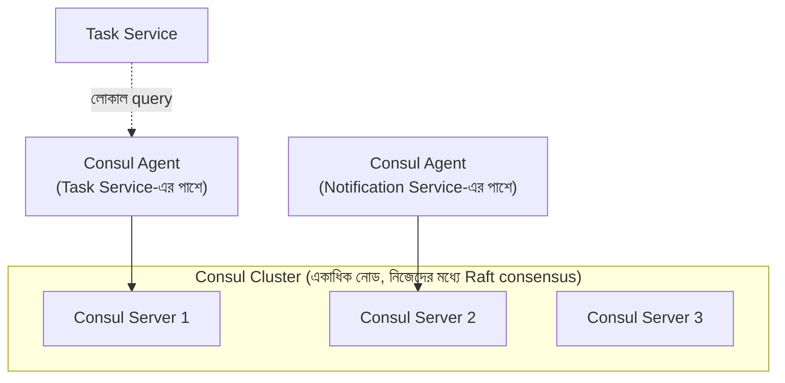

# ৪০.১৯ Service Discovery & Registry — Deep Dive: Consul ও etcd

৪০.১১-এ আমরা নিজে হাতে একটা সরল Service Registry ক্লায়েন্ট লিখেছিলাম, শুধু ধারণাটা স্পষ্ট করার জন্য। বাস্তব প্রোডাকশনে নিজের-লেখা রেজিস্ট্রি ব্যবহার করা প্রায় অসম্ভব কারণ এটাকে নিজেই একটা highly-available, consistent, distributed সিস্টেম হতে হয় — যদি রেজিস্ট্রি নিজেই ডাউন হয়ে যায়, পুরো সিস্টেম একে অপরকে খুঁজে পাওয়া বন্ধ করে দেবে। এই কারণে বাস্তবে **Consul** বা **etcd**-এর মতো পরীক্ষিত টুল ব্যবহার করা হয়।

**Consul** (HashiCorp-এর তৈরি) একটা সম্পূর্ণ service mesh সমাধান, যেটা service discovery, health checking, আর key-value স্টোর — সবকিছু একসাথে দেয়:



Consul-এ একটা সার্ভিস রেজিস্টার করা হয় একটা কনফিগ ফাইল দিয়ে, যেটা সেই সার্ভিসের পাশে চলা `consul agent`-কে জানায়:

```json
// notification-service.json — Consul agent-কে জানানো হচ্ছে
{
  "service": {
    "name": "notification-service",
    "port": 4002,
    "check": {
      "http": "http://localhost:4002/health",
      "interval": "10s",
      "timeout": "2s"
    }
  }
}
```

```javascript
// Node.js থেকে Consul-এ query করা — DNS interface বা HTTP API দিয়ে
const consul = require('consul')();

async function discoverNotificationService() {
  const services = await consul.health.service({
    service: 'notification-service',
    passing: true, // শুধু স্বাস্থ্যবান ইনস্ট্যান্স ফেরত দাও
  });
  return services.map(s => ({
    address: s.Service.Address,
    port: s.Service.Port,
  }));
}
```

লক্ষ্য করো `passing: true` — Consul নিজে health check চালায় (আমাদের ৪০.১১-এর সরল heartbeat-এর চেয়ে অনেক বেশি নির্ভুল, কারণ এটা সরাসরি `/health` এন্ডপয়েন্টে HTTP কল করে যাচাই করে) এবং শুধু সুস্থ ইনস্ট্যান্সের তালিকা ফেরত দেয় — একই কাজ যেটা ৪০.১২-এর `HealthAwareBalancer` করছিলো, কিন্তু এখন এটা রেজিস্ট্রি নিজেই সামলাচ্ছে।

**etcd** (Kubernetes-এর মূল ডেটা স্টোর হিসেবে বিখ্যাত) একটু ভিন্ন দর্শন নিয়ে আসে — এটা মূলত একটা distributed key-value store, service discovery তার একটা প্রয়োগ মাত্র:

```javascript
const { Etcd3 } = require('etcd3');
const client = new Etcd3();

// রেজিস্টার করা — একটা key-value এন্ট্রি, TTL (time-to-live) সহ
async function registerService() {
  const lease = client.lease(10); // ১০ সেকেন্ডের lease
  await lease.put('services/notification-service/instance-1').value(
    JSON.stringify({ address: '10.0.2.5', port: 4002 })
  );

  // lease নবায়ন করতে থাকা — এটাই heartbeat-এর সমতুল্য
  lease.keepaliveInBackground();
}

// আবিষ্কার করা — prefix দিয়ে সব ইনস্ট্যান্স খোঁজা
async function discoverService() {
  const instances = await client.getAll().prefix('services/notification-service/').json();
  return Object.values(instances);
}
```

এখানে `lease` ধারণাটা গুরুত্বপূর্ণ — যদি সার্ভিস ইনস্ট্যান্স ক্র্যাশ করে এবং lease নবায়ন করতে না পারে, নির্দিষ্ট সময় পরে etcd নিজে থেকেই সেই এন্ট্রি মুছে দেয়। এটা আমাদের ৪০.১১-এর ম্যানুয়াল heartbeat-timeout লজিকের একই কাজ, কিন্তু etcd-এর built-in distributed consensus (Raft algorithm) দিয়ে অনেক বেশি নির্ভরযোগ্যভাবে।

Consul বনাম etcd বেছে নেয়ার একটা সহজ নিয়ম — যদি ইতিমধ্যে Kubernetes ব্যবহার করছো, etcd এমনিতেই ক্লাস্টারের ভেতরে চলছে (Kubernetes নিজেই এটা তার internal state-এর জন্য ব্যবহার করে), তাই সরাসরি ব্যবহার করা সুবিধাজনক। যদি একটা full-featured service mesh (traffic management, mTLS, multi-datacenter) দরকার হয়, Consul বেশি উপযোগী।

পরের এবং এই মডিউলের শেষ লেসনে আমরা Load Balancing-এ ফিরে যাবো — বিভিন্ন অ্যালগরিদম (Round Robin, Least Connections, Consistent Hashing) এর গভীর তুলনা করে বুঝবো কোনটা কখন সবচেয়ে ভালো কাজ করে।
