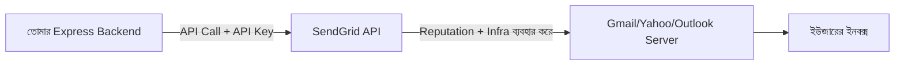
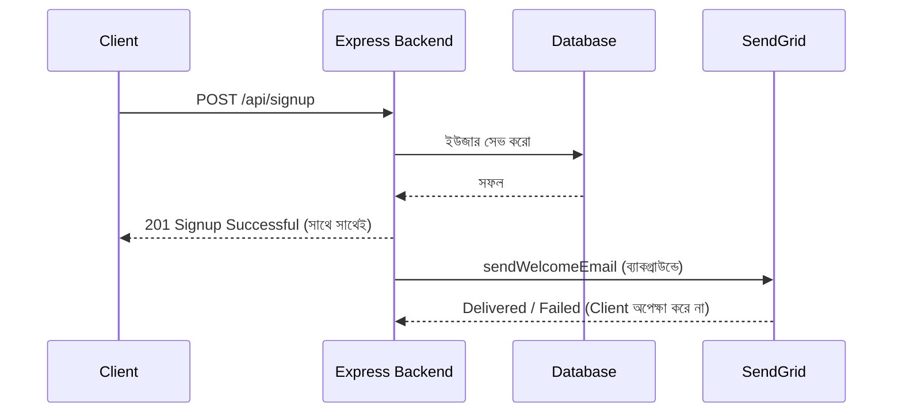

# ০১. Email Integration with SendGrid

এতদিন আমরা যা কিছু বানিয়েছি — Module 4-এ Express দিয়ে API, Module 12-তে JWT দিয়ে অথেনটিকেশন, Module 15-16-এ ডেটাবেজ — সবকিছুই ছিলো আমাদের নিজের সিস্টেমের ভেতরে বন্দি। ইউজার সাইনআপ করলো, ডেটাবেজে সেভ হলো, JWT টোকেন ফেরত গেলো — সব কিছু আমাদের কন্ট্রোলে। কিন্তু বাস্তব একটা প্রোডাক্টে ইউজার সাইনআপ করার পর তুমি কি তাকে "ওয়েলকাম ইমেইল" পাঠাবে না? পাসওয়ার্ড ভুলে গেলে "রিসেট লিংক" পাঠাবে না? অর্ডার কনফার্ম হলে "রিসিট" পাঠাবে না? এই কাজগুলো আমাদের নিজের সার্ভার একা করতে পারে না — কারণ ইমেইল পাঠানো আসলে একটা সম্পূর্ণ আলাদা অবকাঠামো (ইমেইল সার্ভার, স্প্যাম ফিল্টার এড়ানো, ডেলিভারি নিশ্চিত করা) দাবি করে, যেটা নিজে বানানো একটা প্রায়-অসম্ভব কাজ। এখান থেকেই শুরু হয় আমাদের এই নতুন মডিউলের গল্প — **থার্ড পার্টি ইন্টিগ্রেশন**, মানে অন্য কোম্পানির বানানো বিশেষায়িত সার্ভিসকে নিজের ব্যাকএন্ডের ভেতর থেকে ব্যবহার করা।

ধরো তুমি একটা রেস্টুরেন্ট খুলেছো। রান্নাঘর, বসার জায়গা — সব তুমি নিজে বানাচ্ছো। কিন্তু খাবার ডেলিভারি করার জন্য তুমি কি নিজের ডেলিভারি ফ্লিট বানাবে, নাকি Pathao/Foodpanda-র মতো এক্সপার্ট সার্ভিস ব্যবহার করবে? বেশিরভাগ ক্ষেত্রে দ্বিতীয়টাই বুদ্ধিমানের কাজ — কারণ ডেলিভারি তাদের মূল বিশেষত্ব, তোমার না। ঠিক একইভাবে, ইমেইল ডেলিভারি করাটাও একটা বিশাল বিশেষায়িত সমস্যা — Gmail, Yahoo, Outlook প্রতিটা স্প্যাম চেনার জন্য জটিল অ্যালগরিদম চালায়, আর কোনো নতুন সার্ভার থেকে ইমেইল পাঠালে সেটা সহজেই স্প্যাম ফোল্ডারে চলে যায়। **SendGrid** নামের কোম্পানিটা ঠিক এই সমস্যার সমাধান — তারা বছরের পর বছর ধরে "ভালো রেপুটেশন" তৈরি করেছে মেইল সার্ভারগুলোর কাছে, আর সেই রেপুটেশনটা তারা তোমাকে ভাড়া দেয় একটা API-এর মাধ্যমে।



এই ছবিটা লক্ষ্য করো — তোমার সার্ভার সরাসরি ইউজারের ইনবক্সে কিছু পাঠাচ্ছে না, বরং SendGrid-কে একটা "রিকোয়েস্ট" পাঠাচ্ছে, আর SendGrid নিজের ইনফ্রাস্ট্রাকচার দিয়ে সেটা পৌঁছে দিচ্ছে। এই প্যাটার্নটাই আমরা এই পুরো মডিউল জুড়ে বারবার দেখবো — নিজের ব্যাকএন্ড একটা "অর্কেস্ট্রেটর" হয়ে যায়, যে বিভিন্ন এক্সপার্ট সার্ভিসকে নির্দেশ দেয়।

শুরু করা যাক হাতে-কলমে। প্রথমে SendGrid-এ একটা অ্যাকাউন্ট খুলতে হবে (ফ্রি টায়ার আছে), এরপর তাদের ড্যাশবোর্ড থেকে একটা **API Key** জেনারেট করতে হবে। এই API Key আসলে একটা গোপন পাসওয়ার্ডের মতো — এটা দিয়ে SendGrid বুঝবে "এই রিকোয়েস্টটা কার পক্ষ থেকে আসছে, আর এই অ্যাকাউন্টের বিলে চার্জ করবে।" এখানেই প্রথম গুরুত্বপূর্ণ নিয়ম — **এই API Key কখনো তোমার কোডের ভেতরে সরাসরি লিখবে না**। কেন? কারণ কোড যদি GitHub-এ পাবলিক হয়ে যায় (ভুলে বা ইচ্ছাকৃতভাবে), তাহলে যে কেউ তোমার API Key ব্যবহার করে তোমার নামে ইমেইল পাঠাতে পারবে, তোমার বিল বাড়িয়ে দিতে পারবে। এই সমস্যা এড়ানোর জন্য আমরা ব্যবহার করবো **environment variables** — `.env` নামের একটা ফাইলে গোপন তথ্য রাখা, যেটা `.gitignore`-এ যোগ করা থাকে, ফলে সেটা কখনো GitHub-এ যায় না।

```bash
npm install @sendgrid/mail dotenv
```

`.env` ফাইলে লেখো:

```
SENDGRID_API_KEY=SG.xxxxxxxxxxxxxxxxxxxxxxxx
FROM_EMAIL=noreply@yourapp.com
```

এবার আমাদের Express অ্যাপে একটা ইমেইল সার্ভিস ফাইল বানাই, `services/emailService.js`:

```js
require('dotenv').config();
const sgMail = require('@sendgrid/mail');

sgMail.setApiKey(process.env.SENDGRID_API_KEY);

async function sendWelcomeEmail(toEmail, userName) {
  const message = {
    to: toEmail,
    from: process.env.FROM_EMAIL,
    subject: 'স্বাগতম আমাদের প্ল্যাটফর্মে!',
    text: `হ্যালো ${userName}, তোমার অ্যাকাউন্ট সফলভাবে তৈরি হয়েছে।`,
    html: `<strong>হ্যালো ${userName}</strong>, তোমার অ্যাকাউন্ট সফলভাবে তৈরি হয়েছে।`,
  };

  try {
    await sgMail.send(message);
    console.log(`Welcome email sent to ${toEmail}`);
  } catch (error) {
    console.error('SendGrid error:', error.response?.body || error.message);
    throw error;
  }
}

module.exports = { sendWelcomeEmail };
```

এই কোডটা লাইন ধরে দেখি। `sgMail.setApiKey(...)` — এটা লাইব্রেরিকে বলে দিচ্ছে কোন অ্যাকাউন্ট দিয়ে কাজ করতে হবে। এরপর `sendWelcomeEmail` একটা `async` ফাংশন — মনে আছে Module 5-এ আমরা শিখেছিলাম async/await কেন দরকার? কারণ ইমেইল পাঠানো একটা নেটওয়ার্ক কল, যেটা সম্পূর্ণ হতে কিছুটা সময় লাগে, আর সেই সময়টায় আমাদের সার্ভার অন্য কোনো ইউজারের রিকোয়েস্ট আটকে রাখবে না — এটাই Node.js-এর non-blocking স্বভাব, যা আমরা আগেই দেখেছি।

`try/catch` ব্লকটা এখানে অপরিহার্য, কারণ SendGrid-এর সার্ভার ডাউন থাকতে পারে, অথবা API Key ভুল হতে পারে, অথবা রিসিভারের ইমেইল ঠিকানা অবৈধ হতে পারে — এই সব পরিস্থিতিতে আমাদের সার্ভার যেন ক্র্যাশ না করে, বরং সুন্দরভাবে এরর হ্যান্ডল করে, সেই নিশ্চয়তা `try/catch` দেয়।

এবার এটাকে আমাদের সাইনআপ রাউটে ব্যবহার করি:

```js
const { sendWelcomeEmail } = require('../services/emailService');

app.post('/api/signup', async (req, res) => {
  const { name, email, password } = req.body;

  // ধরে নিচ্ছি ইউজার ডেটাবেজে সেভ হয়ে গেছে (Module 15-16 থেকে যা শিখেছি)
  const newUser = await saveUserToDatabase(name, email, password);

  // ইমেইল পাঠানো — কিন্তু এটা ব্যর্থ হলেও যেন সাইনআপ ব্যর্থ না হয়
  sendWelcomeEmail(email, name).catch((err) => {
    console.error('Welcome email failed, but signup succeeded:', err.message);
  });

  res.status(201).json({ message: 'Signup successful', user: newUser });
});
```

এখানে একটা গুরুত্বপূর্ণ ডিজাইন সিদ্ধান্ত লক্ষ্য করো — আমরা `await sendWelcomeEmail(...)` না লিখে ইচ্ছাকৃতভাবে `.catch()` দিয়ে আলাদা রেখেছি। কেন? কারণ ইমেইল পাঠানো ব্যর্থ হলেও ইউজারের সাইনআপ ব্যর্থ হওয়া উচিত না — ইউজার তো ঠিকভাবে অ্যাকাউন্ট বানিয়েছে, শুধু ওয়েলকাম মেইলটা হয়তো একটু দেরিতে যাবে বা যাবে না। এই ধরনের সিদ্ধান্তকে বলে "graceful degradation" — মূল কাজ (সাইনআপ) সবসময় প্রাধান্য পাবে, পার্শ্ব-কাজ (ইমেইল পাঠানো) ব্যর্থ হলেও যেন পুরো সিস্টেম না ভাঙে।



আরেকটা বাস্তব বিষয় — ট্রানজ্যাকশনাল ইমেইল (যেমন পাসওয়ার্ড রিসেট) পাঠানোর সময় HTML টেমপ্লেট হার্ডকোড না করে SendGrid-এর **Dynamic Templates** ফিচার ব্যবহার করলে ভালো, যেখানে ডিজাইন তাদের ড্যাশবোর্ডে বানানো থাকে আর কোড শুধু ডেটা পাঠায়:

```js
async function sendPasswordResetEmail(toEmail, resetLink) {
  const message = {
    to: toEmail,
    from: process.env.FROM_EMAIL,
    templateId: 'd-xxxxxxxxxxxxxxxxxxxx',
    dynamicTemplateData: { resetLink },
  };
  await sgMail.send(message);
}
```

এভাবে ডিজাইনার/মার্কেটিং টিম ইমেইলের চেহারা বদলাতে পারে কোড না ছুঁয়েই — এটা বড় টিমে কাজ ভাগাভাগির একটা সুন্দর উদাহরণ।

সবশেষে, প্রোডাকশন সিস্টেমে একটা লগ রাখা জরুরি যে কোন ইমেইল পাঠানো হয়েছে, কখন, সফল হয়েছে কিনা — এটা Module 32 (Logging and Observability)-এ যা শিখেছি তারই বাস্তব প্রয়োগ। আপাতত আমরা `console.log`/`console.error` দিয়ে সহজভাবে দেখালাম, কিন্তু বাস্তব প্রোডাকশনে Winston-এর মতো লগারের সাথে এটা যুক্ত করবে।

ইমেইল তো গেলো টেক্সট আর HTML-এর মাধ্যমে। কিন্তু কিছু বার্তা এমন জরুরি যে ইমেইলও যথেষ্ট না — যেমন OTP কোড, যেটা ইউজার সাথে সাথে দেখা দরকার। সেজন্য পরের লেসনে আমরা দেখবো কীভাবে **Twilio** ব্যবহার করে সরাসরি মোবাইলে SMS পাঠানো যায়।
