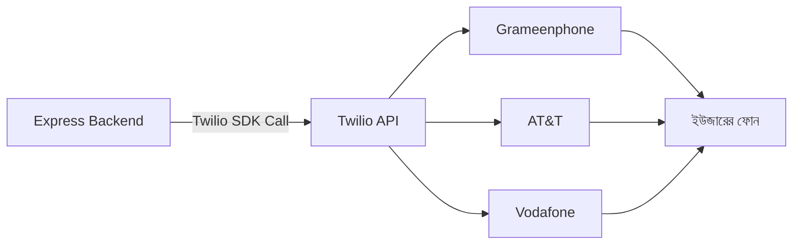
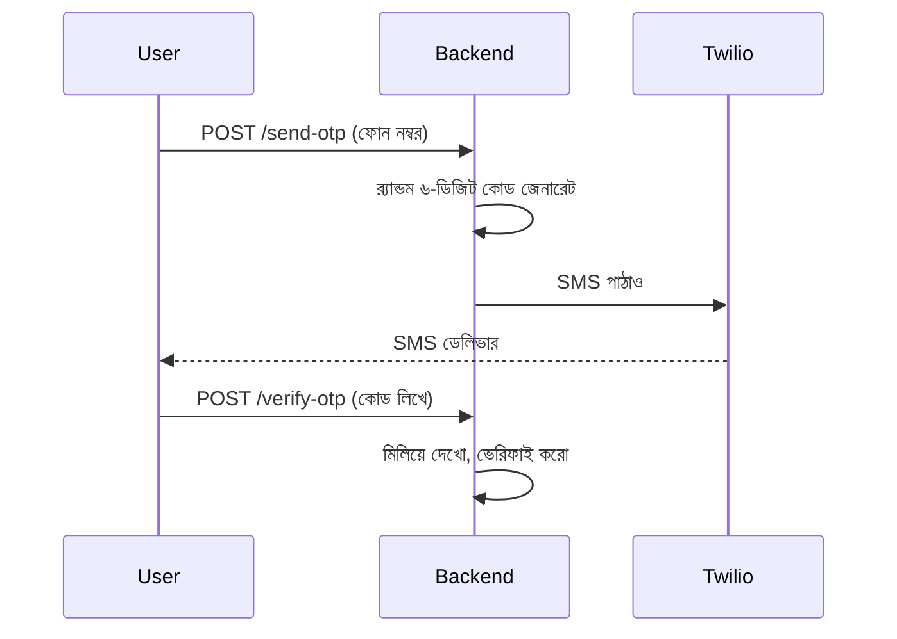

# ০২. SMS Integration with Twilio

আগের লেসনে আমরা SendGrid দিয়ে ইমেইল পাঠানো শিখেছি, আর দেখেছি কীভাবে একটা এক্সপার্ট থার্ড-পার্টি সার্ভিসকে "ভাড়া" করে নিজের ব্যাকএন্ডের কাজ সহজ করা যায়। কিন্তু ইমেইলের একটা সীমাবদ্ধতা আছে — মানুষ সবসময় ইমেইল চেক করে না। কেউ সাইনআপ করার পর ওটিপি (OTP) ভেরিফিকেশনের জন্য যদি তাকে ইমেইল চেক করতে বলো, সে হয়তো ৫ মিনিট পর দেখবে, বা স্প্যাম ফোল্ডারে চলে যাবে বলে দেখবেই না। কিন্তু মোবাইলে একটা SMS এলে সেটা মানুষ প্রায় সাথে সাথেই দেখে। এই তাৎক্ষণিকতার কারণেই OTP ভেরিফিকেশন, জরুরি এলার্ট, ডেলিভারি আপডেটের মতো কাজে SMS আজও সবচেয়ে নির্ভরযোগ্য মাধ্যম।

কিন্তু SMS পাঠানো ইমেইলের চেয়েও জটিল একটা সমস্যা, কারণ এখানে জড়িত আছে বিশ্বের শত শত মোবাইল অপারেটর (Grameenphone, Robi, AT&T, Vodafone...) — প্রত্যেকের নিজস্ব নেটওয়ার্ক, নিজস্ব প্রোটোকল। তোমার একার পক্ষে এতগুলো অপারেটরের সাথে সরাসরি চুক্তি করে SMS পাঠানোর ব্যবস্থা করা প্রায় অসম্ভব। **Twilio** ঠিক এই জটিলতাটা লুকিয়ে রাখে — তুমি শুধু তাদের API-কে "এই নম্বরে এই মেসেজ পাঠাও" বললেই তারা পেছনের সব অপারেটর-সংযোগ সামলে নেয়। এটা অনেকটা Module 3-এ আমরা যেভাবে দেখেছিলাম Node.js-এর `http` মডিউল নেটওয়ার্কের জটিলতা লুকিয়ে একটা সহজ ইন্টারফেস দেয় — Twilio ঠিক তেমনই টেলিকম জগতের জটিলতা লুকিয়ে একটা সহজ API দেয়।



শুরু করার জন্য Twilio-তে অ্যাকাউন্ট খুলে তিনটা জিনিস সংগ্রহ করতে হবে — **Account SID**, **Auth Token**, আর একটা **Twilio Phone Number** (তাদের কাছ থেকে কেনা বা ট্রায়াল নম্বর)। এই তিনটাই সংবেদনশীল তথ্য, তাই আগের লেসনের মতোই `.env` ফাইলে রাখবো।

```bash
npm install twilio
```

```
TWILIO_ACCOUNT_SID=ACxxxxxxxxxxxxxxxxxxxxxxxx
TWILIO_AUTH_TOKEN=xxxxxxxxxxxxxxxxxxxxxxxx
TWILIO_PHONE_NUMBER=+15005550006
```

এবার `services/smsService.js`:

```js
require('dotenv').config();
const twilio = require('twilio');

const client = twilio(
  process.env.TWILIO_ACCOUNT_SID,
  process.env.TWILIO_AUTH_TOKEN
);

async function sendOtp(toPhoneNumber, otpCode) {
  try {
    const message = await client.messages.create({
      body: `তোমার ভেরিফিকেশন কোড: ${otpCode}। এটা কারো সাথে শেয়ার করো না।`,
      from: process.env.TWILIO_PHONE_NUMBER,
      to: toPhoneNumber,
    });
    console.log('SMS sent, SID:', message.sid);
    return message.sid;
  } catch (error) {
    console.error('Twilio error:', error.message);
    throw error;
  }
}

module.exports = { sendOtp };
```

লক্ষ্য করো, `client.messages.create()` একটা প্রমিজ রিটার্ন করে — এটাই সেই প্যাটার্ন যা আমরা SendGrid-এও দেখেছিলাম, আর Module 5-এ async/await শেখার সময়ও দেখেছিলাম। প্রায় সব থার্ড-পার্টি SDK-ই এই একই নিয়মে চলে: একটা নেটওয়ার্ক কল করো, প্রমিজ পাও, `await` দিয়ে ফলাফলের অপেক্ষা করো। একবার এই প্যাটার্নটা বুঝে গেলে, নতুন যেকোনো SDK শেখা অনেক সহজ হয়ে যায় — এই পুরো মডিউলে তুমি এটাই বারবার দেখবে।

এবার OTP ভেরিফিকেশনের পুরো ফ্লোটা বানাই। এখানে একটা গুরুত্বপূর্ণ প্রশ্ন — OTP কোডটা কোথায় রাখবো? সাধারণত সাময়িক তথ্য মেমোরিতে বা Redis-এ রাখা হয়, ডেটাবেজে না, কারণ এটা কয়েক মিনিট পরই অপ্রয়োজনীয় হয়ে যায়:

```js
const otpStore = new Map(); // বাস্তব প্রোডাকশনে Redis ব্যবহার করা উচিত

app.post('/api/send-otp', async (req, res) => {
  const { phoneNumber } = req.body;
  const otpCode = Math.floor(100000 + Math.random() * 900000).toString();

  otpStore.set(phoneNumber, { otpCode, expiresAt: Date.now() + 5 * 60 * 1000 });

  try {
    await sendOtp(phoneNumber, otpCode);
    res.json({ message: 'OTP পাঠানো হয়েছে' });
  } catch (error) {
    res.status(502).json({ error: 'SMS পাঠাতে ব্যর্থ, একটু পর আবার চেষ্টা করো' });
  }
});

app.post('/api/verify-otp', (req, res) => {
  const { phoneNumber, otpCode } = req.body;
  const record = otpStore.get(phoneNumber);

  if (!record || record.expiresAt < Date.now()) {
    return res.status(400).json({ error: 'OTP মেয়াদোত্তীর্ণ, নতুন করে চেষ্টা করো' });
  }
  if (record.otpCode !== otpCode) {
    return res.status(400).json({ error: 'ভুল OTP' });
  }

  otpStore.delete(phoneNumber);
  res.json({ verified: true });
});
```

লক্ষ্য করো `res.status(502)` ব্যবহার করেছি — Module 6 (Status Codes)-এ আমরা শিখেছিলাম প্রতিটা স্ট্যাটাস কোডের নির্দিষ্ট অর্থ আছে। ৫০২ মানে "Bad Gateway" — অর্থাৎ আমাদের সার্ভার ঠিক আছে, কিন্তু যে বাইরের সার্ভিসের (Twilio) উপর আমরা নির্ভর করছিলাম, সেটা সাড়া দেয়নি। এই সূক্ষ্ম পার্থক্যটা ফ্রন্টএন্ড ডেভেলপারকে বুঝতে সাহায্য করে সমস্যাটা কোথায় — আমাদের সার্ভার না, বাইরের সিস্টেম।



একটা বাস্তব সতর্কতা — Twilio-র মতো SMS সার্ভিস প্রতিটা মেসেজের জন্য চার্জ করে, তাই কেউ যদি একই নম্বরে বারবার OTP রিকোয়েস্ট পাঠাতে থাকে (rate limiting ছাড়া), তোমার বিল আকাশছোঁয়া হয়ে যেতে পারে। এখানেই Module 7-এ শেখা **rate limiting middleware**-এর গুরুত্ব বোঝা যায় — একই নম্বরে মিনিটে একবারের বেশি OTP পাঠানো আটকে দেওয়া উচিত, আর Module 30-এ শেখা API সিকিউরিটির নীতিগুলো এখানে সরাসরি কাজে লাগে।

SMS দিয়ে টেক্সট মেসেজ তো পাঠানো গেলো, কিন্তু আজকাল ব্যবসাগুলো আরও সমৃদ্ধ যোগাযোগ চায় — ছবি, বাটন, টেমপ্লেট মেসেজ, রিড রিসিট। পরের লেসনে আমরা দেখবো কীভাবে **WhatsApp Business API** ব্যবহার করে এই ধরনের সমৃদ্ধ কথোপকথন তৈরি করা যায়।
