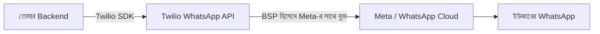
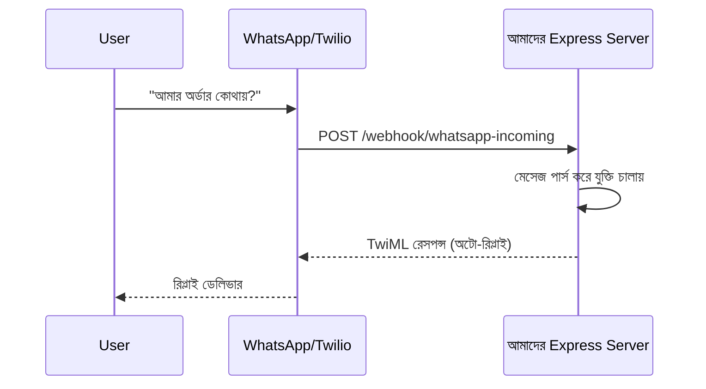

# ০৩. WhatsApp Business API Integration

আগের লেসনে আমরা Twilio দিয়ে সাধারণ SMS পাঠানো শিখেছি — প্লেইন টেক্সট, একমুখী বার্তা। কিন্তু বাংলাদেশ, ভারতসহ বিশ্বের অনেক দেশে মানুষের প্রথম পছন্দ SMS নয়, **WhatsApp**। এখানে শুধু টেক্সট না, ছবি পাঠানো যায়, বাটন থাকে ("অর্ডার কনফার্ম করুন"), রিড রিসিট দেখা যায় (নীল টিক), এমনকি পুরো একটা কাস্টমার সাপোর্ট কথোপকথন চালানো যায়। ব্যবসার দৃষ্টিকোণ থেকে এটা SMS-এর চেয়ে অনেক বেশি সমৃদ্ধ যোগাযোগ মাধ্যম, তাই বড় প্ল্যাটফর্মগুলো (Uber, Booking.com) WhatsApp ইন্টিগ্রেশন ব্যবহার করে অর্ডার আপডেট, বুকিং কনফার্মেশন পাঠাতে।

মজার ব্যাপার হলো, **WhatsApp Business API** নিজে থেকে সরাসরি ব্যবহার করা কিছুটা জটিল — Meta (WhatsApp-এর মালিক প্রতিষ্ঠান) সরাসরি ছোট ডেভেলপারদের সাথে কাজ করে না, বরং **Business Solution Provider (BSP)** নামের মধ্যস্থতাকারীদের মাধ্যমে অ্যাক্সেস দেয়। মজার ব্যাপার, Twilio নিজেই একটা BSP হিসেবে কাজ করে, তাই আগের লেসনে যে SDK আমরা শিখেছি, সেটাই এখানেও ব্যবহার করা যায় — এটাই থার্ড-পার্টি ইন্টিগ্রেশনের একটা সুন্দর দিক, একবার একটা SDK-র প্যাটার্ন শিখে ফেললে, একই SDK দিয়ে একাধিক চ্যানেল চালানো যায়।



শুরু করার জন্য Twilio Console-এ গিয়ে WhatsApp Sandbox চালু করতে হয় (টেস্টিং-এর জন্য), যেখানে একটা নির্দিষ্ট কোড টাইপ করে নিজের WhatsApp নম্বর সংযুক্ত (opt-in) করতে হয় — এটা একটা গুরুত্বপূর্ণ নিয়ম, কারণ WhatsApp চায় ইউজার নিজে থেকে সম্মতি না দিলে কোনো ব্যবসা তাকে মেসেজ পাঠাতে না পারুক, যাতে স্প্যাম কমে।

```js
// services/whatsappService.js
require('dotenv').config();
const twilio = require('twilio');

const client = twilio(
  process.env.TWILIO_ACCOUNT_SID,
  process.env.TWILIO_AUTH_TOKEN
);

async function sendOrderConfirmation(toWhatsAppNumber, orderId, amount) {
  const message = await client.messages.create({
    from: `whatsapp:${process.env.TWILIO_WHATSAPP_NUMBER}`,
    to: `whatsapp:${toWhatsAppNumber}`,
    body: `তোমার অর্ডার #${orderId} কনফার্ম হয়েছে। মোট: ৳${amount}। ধন্যবাদ!`,
  });
  return message.sid;
}

module.exports = { sendOrderConfirmation };
```

লক্ষ্য করো `from` আর `to`-র সামনে `whatsapp:` প্রিফিক্স — এটা দিয়ে Twilio বুঝতে পারে এটা সাধারণ SMS না, বরং WhatsApp চ্যানেলের বার্তা। বাকি কোড কাঠামো প্রায় হুবহু আগের লেসনের মতোই, কারণ ভেতরে ভেতরে এটা একই `messages.create()` API, শুধু চ্যানেলের নাম বদলে গেছে — এটাই ভালো SDK ডিজাইনের একটা উদাহরণ, একই প্যাটার্নে একাধিক চ্যানেল সাপোর্ট করা।

এখন আসা যাক একটা নতুন ধারণায়, যা SMS-এ ছিলো না — **ইনকামিং মেসেজ**। ইউজার যদি তোমার ব্যবসায়িক WhatsApp নম্বরে রিপ্লাই দেয় ("আমার অর্ডার কোথায়?"), সেই বার্তাটা তোমার সার্ভারে কীভাবে আসবে? উত্তর হলো **webhook** — একটা URL যেটা তুমি Twilio-কে বলে রাখো, "কেউ মেসেজ পাঠালে এই ঠিকানায় জানিও।"

```js
const express = require('express');
const app = express();
app.use(express.urlencoded({ extended: false }));

app.post('/webhook/whatsapp-incoming', (req, res) => {
  const incomingMessage = req.body.Body;
  const fromNumber = req.body.From;

  console.log(`${fromNumber} লিখেছে: ${incomingMessage}`);

  // সাধারণ অটো-রিপ্লাই লজিক
  const { MessagingResponse } = require('twilio').twiml;
  const twiml = new MessagingResponse();

  if (incomingMessage.toLowerCase().includes('order')) {
    twiml.message('তোমার সাম্প্রতিক অর্ডারের স্ট্যাটাস দেখতে ভিজিট করো: yourapp.com/orders');
  } else {
    twiml.message('ধন্যবাদ! আমাদের একজন প্রতিনিধি শীঘ্রই যোগাযোগ করবেন।');
  }

  res.type('text/xml').send(twiml.toString());
});
```

এই কোডটা আমাদের জন্য একটা নতুন ধারণা নিয়ে আসে — **webhook হলো এক ধরনের "উল্টো API কল"**। এতদিন আমরা যা শিখেছি তাতে আমাদের ব্যাকএন্ড সবসময় থার্ড-পার্টি সার্ভিসকে কল করতো (আমরা Twilio-কে কল করি)। কিন্তু webhook-এ সম্পর্কটা উল্টে যায় — এখন Twilio আমাদের সার্ভারকে কল করছে, কারণ কিছু একটা ঘটেছে (ইউজার রিপ্লাই দিয়েছে) যা শুধু তারাই জানে।



webhook নিরাপদ রাখা জরুরি, কারণ এই URL টা পাবলিকভাবে ইন্টারনেটে উন্মুক্ত থাকে। Twilio প্রতিটা webhook রিকোয়েস্টে একটা সিগনেচার হেডার (`X-Twilio-Signature`) পাঠায়, যেটা যাচাই করে নিশ্চিত হওয়া যায় রিকোয়েস্টটা সত্যিই Twilio থেকে এসেছে, অন্য কেউ ভুয়া রিকোয়েস্ট পাঠাচ্ছে না — এটা ঠিক সেই একই নিরাপত্তা-চিন্তা যা আমরা Module 30-এ API সিকিউরিটি নিয়ে আলোচনা করার সময় দেখেছিলাম।

এখন পর্যন্ত আমরা যোগাযোগ-ভিত্তিক ইন্টিগ্রেশন (ইমেইল, SMS, WhatsApp) দেখলাম। কিন্তু একটা ব্যবসার শুধু কাস্টমারের সাথে যোগাযোগ করাই যথেষ্ট না — তাদের তথ্যও সুশৃঙ্খলভাবে সংরক্ষণ করতে হয়, সেলস টিমকে সাহায্য করতে হয়। পরের লেসনে আমরা ঢুকবো **CRM (Customer Relationship Management)** জগতে, Salesforce API দিয়ে।
