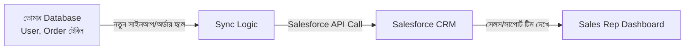
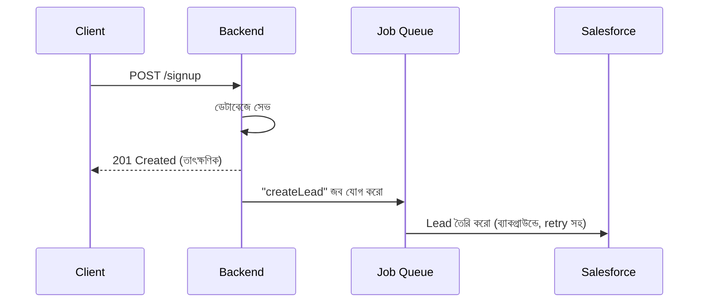

# ০৪. CRM Integration with Salesforce API

আগের তিনটা লেসনে আমরা দেখলাম কীভাবে ইউজারের সাথে যোগাযোগ করা যায় — ইমেইল, SMS, WhatsApp। কিন্তু একটা প্রশ্ন থেকেই যাচ্ছে — এই ইউজারদের তথ্য, তাদের সাথে কথোপকথনের ইতিহাস, তারা কোন পর্যায়ে আছে (নতুন লিড? পেইড কাস্টমার? চলে যাচ্ছে?) — এসব কে ট্র্যাক করবে? তোমার নিজের ডেটাবেজে ইউজার টেবিল আছে ঠিকই (Module 15-16), কিন্তু সেলস টিম, সাপোর্ট টিম চায় আরও রিচ একটা ভিউ — কে কবে কল করেছিলো, কোন ডিল কত টাকার, পরবর্তী ফলো-আপ কবে। এই সবকিছু ম্যানেজ করার জন্য বিশেষায়িত সফটওয়্যার লাগে, যাকে বলে **CRM (Customer Relationship Management)**, আর এই জগতের সবচেয়ে বড় নাম **Salesforce**।

এখানে একটা গুরুত্বপূর্ণ ধারণাগত পার্থক্য বুঝে নেওয়া দরকার। SendGrid বা Twilio ছিলো "অ্যাকশন সার্ভিস" — তুমি একটা কমান্ড দিলে, তারা কিছু একটা করে দেয় (মেইল পাঠায়, SMS পাঠায়)। Salesforce অনেকটা ভিন্ন — এটা একটা **সিস্টেম অফ রেকর্ড**, মানে এটা নিজেই একটা ডেটাবেজের মতো, যেখানে কাস্টমার/লিড/ডিলের তথ্য জমা থাকে, আর তোমার ব্যাকএন্ডের কাজ হলো নিজের সিস্টেমের ডেটার সাথে Salesforce-এর ডেটা সিঙ্ক্রোনাইজড রাখা। এটাকে এভাবে ভাবতে পারো — তোমার নিজের ডেটাবেজ হলো "প্রোডাক্টের সত্য" (কে লগইন করতে পারবে, কার কী পারমিশন), আর Salesforce হলো "ব্যবসার সত্য" (কে গুরুত্বপূর্ণ কাস্টমার, কার সাথে কবে দেখা করতে হবে) — দুটো আলাদা উদ্দেশ্যে দুটো আলাদা ডেটাবেজ, কিন্তু তাদের মধ্যে তথ্য প্রবাহিত হতে হয়।



Salesforce-এর সাথে কানেক্ট হওয়া SendGrid বা Twilio-র চেয়ে একটু জটিল, কারণ এখানে সাধারণ API Key যথেষ্ট না — এখানে ব্যবহার হয় **OAuth 2.0**, যেটা নিয়ে আমরা Module 29-এ টোকেন-ভিত্তিক অথেনটিকেশনের প্রসঙ্গে আলোচনা করেছিলাম। ধারণাটা একই — একটা ক্লায়েন্ট আইডি আর সিক্রেট ব্যবহার করে একটা এক্সেস টোকেন সংগ্রহ করতে হয়, যেটা দিয়ে পরবর্তী সব রিকোয়েস্ট অথরাইজড হয়।

```bash
npm install jsforce dotenv
```

`jsforce` হলো Node.js-এর জন্য জনপ্রিয় একটা Salesforce লাইব্রেরি, যেটা OAuth ফ্লো আর ডেটা অপারেশন — দুটোই সহজ করে দেয়।

```
SALESFORCE_USERNAME=you@yourcompany.com
SALESFORCE_PASSWORD=yourpassword
SALESFORCE_SECURITY_TOKEN=xxxxxxxxxxxxxxxxx
```

```js
// services/crmService.js
require('dotenv').config();
const jsforce = require('jsforce');

const conn = new jsforce.Connection({
  loginUrl: 'https://login.salesforce.com',
});

async function connectToSalesforce() {
  await conn.login(
    process.env.SALESFORCE_USERNAME,
    process.env.SALESFORCE_PASSWORD + process.env.SALESFORCE_SECURITY_TOKEN
  );
  console.log('Salesforce-এ কানেক্ট হয়েছে');
}

async function createLead(name, email, company) {
  const result = await conn.sobject('Lead').create({
    LastName: name,
    Email: email,
    Company: company,
    LeadSource: 'Website Signup',
  });

  if (!result.success) {
    throw new Error('Salesforce lead তৈরি ব্যর্থ হয়েছে');
  }
  return result.id;
}

module.exports = { connectToSalesforce, createLead };
```

এখানে `conn.sobject('Lead').create({...})` লাইনটা লক্ষ্য করার মতো। Salesforce-এর ডেটা মডেল "sObject" নামে পরিচিত অবজেক্টে সংগঠিত — `Lead`, `Contact`, `Opportunity` এই রকম নির্দিষ্ট নামের অবজেক্ট আছে, প্রতিটার নিজস্ব ফিল্ড সেট। এটা অনেকটা আমাদের নিজের ডেটাবেজের টেবিলের মতোই ভাবতে পারো — শুধু পার্থক্য হলো এই "টেবিল"গুলো Salesforce নিজেই ডিফাইন করে রেখেছে, তুমি সরাসরি স্কিমা বদলাতে পারো না (কাস্টম ফিল্ড অবশ্য যোগ করা যায়)।

এবার এটাকে আমাদের সাইনআপ ফ্লোতে যুক্ত করি, ঠিক যেভাবে আগে ইমেইল যুক্ত করেছিলাম:

```js
app.post('/api/signup', async (req, res) => {
  const { name, email, company } = req.body;
  const newUser = await saveUserToDatabase(name, email);

  createLead(name, email, company || 'Individual')
    .then((leadId) => console.log('Salesforce lead created:', leadId))
    .catch((err) => console.error('CRM sync failed:', err.message));

  res.status(201).json({ user: newUser });
});
```

এখানেও আমরা আগের লেসনের মতোই `.catch()` প্যাটার্ন ব্যবহার করেছি — CRM সিঙ্ক ব্যর্থ হলেও সাইনআপ যেন ব্যর্থ না হয়। বাস্তব প্রোডাকশন সিস্টেমে অবশ্য এই ধরনের সিঙ্ক সাধারণত সরাসরি রিকোয়েস্টের ভেতরে না করে একটা আলাদা **queue** (যেমন BullMQ বা RabbitMQ) ব্যবহার করা হয়, যাতে Salesforce ধীরগতির হলেও আমাদের মূল API দ্রুত সাড়া দিতে পারে, আর ব্যর্থ হলে পরে আবার চেষ্টা (retry) করা যায়।



এই queue-ভিত্তিক প্যাটার্নটা মনে রাখা ভালো, কারণ এই মডিউলের পরের বেশ কয়েকটা লেসনেও (Mailchimp, HubSpot) আমরা একই ধরনের "বাইরের সিস্টেমের সাথে সিঙ্ক" সমস্যার মুখোমুখি হবো, আর প্রতিবারই মূল নীতি একই থাকবে — বাইরের সার্ভিসের ধীরগতি বা ব্যর্থতা যেন আমাদের মূল প্রোডাক্টের গতি বা নির্ভরযোগ্যতা নষ্ট না করে।

কাস্টমারের তথ্য তো CRM-এ গেলো, কিন্তু এখনো আমরা টাকার লেনদেন নিয়ে কিছু বলিনি। একটা রিয়েল প্রোডাক্টে সবচেয়ে গুরুত্বপূর্ণ ইন্টিগ্রেশনগুলোর একটা হলো পেমেন্ট প্রসেসিং। পরের লেসনে আমরা ঢুকবো সেই জগতে — **Stripe** দিয়ে পেমেন্ট নেওয়া শিখবো।
