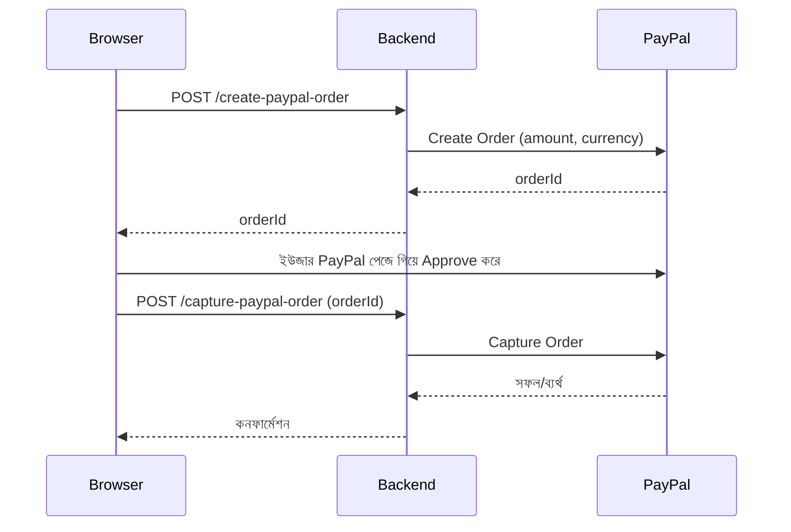

# ০৬. Payment Processing with PayPal

আগের লেসনে আমরা Stripe দিয়ে পেমেন্ট প্রসেসিং শিখেছি, আর সবচেয়ে গুরুত্বপূর্ণ নীতিটা বুঝেছি — কার্ডের কাঁচা তথ্য কখনো নিজের ব্যাকএন্ডে আনা যাবে না। এই একই নীতি **PayPal**-এও সমানভাবে প্রযোজ্য, কারণ PayPal মূলত একটা ভিন্ন ধরনের পেমেন্ট মাধ্যম সমাধান করে — এখানে ইউজার তার কার্ড না দিয়ে সরাসরি তার PayPal অ্যাকাউন্টের ব্যালেন্স বা লিংকড ব্যাংক থেকে টাকা পাঠায়। অনেক দেশে, বিশেষ করে ফ্রিল্যান্স মার্কেটপ্লেসে (মনে করো Module 19-এ যে freelancer platform ERD আমরা দেখেছিলাম), PayPal-ই লেনদেনের প্রধান মাধ্যম, তাই একটা প্রোডাকশন সিস্টেমে প্রায়ই Stripe আর PayPal — দুটোই বিকল্প হিসেবে রাখা হয়।

স্ট্রাকচারালি PayPal-এর ফ্লো Stripe-এর PaymentIntent-এর সাথে দারুণভাবে মেলে, শুধু নামকরণ আর ধাপগুলো একটু ভিন্ন — এখানে প্রথমে একটা **Order** তৈরি করতে হয়, ইউজার PayPal-এ গিয়ে অনুমোদন (approve) দেয়, এরপর ব্যাকএন্ড সেই অর্ডারটা **Capture** করে টাকা প্রকৃতপক্ষে স্থানান্তর করে।



এই ফ্লোতে দুইটা ধাপ (create + capture) থাকার একটা যৌক্তিক কারণ আছে — "Create" ধাপে শুধু বলা হচ্ছে "এই পরিমাণ টাকার একটা লেনদেন হতে যাচ্ছে", কিন্তু আসল টাকা তখনও সরে না। ইউজার যতক্ষণ না নিজে গিয়ে PayPal-এ লগইন করে অনুমোদন দিচ্ছে, ততক্ষণ কিছুই ঘটে না। এটা অনেকটা Module 12 (JWT)-এ আমরা যেমন দেখেছিলাম "কোনো কাজ করার আগে অথরাইজেশন যাচাই করা দরকার" — এখানেও PayPal নিশ্চিত করে যে টাকা সরানোর আগে প্রকৃত মালিকের সম্মতি নেওয়া হয়েছে।

```bash
npm install @paypal/checkout-server-sdk
```

```
PAYPAL_CLIENT_ID=xxxxxxxxxxxxxxxxxxxxxxxx
PAYPAL_CLIENT_SECRET=xxxxxxxxxxxxxxxxxxxxxxxx
```

```js
// services/paypalService.js
require('dotenv').config();
const paypal = require('@paypal/checkout-server-sdk');

const environment = new paypal.core.SandboxEnvironment(
  process.env.PAYPAL_CLIENT_ID,
  process.env.PAYPAL_CLIENT_SECRET
);
const client = new paypal.core.PayPalHttpClient(environment);

async function createOrder(amount, currency = 'USD') {
  const request = new paypal.orders.OrdersCreateRequest();
  request.prefer('return=representation');
  request.requestBody({
    intent: 'CAPTURE',
    purchase_units: [
      {
        amount: { currency_code: currency, value: amount.toFixed(2) },
      },
    ],
  });

  const order = await client.execute(request);
  return order.result.id;
}

async function captureOrder(orderId) {
  const request = new paypal.orders.OrdersCaptureRequest(orderId);
  request.requestBody({});
  const capture = await client.execute(request);
  return capture.result;
}

module.exports = { createOrder, captureOrder };
```

`SandboxEnvironment` লক্ষ্য করো — PayPal-এর নিজস্ব একটা টেস্টিং পরিবেশ আছে যেখানে আসল টাকা ছাড়াই পুরো ফ্লো টেস্ট করা যায়। প্রোডাকশনে গেলে এটা `LiveEnvironment`-এ বদলাতে হবে। এই "sandbox বনাম production" ধারণাটা প্রায় সব পেমেন্ট আর অনেক থার্ড-পার্টি সার্ভিসেই থাকে (Stripe-এও `sk_test_` বনাম `sk_live_` কী দেখেছিলাম) — সবসময় ডেভেলপমেন্টের সময় sandbox/test মোড ব্যবহার করা উচিত, নাহলে টেস্ট করতে গিয়ে সত্যিকারের টাকা লেনদেন হয়ে যেতে পারে।

Express রাউট দুটো:

```js
app.post('/api/create-paypal-order', async (req, res) => {
  try {
    const orderId = await createOrder(req.body.amount);
    res.json({ orderId });
  } catch (error) {
    console.error('PayPal create order error:', error.message);
    res.status(502).json({ error: 'PayPal অর্ডার তৈরি করা যায়নি' });
  }
});

app.post('/api/capture-paypal-order', async (req, res) => {
  const { orderId } = req.body;
  try {
    const captureResult = await captureOrder(orderId);
    if (captureResult.status === 'COMPLETED') {
      // ডেটাবেজে অর্ডার সম্পন্ন হিসেবে চিহ্নিত করো
      res.json({ status: 'success', details: captureResult });
    } else {
      res.status(400).json({ status: 'incomplete', details: captureResult });
    }
  } catch (error) {
    console.error('PayPal capture error:', error.message);
    res.status(502).json({ error: 'পেমেন্ট ক্যাপচার ব্যর্থ' });
  }
});
```

এখন একটা গুরুত্বপূর্ণ প্রশ্ন — যদি Stripe আর PayPal দুটোই সাপোর্ট করতে হয়, তাহলে কি পুরো কোড দুইবার লিখতে হবে? বাস্তব প্রোডাকশন সিস্টেমে এই সমস্যার সমাধান করা হয় একটা **abstraction layer** দিয়ে — Module 22-এ আমরা যে ডিজাইন প্যাটার্ন শিখেছিলাম (Strategy Pattern), সেটা এখানে দারুণভাবে কাজে লাগে:

```js
// paymentGateway.js — Strategy Pattern-এর প্রয়োগ
const stripeService = require('./paymentService');
const paypalService = require('./paypalService');

function getPaymentGateway(gatewayName) {
  if (gatewayName === 'stripe') return stripeService;
  if (gatewayName === 'paypal') return paypalService;
  throw new Error('অজানা পেমেন্ট গেটওয়ে');
}

module.exports = { getPaymentGateway };
```

এভাবে বাকি কোড শুধু `getPaymentGateway(userChoice)` কল করে, নির্দিষ্ট গেটওয়ের নাম না জেনেই কাজ চালিয়ে যেতে পারে — এটাই Strategy Pattern-এর মূল শক্তি, যা আমরা Module 22-এ তাত্ত্বিকভাবে শিখেছিলাম, আর এখানে বাস্তব প্রয়োগ দেখছি।

দুটো পেমেন্ট গেটওয়েতেই আমরা লক্ষ্য করেছি একটা কমন প্যাটার্ন — বাইরের সার্ভিস কল করো, প্রমিজ পাও, এরর হ্যান্ডল করো, আর সংবেদনশীল কী `.env`-এ রাখো। ইমেইল মার্কেটিং জগতেও এই একই প্যাটার্ন প্রযোজ্য, শুধু উদ্দেশ্যটা ভিন্ন — এবার আমরা এককালীন ইমেইলের বদলে বড় স্কেলে **ইমেইল মার্কেটিং ক্যাম্পেইন** চালানো শিখবো, Mailchimp দিয়ে।
