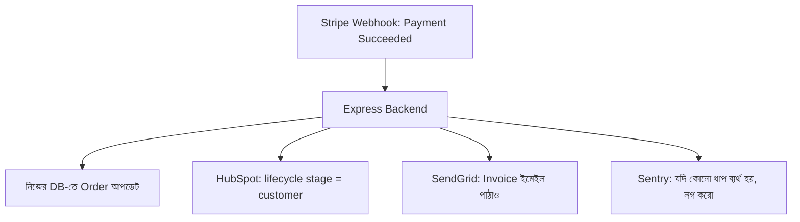

# ০৮. HubSpot CRM Integration

আমরা আগে Salesforce (লেসন ৪) দেখেছি ভারী, এন্টারপ্রাইজ-গ্রেড CRM হিসেবে, আর Mailchimp (লেসন ৭) দেখেছি ইমেইল-মার্কেটিং-কেন্দ্রিক টুল হিসেবে। **HubSpot** এই দুইয়ের মাঝামাঝি একটা চমৎকার জায়গায় দাঁড়িয়ে আছে — এটা একইসাথে CRM, মার্কেটিং, আর সেলস প্ল্যাটফর্ম, আর ছোট-মাঝারি কোম্পানির কাছে এটা খুব জনপ্রিয় কারণ এর ফ্রি টায়ার আছে এবং API তুলনামূলক সহজবোধ্য। এই লেসনে আমরা HubSpot ইন্টিগ্রেট করবো, আর পাশাপাশি লক্ষ্য করবো Salesforce-এর সাথে এর ধারণাগত মিল — কারণ দুটোই মূলত "Contact/Lead/Deal" নামের অবজেক্ট নিয়ে কাজ করে, শুধু API-এর আকার-প্রকার আলাদা।

HubSpot-এর অথেনটিকেশন সিস্টেম Salesforce-এর জটিল OAuth ফ্লোর চেয়ে সহজ — একটা **Private App Token** তৈরি করলেই কাজ চলে (নিজের অ্যাকাউন্টের ভেতরের ব্যবহারের জন্য), যেটা অনেকটা আমরা SendGrid/Twilio-তে যে সাধারণ API Key দেখেছিলাম তার মতোই।

```bash
npm install @hubspot/api-client dotenv
```

```
HUBSPOT_ACCESS_TOKEN=pat-na1-xxxxxxxxxxxxxxxxxxxxxxxx
```

```js
// services/hubspotService.js
require('dotenv').config();
const hubspot = require('@hubspot/api-client');

const hubspotClient = new hubspot.Client({
  accessToken: process.env.HUBSPOT_ACCESS_TOKEN,
});

async function createContact(email, firstName, lastName) {
  const contactObj = {
    properties: {
      email,
      firstname: firstName,
      lastname: lastName,
      lifecyclestage: 'lead',
    },
  };

  try {
    const response = await hubspotClient.crm.contacts.basicApi.create(contactObj);
    return response.id;
  } catch (error) {
    if (error.code === 409) {
      console.log('Contact আগে থেকেই HubSpot-এ আছে');
      return null;
    }
    throw error;
  }
}

module.exports = { createContact };
```

এখানে `lifecyclestage: 'lead'` লক্ষ্য করো — HubSpot প্রতিটা কন্টাক্টকে একটা "জীবনচক্রের পর্যায়ে" রাখে (subscriber → lead → marketing qualified lead → customer)। এটা সেলস টিমকে বুঝতে সাহায্য করে কে এখনো শুধু আগ্রহী, আর কে টাকা দিয়েছে। আমাদের ব্যাকএন্ডের কাজ হলো, প্রোডাক্টে যখন এমন কিছু ঘটে যা এই পর্যায় বদলে দেয় (যেমন প্রথম পেমেন্ট), তখন HubSpot-কেও সেটা জানানো:

```js
async function updateLifecycleStage(contactId, newStage) {
  await hubspotClient.crm.contacts.basicApi.update(contactId, {
    properties: { lifecyclestage: newStage },
  });
}

// পেমেন্ট সফল হলে (আগের Stripe লেসনের webhook থেকে কল করা যায়)
app.post('/webhook/stripe', /* ... */ async (req, res) => {
  // ... signature verify করার পর
  if (event.type === 'payment_intent.succeeded') {
    const customerEmail = event.data.object.receipt_email;
    const contact = await findHubspotContactByEmail(customerEmail);
    if (contact) {
      await updateLifecycleStage(contact.id, 'customer');
    }
  }
  res.json({ received: true });
});
```

এই কোডটা আসলে এই পুরো মডিউলের একটা গুরুত্বপূর্ণ শিক্ষা তুলে ধরে — **থার্ড-পার্টি ইন্টিগ্রেশনগুলো একে অপরের সাথে যুক্ত হয়**। Stripe-এর webhook থেকে পাওয়া তথ্য দিয়ে HubSpot আপডেট হচ্ছে। বাস্তব প্রোডাকশন সিস্টেমে এভাবেই দশ-বারোটা থার্ড-পার্টি সার্ভিস একে অপরের সাথে যুক্ত হয়ে একটা বড় "ইন্টিগ্রেশন নেটওয়ার্ক" তৈরি করে, আর তোমার ব্যাকএন্ড হয়ে ওঠে সেই নেটওয়ার্কের কেন্দ্রীয় সমন্বয়কারী।



এই ডায়াগ্রামটা একটা গুরুত্বপূর্ণ ডিজাইন প্রশ্ন তুলে ধরে — যদি এই চারটা কাজের মধ্যে একটা (ধরো HubSpot আপডেট) ব্যর্থ হয়, বাকিগুলো কি থেমে যাবে? উত্তর হওয়া উচিত না — প্রতিটা ইন্টিগ্রেশন কল আলাদাভাবে try/catch দিয়ে ঘেরা থাকা উচিত, যাতে একটার ব্যর্থতা অন্যগুলোকে প্রভাবিত না করে:

```js
async function handlePaymentSucceeded(event) {
  const email = event.data.object.receipt_email;

  const results = await Promise.allSettled([
    updateCrmLifecycle(email),
    sendInvoiceEmail(email),
    syncToMailchimp(email),
  ]);

  results.forEach((result, index) => {
    if (result.status === 'rejected') {
      console.error(`Integration ${index} failed:`, result.reason.message);
    }
  });
}
```

এখানে `Promise.allSettled()` ব্যবহার করা হয়েছে `Promise.all()`-এর বদলে — এটা একটা গুরুত্বপূর্ণ পার্থক্য যা Module 5-এ আমরা প্রমিজ নিয়ে শেখার সময় হয়তো বিস্তারিত দেখিনি। `Promise.all()` একটাও ব্যর্থ হলে পুরোটাই ব্যর্থ ধরে নেয়, কিন্তু `Promise.allSettled()` প্রতিটা প্রমিজকে স্বাধীনভাবে চলতে দেয় এবং সব শেষে ফলাফল রিপোর্ট করে — একাধিক স্বাধীন থার্ড-পার্টি ইন্টিগ্রেশন একসাথে চালানোর জন্য এটাই সঠিক পদ্ধতি।

এতক্ষণ আমরা দেখলাম কীভাবে বিভিন্ন সার্ভিস একে অপরের সাথে ডেটা শেয়ার করে, ফাংশনালিটি যোগ করে। কিন্তু এত জটিল ইন্টিগ্রেশনের নেটওয়ার্কে যখন কোনো একটা জায়গায় সত্যিকারের বাগ বা ক্র্যাশ হয়, সেটা কীভাবে দ্রুত ধরা যায়? পরের লেসনে আমরা দেখবো **Sentry** দিয়ে এরর ট্র্যাকিং — একটা সিস্টেম যা প্রোডাকশনে ঘটা প্রতিটা ক্র্যাশ, এক্সেপশন, আর তার সম্পূর্ণ প্রেক্ষাপট রেকর্ড করে রাখে।
