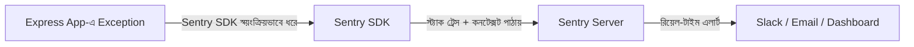
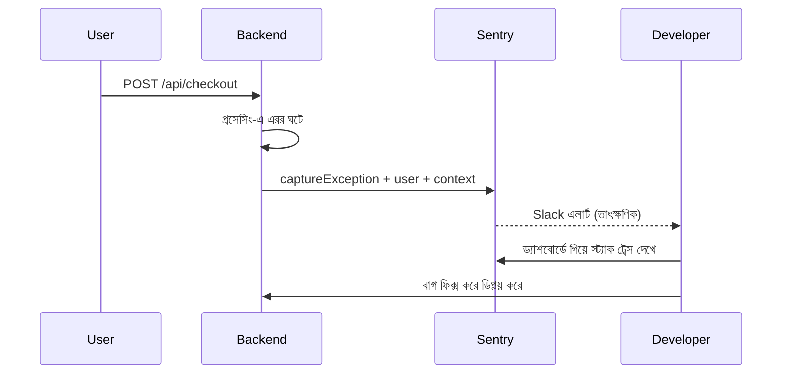

# ০৯. Error Tracking with Sentry

আগের লেসনের শেষে আমরা দেখেছিলাম কতগুলো থার্ড-পার্টি ইন্টিগ্রেশন একসাথে কাজ করছে — Stripe, HubSpot, SendGrid, Mailchimp — একটা মাত্র পেমেন্ট ইভেন্টে। এত জটিল একটা সিস্টেমে যদি কোথাও একটা ক্র্যাশ হয় মাঝরাতে, যখন তুমি ঘুমিয়ে আছো, সেটা তুমি কীভাবে জানবে? Module 32-এ আমরা Winston/Pino দিয়ে লগিং শিখেছিলাম — সেটা সাহায্য করে, কিন্তু লগ ফাইল তো তখনই কাজে লাগে যখন তুমি নিজে সেটা খুঁজে দেখো। বাস্তবে হাজার হাজার লাইন লগের মধ্যে একটা নির্দিষ্ট ক্র্যাশ খুঁজে বের করা, আর সেটার প্রেক্ষাপট (কোন ইউজার, কোন রিকোয়েস্ট, কোন ব্রাউজার) বোঝা প্রায় অসম্ভব হয়ে যায় যদি হাতে করে খুঁজতে হয়।

এই সমস্যার সমাধানই **Sentry** — একটা এরর-ট্র্যাকিং সার্ভিস যেটা তোমার অ্যাপ্লিকেশনের প্রতিটা এক্সেপশন স্বয়ংক্রিয়ভাবে ধরে ফেলে, তার সম্পূর্ণ প্রেক্ষাপট (স্ট্যাক ট্রেস, কোন ইউজার, কোন রিকোয়েস্ট, কোন এনভায়রনমেন্ট) জমা করে, আর সাথে সাথে তোমাকে (Slack/ইমেইলে) জানিয়ে দেয়। এটাকে ভাবতে পারো একটা "স্মোক ডিটেক্টর"-এর মতো — তুমি সবসময় বাড়িতে বসে আগুন খুঁজতে থাকো না, বরং একটা ডিটেক্টর বসিয়ে রাখো যেটা আগুন লাগলেই অ্যালার্ম বাজায়।



ইন্সটলেশন এবং সেটআপ:

```bash
npm install @sentry/node @sentry/profiling-node
```

```
SENTRY_DSN=https://xxxxxxxxxxxxxxxxxxxxxxxx@o000000.ingest.sentry.io/0000000
```

Sentry-এর সেটআপ একটু বিশেষ, কারণ এটাকে অ্যাপ্লিকেশনের একদম শুরুতেই ইনিশিয়ালাইজ করতে হয়, বাকি সব মিডলওয়্যারের আগে:

```js
// app.js
require('dotenv').config();
const Sentry = require('@sentry/node');
const express = require('express');
const app = express();

Sentry.init({
  dsn: process.env.SENTRY_DSN,
  environment: process.env.NODE_ENV || 'development',
  tracesSampleRate: 1.0, // পারফরম্যান্স মনিটরিং, প্রোডাকশনে কমিয়ে দেওয়া ভালো
});

// Sentry-র রিকোয়েস্ট হ্যান্ডলার সবার আগে বসাতে হয়
app.use(Sentry.Handlers.requestHandler());

app.use(express.json());

app.get('/api/products/:id', async (req, res) => {
  const product = await getProductById(req.params.id); // যদি এখানে এরর হয়...
  res.json(product);
});

// Sentry-র এরর হ্যান্ডলার সব রাউটের পরে, কিন্তু নিজের এরর হ্যান্ডলারের আগে
app.use(Sentry.Handlers.errorHandler());

app.use((err, req, res, next) => {
  console.error(err);
  res.status(500).json({ error: 'কিছু একটা ভুল হয়েছে' });
});

app.listen(3000);
```

এই মিডলওয়্যার সাজানোর ক্রম নিয়ে একটু মনোযোগ দেওয়া দরকার, কারণ এটা Module 7-এ আমরা যে মিডলওয়্যার আর্কিটেকচার শিখেছিলাম তারই একটা সরাসরি প্রয়োগ। `requestHandler()` সবার শুরুতে বসে যাতে প্রতিটা রিকোয়েস্টের তথ্য (URL, হেডার, ইউজার) Sentry ট্র্যাক করতে পারে। `errorHandler()` বসে সব রাউটের পরে কিন্তু নিজেদের কাস্টম এরর-হ্যান্ডলারের আগে — এটা মনে করিয়ে দেয় Express-এ middleware চেইন একটা নির্দিষ্ট ক্রমে চলে, আর ক্রম ভুল হলে পুরো মেকানিজম কাজ করবে না।

শুধু স্বয়ংক্রিয় ক্যাচ নয়, নিজে থেকেও গুরুত্বপূর্ণ তথ্য পাঠানো যায়:

```js
app.post('/api/checkout', async (req, res) => {
  try {
    const result = await processPayment(req.body);
    res.json(result);
  } catch (error) {
    Sentry.captureException(error, {
      tags: { feature: 'checkout' },
      extra: { userId: req.user?.id, amount: req.body.amount },
    });
    res.status(500).json({ error: 'চেকআউট ব্যর্থ হয়েছে' });
  }
});
```

লক্ষ্য করো `tags` আর `extra` ফিল্ড — এগুলো Sentry-এর ড্যাশবোর্ডে এরর ফিল্টার আর সার্চ করার জন্য অসম্ভব উপকারী। ধরো তুমি জানতে চাও "checkout ফিচারে গত সপ্তাহে কতগুলো এরর হয়েছে" — `tags: { feature: 'checkout' }` দিয়ে সহজেই সেটা ফিল্টার করা যায়। এটা অনেকটা Module 32-এ শেখা "structured logging"-এর ধারণার মতোই — শুধু একটা টেক্সট মেসেজ লগ না করে, সংগঠিত মেটাডেটাসহ লগ করা।

Sentry-তে ইউজার শনাক্ত করাও গুরুত্বপূর্ণ, বিশেষ করে যখন Module 12-এ শেখা JWT অথেনটিকেশন ব্যবহার করছো:

```js
app.use((req, res, next) => {
  if (req.user) {
    Sentry.setUser({ id: req.user.id, email: req.user.email });
  }
  next();
});
```

এভাবে যখন কোনো এরর হয়, Sentry-এর ড্যাশবোর্ডে সরাসরি দেখা যায় ঠিক কোন ইউজারের অভিজ্ঞতায় সমস্যাটা হয়েছে — এটা সাপোর্ট টিমের জন্য অমূল্য, কারণ ইউজার অভিযোগ করার আগেই তুমি সমস্যাটা জানতে ও সমাধান করতে পারো।



একটা বাস্তব সতর্কতা — Sentry-তে সব ধরনের এরর পাঠানো ঠিক না, বিশেষ করে যেগুলো ইউজারের সাধারণ ভুল (যেমন ভুল পাসওয়ার্ড দেওয়া, যেটা `400`/`401` স্ট্যাটাসে হ্যান্ডল করা উচিত)। সেগুলো "এরর" নয়, বরং প্রত্যাশিত আচরণ। Sentry রাখা উচিত সত্যিকারের অপ্রত্যাশিত পরিস্থিতির জন্য — যেমন ডেটাবেজ কানেকশন হঠাৎ বিচ্ছিন্ন হওয়া, বা কোনো থার্ড-পার্টি সার্ভিস অপ্রত্যাশিত ফরম্যাটে ডেটা ফেরত দেওয়া। এই পার্থক্যটা বোঝা জরুরি, নাহলে Sentry-এর ড্যাশবোর্ড "নয়েজ"-এ ভরে যাবে আর আসল সমস্যা খুঁজে পাওয়া কঠিন হয়ে যাবে।

আমরা এখন জানি কীভাবে সমস্যা ধরতে হয়, কিন্তু আরেকটা প্রশ্ন থেকে যায় — ইউজাররা আসলে আমাদের প্রোডাক্ট কীভাবে ব্যবহার করছে, কোন পেজে বেশি সময় কাটাচ্ছে, কোথায় থেমে যাচ্ছে? এটা এরর নয়, বরং আচরণগত তথ্য, যেটা বোঝার জন্য দরকার **অ্যানালিটিক্স**। এই মডিউলের শেষ লেসনে আমরা দেখবো **Google Analytics** কীভাবে ব্যাকএন্ড ও ফ্রন্টএন্ড থেকে ইন্টিগ্রেট করা যায়।
