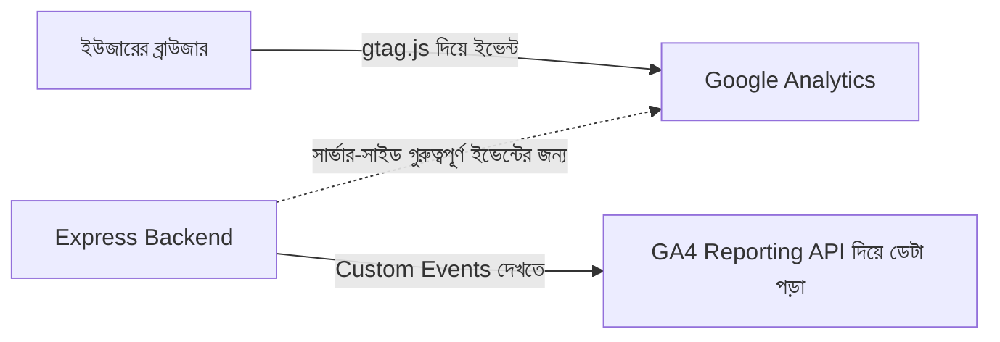
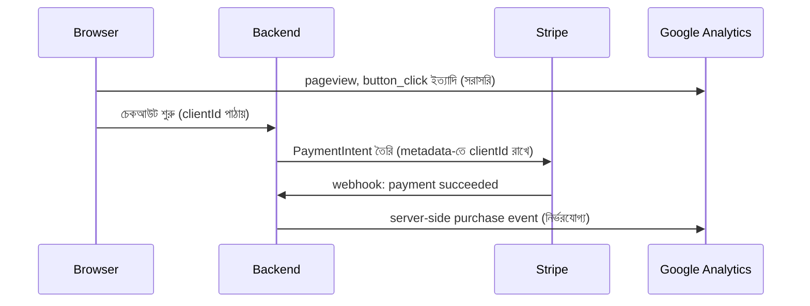

# ১০. Analytics Integration with Google Analytics

আগের লেসনে আমরা Sentry দিয়ে দেখেছি কীভাবে "কিছু ভুল হলে" জানা যায়। কিন্তু একটা প্রোডাক্ট সফল হওয়ার জন্য শুধু ভুল-না-হওয়া যথেষ্ট নয় — তোমাকে বুঝতে হবে ইউজার আসলে কী করছে। কতজন হোমপেজে আসছে, তাদের মধ্যে কতজন সাইনআপ পর্যন্ত যাচ্ছে, কোন পেজে এসে তারা সাইট ছেড়ে চলে যাচ্ছে (bounce করছে)। এই আচরণগত প্রশ্নগুলোর উত্তর দেওয়ার জন্যই তৈরি **Google Analytics (GA4)** — বিশ্বের সবচেয়ে ব্যবহৃত ওয়েব অ্যানালিটিক্স টুল।

এই মডিউলের শেষ লেসনে এসে একটা গুরুত্বপূর্ণ পার্থক্য বোঝা দরকার, যেটা আগের সবগুলো ইন্টিগ্রেশন থেকে ভিন্ন। SendGrid, Twilio, Stripe — এই সবগুলোতেই আমাদের ব্যাকএন্ড ছিলো "একটিভ পার্টি" — আমরা নিজেরাই API কল করে কাজ করাতাম। Google Analytics সাধারণত উল্টো দিক থেকে কাজ করে — বেশিরভাগ ট্র্যাকিং হয় **ফ্রন্টএন্ড থেকে সরাসরি**, একটা ছোট JavaScript স্নিপেট দিয়ে, যেটা ইউজারের ব্রাউজারে চলে আর সরাসরি Google-এর সার্ভারে ইভেন্ট পাঠায়। আমাদের ব্যাকএন্ড এই ফ্লোতে সরাসরি অংশগ্রহণ করে না, তবে দুটো গুরুত্বপূর্ণ জায়গায় ব্যাকএন্ডের ভূমিকা থাকে — যেটা আমরা এই লেসনে দেখবো।



প্রথমত, ফ্রন্টএন্ডের বেসিক সেটআপ (এইচটিএমএল-এ বসানো, শুধু প্রেক্ষাপটের জন্য দেখানো হলো, এই ব্যাকএন্ড-কেন্দ্রিক কোর্সের মূল ফোকাস নয়):

```html
<script async src="https://www.googletagmanager.com/gtag/js?id=G-XXXXXXXXXX"></script>
<script>
  window.dataLayer = window.dataLayer || [];
  function gtag(){dataLayer.push(arguments);}
  gtag('js', new Date());
  gtag('config', 'G-XXXXXXXXXX');
</script>
```

কিন্তু ব্যাকএন্ড ডেভেলপার হিসেবে আমাদের আসল আগ্রহ দুই জায়গায়। প্রথমত — **সার্ভার-সাইড ইভেন্ট পাঠানো**। কিছু গুরুত্বপূর্ণ ঘটনা (যেমন পেমেন্ট সফল হওয়া) সরাসরি ব্যাকএন্ড থেকে ট্র্যাক করা বেশি নির্ভরযোগ্য, কারণ ফ্রন্টএন্ড ইভেন্ট Ad-blocker বা ইউজার পেজ বন্ধ করে দিলে হারিয়ে যেতে পারে, কিন্তু ব্যাকএন্ডে পেমেন্ট সফল হওয়া মানে সেটা নিশ্চিতভাবেই ঘটেছে। GA4-এ এটা করা হয় **Measurement Protocol** দিয়ে:

```bash
npm install axios
```

```js
// services/analyticsService.js
require('dotenv').config();
const axios = require('axios');

const GA_MEASUREMENT_ID = process.env.GA_MEASUREMENT_ID;
const GA_API_SECRET = process.env.GA_API_SECRET;

async function trackServerEvent(clientId, eventName, params = {}) {
  const url = `https://www.google-analytics.com/mp/collect?measurement_id=${GA_MEASUREMENT_ID}&api_secret=${GA_API_SECRET}`;

  try {
    await axios.post(url, {
      client_id: clientId,
      events: [{ name: eventName, params }],
    });
  } catch (error) {
    console.error('GA tracking failed:', error.message);
    // ইচ্ছাকৃতভাবে throw করছি না — অ্যানালিটিক্স ব্যর্থ হলে ব্যবসায়িক লজিক থামা উচিত না
  }
}

module.exports = { trackServerEvent };
```

লক্ষ্য করো এই ফাংশনে আমরা `catch`-এ error-টা শুধু লগ করছি, `throw` করছি না — এটা আমরা এই পুরো মডিউল জুড়ে বারবার দেখা "graceful degradation" নীতির সবচেয়ে স্পষ্ট উদাহরণ। ইমেইলে লেসন ১-এ যেমন বলেছিলাম, ইমেইল পাঠানো ব্যর্থ হলে সাইনআপ থেমে যাওয়া উচিত না — এখানেও একই যুক্তি প্রযোজ্য, বরং আরও জোরালোভাবে: অ্যানালিটিক্স ব্যর্থ হলে তো ব্যবসায়িক লজিক (যেমন পেমেন্ট কনফার্মেশন) থামারই কোনো কারণ নেই।

Stripe webhook-এর সাথে যুক্ত করে দেখি:

```js
app.post('/webhook/stripe', /* ... signature verification ... */ async (req, res) => {
  if (event.type === 'payment_intent.succeeded') {
    const payment = event.data.object;

    await trackServerEvent(payment.metadata.clientId, 'purchase', {
      transaction_id: payment.id,
      value: payment.amount / 100,
      currency: payment.currency,
    });
  }
  res.json({ received: true });
});
```

এখানে `payment.metadata.clientId` লক্ষ্য করো — যখন PaymentIntent তৈরি করা হয়েছিলো (লেসন ৫-এ), তখন GA-র `client_id`-টা মেটাডেটা হিসেবে সংরক্ষণ করে রাখতে হবে, যাতে পরে webhook-এ এসে সেই একই ইউজারের সাথে ইভেন্টটা যুক্ত করা যায়। এটা একটা গুরুত্বপূর্ণ ডিজাইন প্যাটার্ন — যখন একাধিক থার্ড-পার্টি সিস্টেম একই ইউজারের একটা কাজ নিয়ে কথা বলছে, তাদের মধ্যে একটা "কমন আইডেন্টিফায়ার" ছড়িয়ে দিতে হয়, নাহলে বিভিন্ন সিস্টেমের ডেটা একসাথে জোড়া লাগানো অসম্ভব হয়ে যায়।

দ্বিতীয় ব্যাকএন্ড ভূমিকাটা হলো **GA4-এর ডেটা পড়ে নিজের ড্যাশবোর্ডে দেখানো** — Google Analytics Data API ব্যবহার করে:

```bash
npm install @google-analytics/data
```

```js
const { BetaAnalyticsDataClient } = require('@google-analytics/data');
const analyticsDataClient = new BetaAnalyticsDataClient();

async function getWeeklyActiveUsers(propertyId) {
  const [response] = await analyticsDataClient.runReport({
    property: `properties/${propertyId}`,
    dateRanges: [{ startDate: '7daysAgo', endDate: 'today' }],
    metrics: [{ name: 'activeUsers' }],
  });
  return response.rows[0]?.metricValues[0]?.value || 0;
}
```

এই ফাংশনটা তোমার নিজের অ্যাডমিন ড্যাশবোর্ডে ("গত সপ্তাহে কতজন একটিভ ইউজার ছিলো") দেখানোর জন্য ব্যবহার করা যায় — অর্থাৎ ব্যাকএন্ড শুধু ডেটা পাঠায় না, কখনো কখনো অন্য সিস্টেমের কাছে থাকা ডেটা টেনেও আনে।



এই মডিউলের পুরো যাত্রাটা যদি ফিরে তাকাই — আমরা দেখেছি যোগাযোগ (SendGrid, Twilio, WhatsApp), ডেটা সিঙ্ক (Salesforce, HubSpot, Mailchimp), টাকা (Stripe, PayPal), স্বাস্থ্য পর্যবেক্ষণ (Sentry), আর আচরণ পর্যবেক্ষণ (Google Analytics) — দশটা ভিন্ন ডোমেইন, কিন্তু প্রতিটাতেই একই মৌলিক কাঠামো বারবার ফিরে এসেছে: SDK ইনস্টল করো, `.env`-এ সিক্রেট রাখো, async/await দিয়ে API কল করো, try/catch দিয়ে ব্যর্থতা সামলাও, দরকার হলে webhook দিয়ে উল্টো দিক থেকে তথ্য নাও, আর মূল ব্যবসায়িক লজিককে থার্ড-পার্টি ব্যর্থতা থেকে রক্ষা করো। এই প্যাটার্নগুলো একবার আয়ত্ত করে ফেললে, ভবিষ্যতে যেকোনো নতুন থার্ড-পার্টি সার্ভিস (যেটা এই কোর্সে কভার করা হয়নি) ইন্টিগ্রেট করাও তোমার জন্য সহজ হয়ে যাবে — কারণ প্রতিটা SDK-র ডকুমেন্টেশন খুললে তুমি চিনতে পারবে চেনা প্যাটার্নগুলো।

এখন পর্যন্ত আমরা যা ইন্টিগ্রেট করেছি, তার সবই ছিলো "নির্দিষ্ট নিয়মে চলা" সার্ভিস — একটা নির্দিষ্ট ইনপুটে নির্দিষ্ট আউটপুট। কিন্তু সফটওয়্যার জগতের সবচেয়ে উত্তেজনাপূর্ণ নতুন দিগন্ত হলো এমন সিস্টেম যেগুলো নিজে থেকে চিন্তা করে, সিদ্ধান্ত নেয়, একাধিক ধাপ পরিকল্পনা করে কাজ সম্পন্ন করে — যাকে বলে **AI Agent**। পরের মডিউলে আমরা ঠিক সেই জগতে প্রবেশ করবো।
