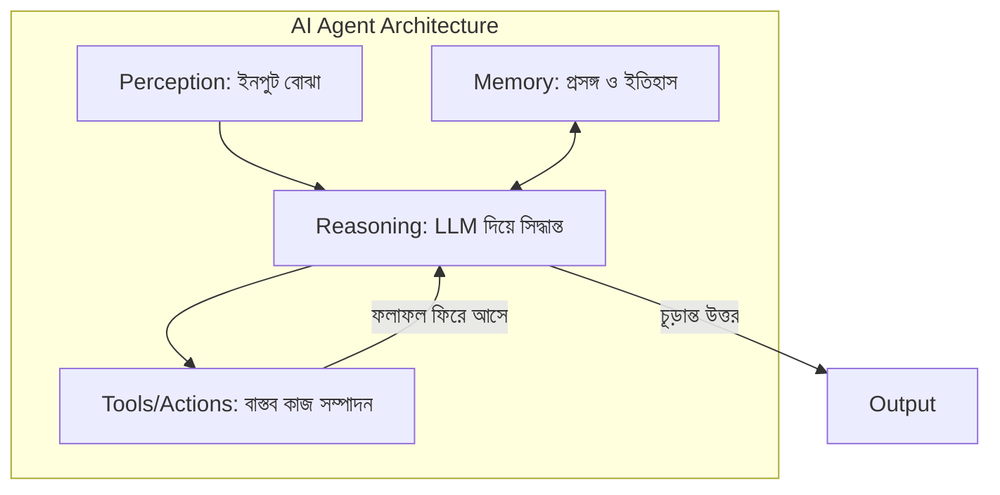
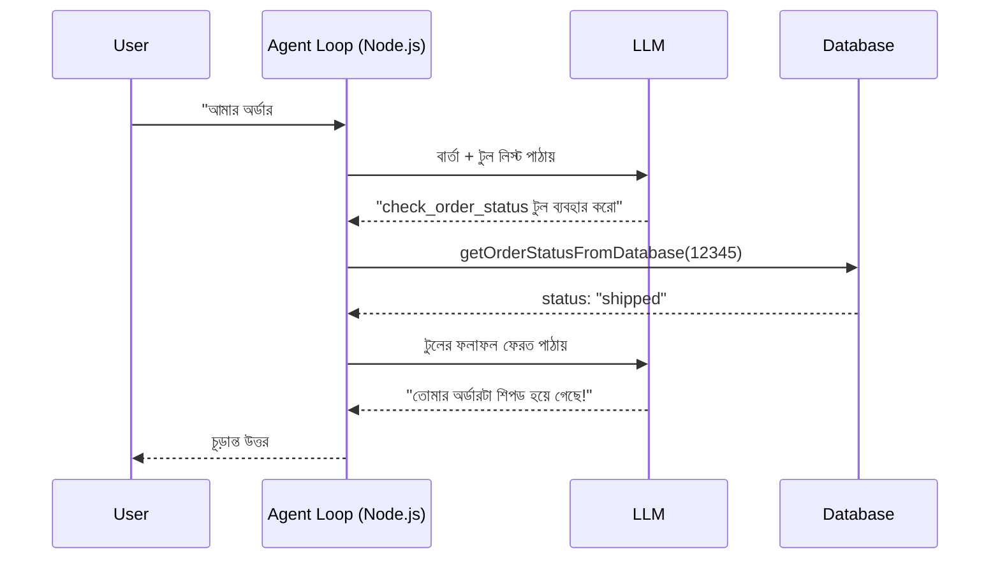

# ০২. Autonomous AI Agent Architecture

আগের লেসনে আমরা এজেন্টের কেন্দ্রে একটা `while` লুপ দেখেছিলাম, আর আভাস দিয়েছিলাম যে এর ভেতরে তিনটা মূল উপাদান আছে — টুল, মেমোরি, আর সিদ্ধান্ত-নেওয়ার প্রক্রিয়া। এই লেসনে আমরা এই স্থাপত্যটা (architecture) বিস্তারিতভাবে ভেঙে দেখবো, যাতে বাকি মডিউল জুড়ে আমরা যখন প্রতিটা অংশ নিয়ে আলাদা করে গভীরে যাবো, তখন পুরো ছবিটা মাথায় স্পষ্ট থাকে।

একটা এজেন্টকে চারটা অংশে ভাগ করে বোঝা যায় — এটাকে মানুষের সিদ্ধান্ত-গ্রহণ প্রক্রিয়ার সাথে তুলনা করলে সহজ হয়। ধরো তুমি একজন ডাক্তার। রোগী এলে (ইনপুট), তুমি আগের রেকর্ড দেখো (মেমোরি), লক্ষণ বিশ্লেষণ করে সিদ্ধান্ত নাও কী পরীক্ষা দরকার (রিজনিং), এরপর ল্যাবে পাঠাও বা ওষুধ লেখো (টুল ব্যবহার), ফলাফল দেখে আবার চিন্তা করো (লুপ)। একটা AI Agent হুবহু এই একই প্রক্রিয়া অনুসরণ করে, শুধু "ডাক্তার"-এর জায়গায় একটা LLM।



এই চারটা অংশ একটু বিস্তারিত দেখি। **Perception** হলো এজেন্ট কীভাবে জগতের তথ্য গ্রহণ করে — এটা হতে পারে ইউজারের টেক্সট মেসেজ, একটা API রেসপন্স, এমনকি একটা ইমেজ। **Memory** হলো এজেন্ট আগে কী দেখেছে, কী সিদ্ধান্ত নিয়েছে তার রেকর্ড — এটা নিয়ে আমরা লেসন ৫-এ বিস্তারিত যাবো, কিন্তু এখনই বুঝে নেওয়া দরকার যে LLM নিজে কিছু "মনে রাখে না" — প্রতিটা কলে আগের পুরো কথোপকথন নতুন করে পাঠাতে হয়, ঠিক যেমন Module 11-এ আমরা শিখেছিলাম HTTP স্বভাবতই **stateless**, তাই কুকি/সেশন দিয়ে state বজায় রাখতে হয়।

**Reasoning** হলো আসল LLM কল — যেখানে মডেল সিদ্ধান্ত নেয় পরবর্তী পদক্ষেপ কী হবে। আর **Tools/Actions** হলো সেই সিদ্ধান্তকে বাস্তবে রূপ দেওয়ার প্রক্রিয়া — একটা ডেটাবেজ কোয়েরি চালানো, একটা API কল করা (মনে করো আগের মডিউলের Stripe/SendGrid ইন্টিগ্রেশন), অথবা একটা হিসাব করা।

এই প্যাটার্নটার একটা প্রচলিত নাম আছে — **ReAct (Reasoning + Acting)**। ধারণাটা হলো, LLM-কে শুধু চূড়ান্ত উত্তর দিতে না বলে, তাকে বলা হয় নিজের চিন্তাভাবনা প্রকাশ করতে, তারপর একটা কাজ করতে, তারপর ফলাফল দেখে আবার চিন্তা করতে। বাস্তবে এটা কোডে কেমন দেখতে, দেখা যাক:

```js
// tools/toolDefinitions.js — প্রতিটা টুল কী করতে পারে, LLM-কে তা বলে দেওয়া
const tools = [
  {
    name: 'check_order_status',
    description: 'একটা নির্দিষ্ট অর্ডার আইডি দিয়ে অর্ডারের বর্তমান অবস্থা জানায়',
    input_schema: {
      type: 'object',
      properties: {
        orderId: { type: 'string', description: 'অর্ডারের ইউনিক আইডি' },
      },
      required: ['orderId'],
    },
  },
  {
    name: 'process_refund',
    description: 'একটা অর্ডারের জন্য রিফান্ড প্রক্রিয়া শুরু করে',
    input_schema: {
      type: 'object',
      properties: {
        orderId: { type: 'string' },
        reason: { type: 'string' },
      },
      required: ['orderId', 'reason'],
    },
  },
];

module.exports = { tools };
```

এই `tool_schema`-টা Module 8-এ আমরা যে JSON ডেটা মডেলিং শিখেছিলাম, তারই একটা প্রয়োগ — এটা মূলত একটা কন্ট্রাক্ট, যা LLM-কে বলে দেয় "তুমি যদি অর্ডার স্ট্যাটাস জানতে চাও, এই নামের ফাংশন কল করো, এই প্যারামিটার দিয়ে।" LLM নিজে কোনো ডেটাবেজ কোয়েরি চালায় না — সে শুধু বলে "আমি মনে করি `check_order_status` কল করা উচিত, `orderId: "12345"` দিয়ে", আর আসল কাজ (ডেটাবেজ কোয়েরি) করে আমাদের নিজের কোড।

```js
// tools/toolExecutor.js
async function executeTool(toolName, input) {
  switch (toolName) {
    case 'check_order_status':
      return await getOrderStatusFromDatabase(input.orderId);
    case 'process_refund':
      return await initiateRefund(input.orderId, input.reason);
    default:
      throw new Error(`অজানা টুল: ${toolName}`);
  }
}

module.exports = { executeTool };
```

এই `executeTool` ফাংশনটা একটা গুরুত্বপূর্ণ নিরাপত্তা সীমারেখা তৈরি করে — LLM কখনো সরাসরি আমাদের ডেটাবেজ বা সার্ভারে কোড চালাতে পারে না, সে শুধু "অনুরোধ" করতে পারে, আর আমাদের কোড সিদ্ধান্ত নেয় সেই অনুরোধ বৈধ কিনা, এক্সিকিউট করা উচিত কিনা। এই বিষয়টা আমরা লেসন ৭-এ (AI Agent Security) আরও গভীরে আলোচনা করবো, কিন্তু এখনই মনে রাখা ভালো — **এজেন্ট প্রস্তাব করে, আমাদের কোড অনুমোদন ও কার্যকর করে**।

পুরো লুপটা একসাথে দেখলে:



এই স্থাপত্যের একটা সুন্দর দিক হলো এটা **মডিউলার** — Module 22-এ আমরা যে ডিজাইন প্যাটার্নগুলো শিখেছিলাম (Factory, Strategy), সেগুলোর মতোই এখানেও প্রতিটা টুল স্বাধীনভাবে যোগ/বাদ দেওয়া যায়। নতুন একটা টুল ("send_apology_email", যেটা আগের মডিউলের SendGrid ইন্টিগ্রেশন ব্যবহার করবে) যোগ করতে চাইলে শুধু `tools` অ্যারেতে একটা নতুন এন্ট্রি আর `executeTool`-এ একটা নতুন `case` যোগ করলেই চলে — মূল লুপের কাঠামো একই থাকে।

এই স্থাপত্যটা আমরা নিজে হাতে লিখলাম, যাতে ভেতরের প্রতিটা অংশ স্পষ্টভাবে বোঝা যায়। কিন্তু বাস্তব প্রোডাকশন প্রজেক্টে এই লুপ, মেমোরি ম্যানেজমেন্ট, টুল-চেইনিং — এসব বারবার হাতে লেখার বদলে একটা রেডিমেড ফ্রেমওয়ার্ক ব্যবহার করা যায়, যেটা এই কাজগুলো অনেক সহজ করে দেয়। পরের লেসনে আমরা পরিচিত হবো ঠিক এমনই একটা জনপ্রিয় ফ্রেমওয়ার্কের সাথে — **LangChain**।
