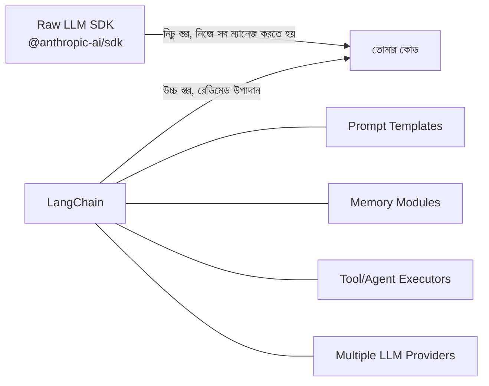
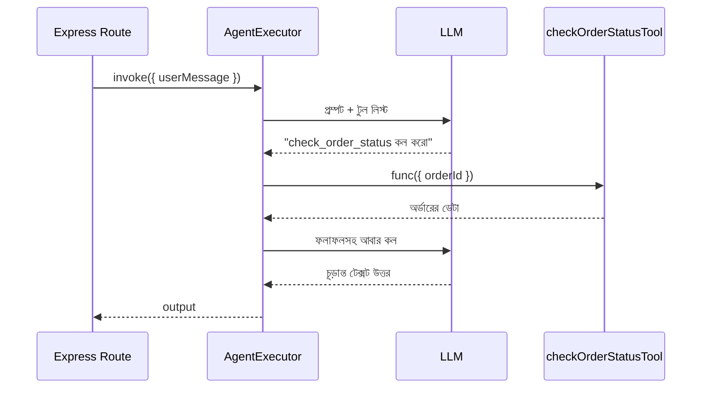

# ০৩. LangChain Framework Integration

আগের লেসনে আমরা নিজের হাতে একটা এজেন্ট লুপ লিখেছিলাম — `while` লুপ, টুল স্কিমা, `executeTool` ফাংশন। এই কোডটা কাজ করে, কিন্তু বাস্তব প্রোডাকশন প্রজেক্টে এজেন্ট আরও জটিল হয়ে ওঠে — একাধিক ধাপের মেমোরি ম্যানেজমেন্ট, একাধিক LLM প্রোভাইডার (OpenAI, Anthropic, Google) সুইচ করার সুবিধা, প্রম্পট টেমপ্লেট রিইউজ করা, স্ট্রিমিং রেসপন্স হ্যান্ডল করা — এই সবকিছু নিজে হাতে লেখা সময়সাপেক্ষ আর ভুল-প্রবণ। ঠিক এই কারণেই তৈরি হয়েছে **LangChain** — একটা ফ্রেমওয়ার্ক যা এজেন্ট বানানোর সাধারণ অংশগুলো (চেইন, মেমোরি, টুল, প্রম্পট) রেডিমেড উপাদান হিসেবে দেয়।

এটাকে Express.js-এর সাথে তুলনা করলে সহজে বোঝা যায়। Module 7-এ আমরা শিখেছিলাম কেন raw `http` মডিউলের বদলে Express ব্যবহার করি — কারণ Express রাউটিং, মিডলওয়্যার, এরর হ্যান্ডলিং-এর মতো পুনরাবৃত্তিমূলক কাজ আগে থেকেই সমাধান করে রেখেছে, আমাদের শুধু বিজনেস লজিকে মনোযোগ দিতে হয়। LangChain ঠিক একই ভূমিকা পালন করে এজেন্ট ডেভেলপমেন্টে — raw LLM API কলের বদলে একটা উচ্চ-স্তরের, রিইউজেবল কাঠামো দেয়।



ইনস্টলেশন দিয়ে শুরু করি:

```bash
npm install @langchain/core @langchain/anthropic langchain dotenv
```

LangChain-এর সবচেয়ে মৌলিক ধারণা হলো **Prompt Template** — একটা রিইউজেবল প্রম্পট কাঠামো, যেখানে ভেরিয়েবল বসানো যায়। এটা অনেকটা আমরা EJS বা অন্য টেমপ্লেটিং ইঞ্জিনে যেভাবে HTML-এ ভেরিয়েবল বসাই, তারই একটা প্রম্পট-সংস্করণ:

```js
// services/langchainSetup.js
require('dotenv').config();
const { ChatAnthropic } = require('@langchain/anthropic');
const { ChatPromptTemplate } = require('@langchain/core/prompts');

const model = new ChatAnthropic({
  apiKey: process.env.ANTHROPIC_API_KEY,
  model: 'claude-sonnet-4-5',
  temperature: 0.3,
});

const promptTemplate = ChatPromptTemplate.fromMessages([
  ['system', 'তুমি একটা ই-কমার্স কাস্টমার সাপোর্ট এজেন্ট। সংক্ষিপ্ত ও ভদ্রভাবে উত্তর দাও।'],
  ['human', '{userMessage}'],
]);

async function getResponse(userMessage) {
  const chain = promptTemplate.pipe(model);
  const result = await chain.invoke({ userMessage });
  return result.content;
}

module.exports = { getResponse };
```

এখানে `temperature: 0.3` একটা নতুন প্যারামিটার লক্ষ্য করার মতো — এটা নিয়ন্ত্রণ করে LLM কতটা "সৃজনশীল" বা "সুনির্দিষ্ট" হবে। কাস্টমার সাপোর্টের মতো কাজে কম temperature (০-০.৩) ভালো, কারণ আমরা চাই সামঞ্জস্যপূর্ণ, পূর্বানুমানযোগ্য উত্তর, লেখালেখি/সৃজনশীল কাজে বেশি temperature (০.৭-১) ভালো লাগতে পারে।

`.pipe()` মেথডটা লক্ষ্য করো — এটা LangChain-এর একটা গুরুত্বপূর্ণ ধারণা, যাকে বলে **LCEL (LangChain Expression Language)**। এটা অনেকটা Unix পাইপ (`|`) এর মতো কাজ করে, অথবা Module 7-এ আমরা যেভাবে একাধিক Express মিডলওয়্যার চেইন করেছিলাম তার মতোই — একটা ধাপের আউটপুট পরের ধাপের ইনপুট হয়ে যায়। এই "pipe" প্যাটার্ন দিয়ে জটিল multi-step প্রসেসিং তৈরি করা সহজ হয়ে যায়।

এবার টুল-ব্যবহারকারী একটা এজেন্ট বানাই, যেখানে LangChain আমাদের আগের লেসনে হাতে-লেখা `while` লুপটা নিজেই সামলে নেয়:

```js
const { DynamicStructuredTool } = require('@langchain/core/tools');
const { z } = require('zod');
const { AgentExecutor, createToolCallingAgent } = require('langchain/agents');

const checkOrderStatusTool = new DynamicStructuredTool({
  name: 'check_order_status',
  description: 'একটা অর্ডার আইডি দিয়ে অর্ডারের বর্তমান অবস্থা জানায়',
  schema: z.object({
    orderId: z.string().describe('অর্ডারের ইউনিক আইডি'),
  }),
  func: async ({ orderId }) => {
    const status = await getOrderStatusFromDatabase(orderId);
    return JSON.stringify(status);
  },
});

async function runAgent(userMessage) {
  const agent = await createToolCallingAgent({
    llm: model,
    tools: [checkOrderStatusTool],
    prompt: promptTemplate,
  });

  const executor = new AgentExecutor({
    agent,
    tools: [checkOrderStatusTool],
  });

  const result = await executor.invoke({ userMessage });
  return result.output;
}
```

এই কোডে দুটো নতুন জিনিস লক্ষ্য করার মতো। প্রথমত, `zod` লাইব্রেরি — এটা টুলের ইনপুট স্কিমা ডিফাইন করতে ব্যবহৃত হয়, যা Module 13-এ আমরা TypeScript দিয়ে শেখা টাইপ-সেফটির ধারণার মতোই, শুধু runtime-এ যাচাই করে। দ্বিতীয়ত, `AgentExecutor` — এটাই আগের লেসনের সেই `while` লুপ যেটা আমরা হাতে লিখেছিলাম, LangChain এখানে সেটা রেডিমেড দিয়ে দিচ্ছে — LLM-কে কল করা, টুল দরকার হলে এক্সিকিউট করা, ফলাফল আবার পাঠানো, এই পুরো চক্রটা `executor.invoke()`-এর ভেতরেই ঘটে যায়।



এবার এটাকে আমাদের চেনা Express রাউটে বসাই:

```js
app.post('/api/support-chat', async (req, res) => {
  const { message } = req.body;
  try {
    const reply = await runAgent(message);
    res.json({ reply });
  } catch (error) {
    console.error('Agent error:', error.message);
    res.status(502).json({ error: 'এজেন্ট এই মুহূর্তে সাড়া দিতে পারছে না' });
  }
});
```

লক্ষ্য করো — এই রাউটটা কাঠামোগতভাবে ঠিক আগের মডিউলের অন্য যেকোনো থার্ড-পার্টি ইন্টিগ্রেশন রাউটের মতোই দেখতে। `try/catch`, `502` স্ট্যাটাস কোড বাইরের সার্ভিস ব্যর্থ হলে — এই প্যাটার্নগুলো এখানেও অবিকল প্রযোজ্য, কারণ শেষ পর্যন্ত LLM-ও একটা নেটওয়ার্ক-নির্ভর বাইরের সার্ভিস, যেটা মাঝে মাঝে ধীর হতে পারে বা ব্যর্থ হতে পারে।

LangChain দিয়ে আমরা একটা সাধারণ টুল-ব্যবহারকারী এজেন্ট বানিয়ে ফেললাম, কিন্তু এখনো এই এজেন্টটা "জেনারেল পারপাস" — যেকোনো প্রশ্নে সে যেকোনো টুল ব্যবহারের চেষ্টা করতে পারে। বাস্তব প্রোডাকশনে আমরা প্রায়ই চাই এমন এজেন্ট যেটা একটা নির্দিষ্ট, সংকীর্ণ কাজে বিশেষায়িত — যেমন শুধু রিফান্ড প্রসেস করা, বা শুধু ডেটা এন্ট্রি করা। পরের লেসনে আমরা দেখবো কীভাবে **টাস্ক-স্পেসিফিক এজেন্ট** ডিজাইন করতে হয়, যেগুলো একটা নির্দিষ্ট কাজে অনেক বেশি নির্ভরযোগ্য।
