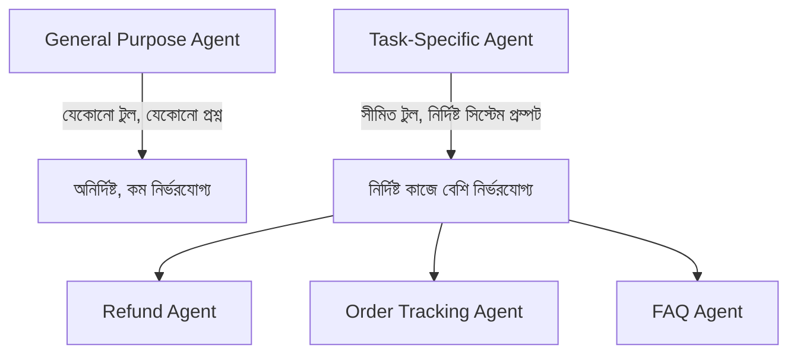

# ০৪. Building Task-Specific AI Agents

আগের লেসনে আমরা LangChain দিয়ে একটা "জেনারেল পারপাস" এজেন্ট বানিয়েছিলাম, যার হাতে একটা টুল ছিলো (`check_order_status`) আর সে নিজে সিদ্ধান্ত নিতো কখন সেটা ব্যবহার করবে। বাস্তব প্রোডাকশন সিস্টেমে এই স্বাধীনতাটাই মাঝে মাঝে সমস্যা — একটা জেনারেল এজেন্ট অপ্রত্যাশিত প্রশ্নে অপ্রত্যাশিত আচরণ করতে পারে। তাই বেশিরভাগ বাস্তব ব্যবহারে আমরা চাই **টাস্ক-স্পেসিফিক এজেন্ট** — এমন এজেন্ট যার কাজের গণ্ডি সুনির্দিষ্ট, স্পষ্টভাবে বেঁধে দেয়া।

টাস্ক-স্পেসিফিক এজেন্ট ডিজাইনের মূল কৌশল হলো তিনটা জিনিস সংকুচিত করা — সিস্টেম প্রম্পট নির্দিষ্ট করা, টুলের সংখ্যা সীমিত রাখা, আর আউটপুট ফরম্যাট বেঁধে দেয়া। ধরো আমরা একটা "রিফান্ড প্রসেসিং এজেন্ট" বানাচ্ছি, যেটা শুধু রিফান্ড সংক্রান্ত অনুরোধ সামলাবে, অন্য কিছু না।

```js
const refundAgentPrompt = ChatPromptTemplate.fromMessages([
  ['system', `তুমি শুধুমাত্র রিফান্ড প্রসেসিং এজেন্ট। তোমার কাজ শুধু তিনটা:
1. অর্ডার আইডি যাচাই করা
2. রিফান্ড যোগ্যতা চেক করা (৭ দিনের মধ্যে হতে হবে)
3. যোগ্য হলে রিফান্ড ইনিশিয়েট করা
অন্য কোনো প্রশ্নের উত্তর দেবে না — বরং বলবে "এই বিষয়ে সাধারণ সাপোর্টে যোগাযোগ করুন।"`],
  ['human', '{userMessage}'],
]);
```



লক্ষ্য করো, এখানে টুলের সংখ্যাও ইচ্ছাকৃতভাবে কম রাখা — একটা এজেন্টকে যত বেশি টুল দেয়া হয়, LLM ভুল টুল বেছে নেয়ার সম্ভাবনা তত বাড়ে। এটা Module 38-এ শেখা "Single Responsibility Principle"-এর একটা AI-সংস্করণ — একটা এজেন্টের একটামাত্র স্পষ্ট দায়িত্ব থাকা উচিত।

```js
const refundTools = [checkOrderEligibilityTool, initiateRefundTool]; // মাত্র দুটো টুল, ইচ্ছাকৃতভাবে

async function runRefundAgent(userMessage, orderContext) {
  const agent = await createToolCallingAgent({
    llm: model,
    tools: refundTools,
    prompt: refundAgentPrompt,
  });
  const executor = new AgentExecutor({ agent, tools: refundTools, maxIterations: 3 });
  return await executor.invoke({ userMessage, ...orderContext });
}
```

`maxIterations: 3` একটা গুরুত্বপূর্ণ সেফটি প্যারামিটার — এটা এজেন্টকে সর্বোচ্চ তিনবার চিন্তা-টুল কল করার চক্রে সীমাবদ্ধ রাখে। এটা ছাড়া একটা এজেন্ট তাত্ত্বিকভাবে অসীম লুপে আটকে যেতে পারে (LLM বারবার ভুল টুল কল করতে থাকলে), যা সরাসরি টাকার খরচ বাড়ায় (প্রতিটা LLM কলের একটা মূল্য আছে) আর ইউজারকে অপেক্ষায় রাখে।

আরেকটা কৌশল হলো আউটপুটকে একটা কাঠামোবদ্ধ ফরম্যাটে বাধ্য করা, যাতে এজেন্টের সিদ্ধান্ত প্রোগ্রামেটিক্যালি প্রসেস করা যায়, শুধু মুক্ত টেক্সট না:

```js
const { z } = require('zod');

const RefundDecisionSchema = z.object({
  approved: z.boolean(),
  reason: z.string(),
  refundAmount: z.number().optional(),
});

const structuredModel = model.withStructuredOutput(RefundDecisionSchema);
```

এই প্যাটার্নটা Module 13-এ শেখা TypeScript ইন্টারফেসের রানটাইম-সংস্করণ ভাবা যায় — আমরা LLM-কে বাধ্য করছি একটা নির্দিষ্ট আকারে উত্তর দিতে, যাতে আমাদের কোড নিশ্চিতভাবে জানে `approved` একটা বুলিয়ান হবে, `refundAmount` একটা সংখ্যা।

টাস্ক-স্পেসিফিক এজেন্ট বানানো একটা এজেন্টকে বেশি নির্ভরযোগ্য করে তোলে, কিন্তু বাস্তব প্রোডাক্টে একটামাত্র এজেন্ট দিয়ে সব কাজ চলে না — প্রায়ই দরকার হয় একাধিক বিশেষায়িত এজেন্ট, প্রতিটা নিজের কাজে দক্ষ। কিন্তু তার আগে একটা এজেন্টের একটা মৌলিক ঘাটতি সমাধান করা দরকার — তার কোনো স্মৃতি নেই, প্রতিটা কথোপকথন শূন্য থেকে শুরু হয়। সেই সমস্যাটাই আমাদের পরের লেসনের বিষয়।
