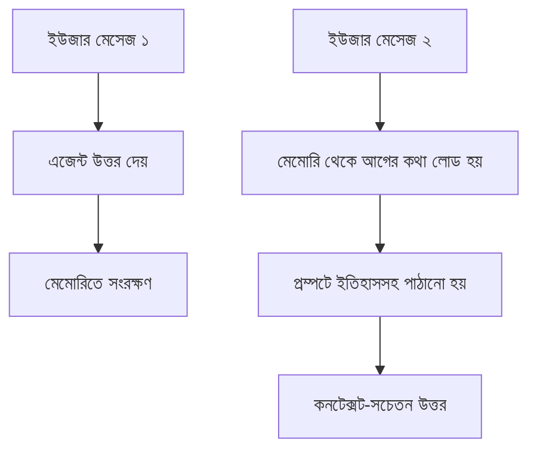

# ০৫. Agent Memory and State Management

আগের লেসনে আমরা একটা রিফান্ড এজেন্ট বানিয়েছিলাম, কিন্তু একটা সমস্যা লুকিয়ে ছিলো — প্রতিবার ইউজার নতুন মেসেজ পাঠালে এজেন্ট আগের কথোপকথন সম্পূর্ণ ভুলে যায়। এটা অনেকটা এমন একজন সাপোর্ট এজেন্টের মতো, যে প্রতি মিনিটে সব ভুলে যায় — গ্রাহককে বারবার একই তথ্য বলতে হয়। এই সমস্যার সমাধান হলো এজেন্টকে মেমোরি দেয়া।

LLM নিজে থেকে **stateless** — প্রতিটা API কল স্বাধীন, আগের কলের কোনো স্মৃতি থাকে না। মেমোরি তৈরি হয় আমাদের কোডেই — আগের কথোপকথন সংরক্ষণ করে, প্রতিটা নতুন কলে সেটা আবার প্রম্পটে জুড়ে দিয়ে।

```js
const { BufferMemory } = require('langchain/memory');

const memory = new BufferMemory({
  memoryKey: 'chatHistory',
  returnMessages: true,
});

// প্রতিটা কথোপকথনের পর মেমোরিতে যোগ হয়
await memory.saveContext(
  { input: userMessage },
  { output: agentResponse }
);
```



তবে এখানে একটা বাস্তব সীমাবদ্ধতা আছে — LLM-এর একটা নির্দিষ্ট **context window** থাকে (কতটুকু টেক্সট একসাথে পড়তে পারে)। একটা লম্বা কথোপকথনের পুরো ইতিহাস প্রতিবার পাঠালে এই সীমা ছাড়িয়ে যেতে পারে, আর খরচও বাড়ে (প্রতিটা টোকেনের একটা মূল্য থাকে)। তাই বাস্তব সিস্টেমে সাধারণত দুই ধরনের মেমোরি কৌশল ব্যবহার হয় — **short-term memory** (সাম্প্রতিক কয়েকটা মেসেজ, সরাসরি প্রম্পটে) আর **long-term memory** (পুরনো তথ্য একটা ডাটাবেজে/ভেক্টর স্টোরে রাখা, দরকার হলে সার্চ করে আনা)।

```js
// Long-term memory: গ্রাহকের প্রোফাইল ডাটাবেজে (PostgreSQL/MongoDB) সংরক্ষণ
async function loadUserContext(userId) {
  const profile = await db.getUserProfile(userId); // আগের মডিউলগুলোতে শেখা ডাটাবেজ কোয়েরি প্যাটার্ন
  const recentOrders = await db.getRecentOrders(userId, 5);
  return { profile, recentOrders };
}

async function runAgentWithMemory(userId, userMessage) {
  const context = await loadUserContext(userId);
  const shortTermHistory = await memory.loadMemoryVariables({});

  return await executor.invoke({
    userMessage,
    userContext: JSON.stringify(context),
    chatHistory: shortTermHistory.chatHistory,
  });
}
```

এই প্যাটার্নটা লক্ষ্য করো — এটা ঠিক Module 11-এ শেখা সেশন ম্যানেজমেন্টের একটা AI-সংস্করণ। সেশনে যেমন আমরা ইউজারের লগইন অবস্থা মনে রাখি, এখানে আমরা এজেন্টের "কথোপকথন অবস্থা" মনে রাখছি — দুটোরই মূল সমস্যা একই: HTTP আর LLM কল, দুটোই মূলত stateless, তাই state ধরে রাখার দায়িত্ব আমাদের অ্যাপ্লিকেশন কোডের।

আরেকটা গুরুত্বপূর্ণ সিদ্ধান্ত হলো মেমোরি কোথায় সংরক্ষণ করবে — ছোট প্রোটোটাইপে in-memory (RAM-এ) রাখা যায়, কিন্তু প্রোডাকশনে সার্ভার রিস্টার্ট হলে মেমোরি হারিয়ে যাওয়া এড়াতে Redis বা ডাটাবেজে রাখা উচিত, ঠিক যেমন Module 11-এ সেশন স্টোরের ক্ষেত্রে শিখেছিলে।

একটা মাত্র এজেন্ট এখন মনে রাখতে পারে কে কথা বলছে আর আগে কী বলেছিলো। কিন্তু বাস্তব জটিল সিস্টেমে প্রায়ই একাধিক এজেন্ট একসাথে কাজ করে, একে অপরকে তথ্য পাঠায় — সেই মাল্টি-এজেন্ট জগতেই আমরা পরের লেসনে ঢুকবো।
