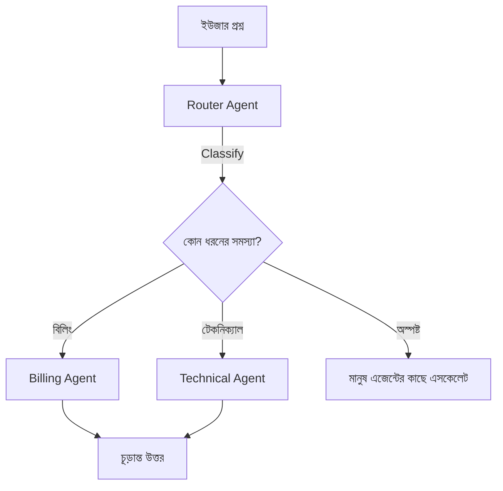

# ০৬. Multi-Agent Automation & Communication

আগের লেসনগুলোতে আমরা একটা এজেন্টকে আরো নির্ভরযোগ্য (টাস্ক-স্পেসিফিক) আর স্মৃতিসম্পন্ন (মেমোরি) করে তুলেছি। কিন্তু একটা মাত্র এজেন্টের একটা স্বাভাবিক সীমা আছে — যত বেশি দায়িত্ব একটা এজেন্টকে দেয়া হয়, তার সিস্টেম প্রম্পট তত জটিল হয়, আর সিদ্ধান্ত ভুল হওয়ার সম্ভাবনা বাড়ে। এর সমাধান হলো Module 40-এ শেখা মাইক্রোসার্ভিস দর্শনের একটা AI-সংস্করণ — একটা বড় এজেন্টের বদলে, কয়েকটা ছোট, বিশেষায়িত এজেন্ট একসাথে কাজ করা।

পরে Module 51-এর SupportPilot প্রজেক্ট ব্রিফেও আমরা এই প্যাটার্নটার একটা ঝলক দেখবো — একটা Router Agent, যে বুঝে নেয় কোন ধরনের সমস্যা, আর কাজটা পাঠিয়ে দেয় Billing Agent বা Technical Agent-এর কাছে। এই লেসনে আমরা দেখবো এই "রাউটিং" প্যাটার্নটা বাস্তবে কীভাবে কোড করতে হয়।



```js
const routerPrompt = ChatPromptTemplate.fromMessages([
  ['system', `তুমি একজন রাউটার। ইউজারের মেসেজ পড়ে ঠিক এই তিনটার একটা মাত্র শব্দ ফেরত দাও: "billing", "technical", অথবা "unclear"। অন্য কিছু লিখো না।`],
  ['human', '{userMessage}'],
]);

async function routeMessage(userMessage) {
  const chain = routerPrompt.pipe(model);
  const result = await chain.invoke({ userMessage });
  return result.content.trim().toLowerCase();
}

async function handleSupportRequest(userMessage, context) {
  const category = await routeMessage(userMessage);

  switch (category) {
    case 'billing':
      return await runBillingAgent(userMessage, context);
    case 'technical':
      return await runTechAgent(userMessage, context);
    default:
      return await escalateToHuman(userMessage, context);
  }
}
```

এই আর্কিটেকচারের একটা সুন্দর দিক হলো, প্রতিটা এজেন্ট (Billing, Technical) স্বাধীনভাবে টেস্ট আর উন্নত করা যায় — ঠিক যেভাবে মাইক্রোসার্ভিসে প্রতিটা সার্ভিস স্বাধীনভাবে ডেপ্লয় করা যায় (Module 50)। Router-টা নিজে খুব সাধারণ থাকে — তার কাজ শুধু শ্রেণীবিভাগ করা, আসল কাজ না করা।

আরেকটা গুরুত্বপূর্ণ প্যাটার্ন হলো এজেন্টদের মধ্যে **hand-off** — যখন একটা এজেন্ট বুঝতে পারে সে নিজের সীমার বাইরে চলে গেছে, সে সরাসরি অন্য এজেন্ট বা মানুষের কাছে পাঠিয়ে দিতে পারে, প্রেক্ষাপট (context) সহ:

```js
async function runBillingAgent(userMessage, context) {
  const result = await billingExecutor.invoke({ userMessage, ...context });

  if (result.output.includes('NEEDS_TECHNICAL_HELP')) {
    return await runTechAgent(userMessage, { ...context, billingNotes: result.output });
  }

  return result.output;
}
```

লক্ষ্য করো, `billingNotes: result.output` দিয়ে বিলিং এজেন্ট যা বুঝেছে তা টেকনিক্যাল এজেন্টের কাছে হস্তান্তর করা হচ্ছে — ঠিক যেমন Module 50-এর মাইক্রোসার্ভিস আর্কিটেকচারে একটা সার্ভিস ইভেন্টের মাধ্যমে আরেকটা সার্ভিসকে প্রেক্ষাপট পাঠায়, যাতে কাজ আবার শূন্য থেকে শুরু করতে না হয়।

মাল্টি-এজেন্ট সিস্টেম শক্তিশালী, কিন্তু একটা বড় ঝুঁকিও বহন করে — একাধিক স্বায়ত্তশাসিত এজেন্ট মিলে ভুল সিদ্ধান্ত নিলে, সেই ভুলটা এক এজেন্ট থেকে আরেক এজেন্টে ছড়িয়ে পড়তে পারে, আর কেউ সেটা ধরার আগেই গ্রাহকের কাছে পৌঁছে যেতে পারে। ঠিক এই কারণেই পরের লেসনে আমরা AI এজেন্টের নিরাপত্তা আর সেফটি নিয়ে গভীরে যাবো — কীভাবে এজেন্টদের সীমার মধ্যে রাখা যায়, যাতে তারা ক্ষতিকর কিছু করে না ফেলে।
