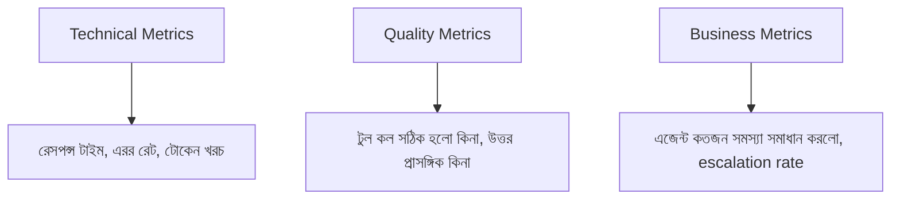

# ০৯. AI Agent Monitoring & Analytics

আমাদের এজেন্ট প্রোডাকশনে লাইভ, কিন্তু একটা গুরুত্বপূর্ণ প্রশ্ন থেকে যায় — এটা আসলে কতটা ভালো কাজ করছে? সাধারণ সফটওয়্যারে এই প্রশ্নের উত্তর সহজ (এরর হলে এরর, না হলে ঠিক), কিন্তু AI এজেন্টের ক্ষেত্রে এটা জটিল — এজেন্ট টেকনিক্যালি "সফলভাবে" রেসপন্স দিতে পারে, কিন্তু উত্তরটা ভুল বা অপ্রাসঙ্গিক হতে পারে। Module 41-এ শেখা Sentry দিয়ে আমরা ক্র্যাশ ধরতে পারি, কিন্তু "এজেন্ট ভুল উত্তর দিয়েছে" এটা কোনো এরর স্ট্যাক ট্রেসে দেখা যাবে না।

এই সমস্যার সমাধানে এজেন্ট মনিটরিং তিনটা স্তরে ভাগ করে দেখা যায় — টেকনিক্যাল মেট্রিক্স, কোয়ালিটি মেট্রিক্স, আর বিজনেস মেট্রিক্স।



প্রতিটা এজেন্ট ইন্টারঅ্যাকশন লগ করা প্রথম ধাপ — শুধু ভুল হলে না, প্রতিটা কল:

```js
async function runAgentWithLogging(userId, userMessage) {
  const startTime = Date.now();

  try {
    const result = await runAgentWithMemory(userId, userMessage);

    await logAgentInteraction({
      userId,
      userMessage,
      toolsUsed: result.intermediateSteps?.map(s => s.action.tool) || [],
      responseTime: Date.now() - startTime,
      success: true,
    });

    return result;
  } catch (error) {
    await logAgentInteraction({
      userId,
      userMessage,
      responseTime: Date.now() - startTime,
      success: false,
      errorMessage: error.message,
    });
    throw error;
  }
}
```

এই লগ ডেটা থেকে গুরুত্বপূর্ণ প্যাটার্ন খুঁজে বের করা যায় — যেমন, একটা নির্দিষ্ট ধরনের প্রশ্নে এজেন্ট বারবার ভুল টুল বেছে নিচ্ছে কিনা, বা রেসপন্স টাইম হঠাৎ বেড়ে যাচ্ছে কিনা (হয়তো LLM প্রোভাইডারের সমস্যা)।

কোয়ালিটি মাপার একটা কার্যকর উপায় হলো **escalation rate** ট্র্যাক করা — Module 42-এর লেসন ০৬-এ শেখা মাল্টি-এজেন্ট সিস্টেমে, কত শতাংশ কথোপকথন মানুষ এজেন্টের কাছে এসকেলেট হচ্ছে তা মাপা। এই সংখ্যা হঠাৎ বেড়ে গেলে বোঝা যায় এজেন্ট নতুন কোনো ধরনের প্রশ্নে হিমশিম খাচ্ছে।

```js
const escalationRate = (escalatedCount / totalConversations) * 100;

if (escalationRate > 30) {
  await notifyTeam('এজেন্ট escalation rate ৩০% ছাড়িয়ে গেছে — প্রম্পট/টুল পর্যালোচনা দরকার');
}
```

আরেকটা মূল্যবান কৌশল হলো নিয়মিতভাবে বাস্তব কথোপকথনের একটা নমুনা ম্যানুয়ালি পর্যালোচনা করা — সংখ্যা কখনো পুরো গল্প বলে না, একজন মানুষ নিজে ২০-৩০টা কথোপকথন পড়লে এমন সমস্যা ধরা পড়ে যা কোনো মেট্রিক্স ধরতে পারে না, যেমন এজেন্টের ভাষা কখনো কখনো অতিরিক্ত ফরম্যাল বা রূঢ় শোনাচ্ছে কিনা।

মনিটরিং আমাদের বলে দেয় এজেন্ট কেমন করছে, কিন্তু এই পুরো মডিউলে আমরা টুকরো টুকরো যা শিখেছি — আর্কিটেকচার, মেমোরি, মাল্টি-এজেন্ট, সেফটি, ডেপ্লয়মেন্ট, মনিটরিং — এই সবকিছু একসাথে জোড়া দিয়ে একটা সম্পূর্ণ, বাস্তব সিস্টেম বানানোই এখন বাকি কাজ। ঠিক সেটাই আমাদের এই মডিউলের শেষ, চূড়ান্ত প্রজেক্ট লেসনে করবো।
