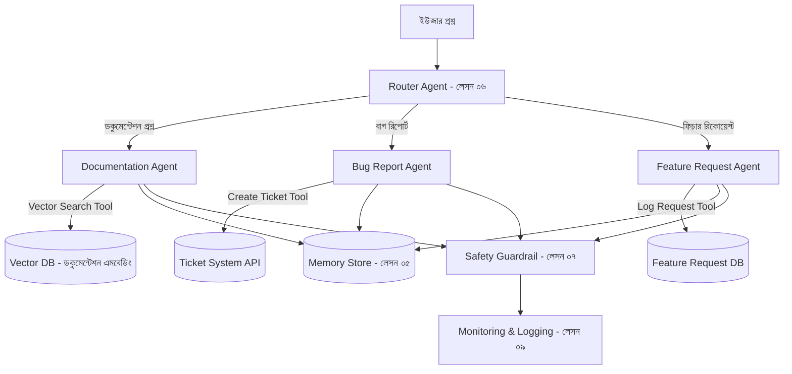

# ১০. Final Project: Building a Complex AI Agent

এই মডিউলের নয়টা লেসনে আমরা টুকরো টুকরো করে একটা AI এজেন্ট সিস্টেমের প্রতিটা উপাদান শিখেছি — বেসিক আর্কিটেকচার (লেসন ০১-০২), LangChain দিয়ে টুল-ব্যবহারকারী এজেন্ট (লেসন ০৩), টাস্ক-স্পেসিফিক ডিজাইন (লেসন ০৪), মেমোরি (লেসন ০৫), মাল্টি-এজেন্ট রাউটিং (লেসন ০৬), সেফটি (লেসন ০৭), ডেপ্লয়মেন্ট (লেসন ০৮), আর মনিটরিং (লেসন ০৯)। এই শেষ লেসনে আমরা এই সবগুলো টুকরো একসাথে জুড়ে একটা সম্পূর্ণ প্রজেক্টের নকশা করবো — যেভাবে পরে Module 48-এর ফাইনাল প্রজেক্টেও আমরা এতদিনের শেখা সবকিছু একসাথে জুড়বো।

## প্রজেক্ট: DocuBot — একটা ডকুমেন্টেশন সহায়ক এজেন্ট

কল্পনা করো একটা কোম্পানির জন্য একটা এজেন্ট বানাতে হবে, যেটা তাদের প্রোডাক্ট ডকুমেন্টেশন থেকে প্রশ্নের উত্তর দেবে, কিন্তু প্রয়োজনে টিকিট তৈরি করবে বা অন্য টিমকে জানাবে।

**মূল রিকোয়ারমেন্ট:**

- **Router Agent**: ইউজারের প্রশ্ন বিশ্লেষণ করে ঠিক করবে কোন বিশেষায়িত এজেন্টের কাছে পাঠাতে হবে (লেসন ০৬-এর প্যাটার্ন)
- **Documentation Agent**: একটা ভেক্টর ডাটাবেজে (যেমন Pinecone বা pgvector) ডকুমেন্টেশন সার্চ করে প্রাসঙ্গিক তথ্য বের করে উত্তর দেবে (এটাকে বলে RAG — Retrieval Augmented Generation)
- **Bug/Feature Agent**: টাস্ক-স্পেসিফিক ডিজাইনে (লেসন ০৪) সীমিত টুল দিয়ে টিকিট তৈরি করবে
- **Memory**: একই ইউজারের আগের প্রশ্ন মনে রেখে পুনরাবৃত্তি এড়াবে (লেসন ০৫)
- **Safety**: বড় বা সংবেদনশীল অ্যাকশন (যেমন সরাসরি প্রোডাকশন ডেটা মুছে ফেলার অনুরোধ) মানুষের অনুমোদন ছাড়া হবে না (লেসন ০৭)
- **Monitoring**: প্রতিটা ইন্টারঅ্যাকশন লগ হবে, escalation rate ট্র্যাক হবে (লেসন ০৯)

## মাইলস্টোন

1. **ধাপ ১ — RAG ফাউন্ডেশন**: ডকুমেন্টেশন টেক্সটকে এমবেডিং-এ রূপান্তর করে ভেক্টর ডাটাবেজে রাখা, একটা সাধারণ সার্চ-ভিত্তিক Documentation Agent বানানো
2. **ধাপ ২ — Router যোগ করা**: বাগ রিপোর্ট আর ফিচার রিকোয়েস্ট আলাদা করার জন্য একটা Router Agent বসানো
3. **ধাপ ৩ — মেমোরি ও সেফটি**: কথোপকথন ইতিহাস সংরক্ষণ, ইনপুট/আউটপুট গার্ডরেল যোগ করা
4. **ধাপ ৪ — ডেপ্লয়মেন্ট ও মনিটরিং**: Express API-তে র‍্যাপ করে ডেপ্লয় করা (লেসন ০৮), লগিং ও এনালিটিক্স ড্যাশবোর্ড বসানো (লেসন ০৯)

এই প্রজেক্টটা শেষ করার পর তুমি প্রমাণ করবে যে একটা মাল্টি-এজেন্ট, নিরাপদ, মনিটরড AI সিস্টেম ডিজাইন থেকে প্রোডাকশন পর্যন্ত নিয়ে যাওয়ার সক্ষমতা তোমার আছে — যা আজকের সফটওয়্যার ইন্ডাস্ট্রিতে দ্রুততম বর্ধনশীল দক্ষতাগুলোর একটা।

এতদিন আমরা টেকনিক্যাল দক্ষতার দিকে মনোযোগ দিয়েছি — কীভাবে বানাতে হয়। কিন্তু পরের Module 43-এ আমরা দেখবো, প্রযুক্তিগতভাবে দক্ষ একটা প্রোডাক্টও ব্যর্থ হতে পারে যদি বাজারে এর কোনো প্রয়োজন না থাকে। এরপর আমরা ফিরে যাবো ব্যবসায়িক চিন্তায় — কীভাবে একজন সোলো ডেভেলপার, কম বাজেটে, নিজের বানানো প্রোডাক্টের জন্য বাস্তব গ্রাহক খুঁজে পায়।
