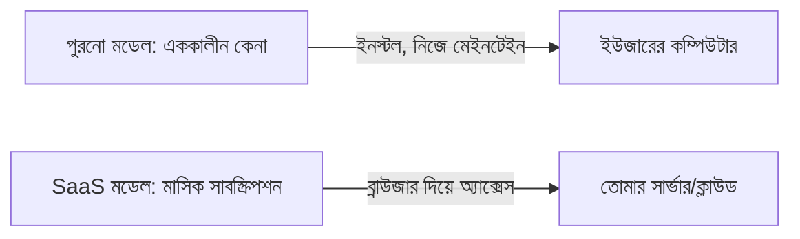

# ০১. Introduction to SaaS Business Models

এতদিন আমরা যা শিখেছি — Node.js, Express, ডাটাবেজ, অথেন্টিকেশন, আর্কিটেকচার প্যাটার্ন (Module 40) — সবই একটা প্রশ্নের উত্তর দিচ্ছিল: "কীভাবে বানাবো?" এখন থেকে কয়েকটা মডিউলে আমরা অন্য একটা প্রশ্নে ঢুকবো: "কী বানাবো, আর কেন কেউ সেটার জন্য টাকা দেবে?" কোড লেখা আর প্রোডাক্ট বানানো এক জিনিস না — একজন দক্ষ ডেভেলপার যদি ব্যবসার যুক্তি না বোঝে, সে দারুণ একটা সফটওয়্যার বানাতে পারে যেটা কেউ কিনবে না।

SaaS মানে **Software as a Service** — সফটওয়্যারকে প্রোডাক্টের মতো একবার বিক্রি না করে, একটা চলমান সেবার মতো মাসে মাসে ভাড়া দেয়া। ধরো তুমি একটা ইনভয়েসিং টুল বানালে। পুরনো মডেলে ইউজার একবার কিনবে, CD/ডাউনলোড পাবে, নিজের কম্পিউটারে ইনস্টল করবে। SaaS মডেলে সেই একই টুল ব্রাউজারে চলবে, তোমার সার্ভারে হোস্টেড থাকবে, আর ইউজার প্রতি মাসে একটা সাবস্ক্রিপশন ফি দেবে — যতদিন ব্যবহার করবে ততদিন দেবে, বন্ধ করলে বন্ধ।

এই মডেলটা এত জনপ্রিয় হওয়ার পেছনে তিনটা বাস্তব কারণ আছে। প্রথমত, **প্রেডিক্টেবল রেভিনিউ** — প্রতি মাসে কত টাকা আসবে সেটা আগে থেকে অনুমান করা যায়, কারণ গ্রাহক একবার সাইন-আপ করলে সাধারণত মাসের পর মাস থেকে যায় (একে বলে recurring revenue)। দ্বিতীয়ত, **আপডেট সহজ** — তোমার সার্ভারে একবার কোড আপডেট করলেই সব ইউজার নতুন ভার্সন পেয়ে যায়, কারো কম্পিউটারে গিয়ে ইনস্টল করতে হয় না। তৃতীয়ত, **স্কেল করা সহজ** — একই কোডবেজ হাজার হাজার গ্রাহককে সার্ভ করতে পারে, প্রতিটা গ্রাহকের জন্য আলাদা কপি বানাতে হয় না।

তবে SaaS-এর একটা কঠিন বাস্তবতাও আছে — তোমাকে গ্রাহককে প্রতি মাসে নতুন করে "জেতা" লাগে। একবার বিক্রি করে ভুলে থাকা যায় না; গ্রাহক যদি মনে করে টাকার মূল্য পাচ্ছে না, সে পরের মাসেই সাবস্ক্রিপশন বন্ধ করে দিতে পারে (একে বলে **churn**, যেটা নিয়ে আমরা Module 43-এর পরের কয়েকটা লেসনে বিস্তারিত যাবো)। তাই SaaS ব্যবসা শুধু ভালো কোড লেখার খেলা না — এটা ক্রমাগত গ্রাহকের সমস্যা সমাধান করে যাওয়ার খেলা।

SaaS ব্যবসার কয়েকটা সাধারণ ধরন আছে — **B2B SaaS** (যেমন Slack, ব্যবসাকে সার্ভিস দেয়), **B2C SaaS** (যেমন Netflix, সাধারণ মানুষকে সার্ভিস দেয়), আর **Vertical SaaS** (একটা নির্দিষ্ট ইন্ডাস্ট্রির জন্য বানানো, যেমন শুধু ডাক্তারদের জন্য বা শুধু রেস্টুরেন্টের জন্য)। এই কোর্সের পরের মডিউলগুলোতে (Module 44, 45) আমরা যখন ইনডি হ্যাকিং নিয়ে কথা বলবো, দেখবে বেশিরভাগ সফল সোলো-ডেভেলপার প্রোডাক্টই আসলে ছোট আকারের B2B বা Vertical SaaS।

এখন প্রশ্ন হলো — এই মডেলটা বেছে নেয়ার আগে বাজারটা বোঝা দরকার। কে কিনবে, কারা প্রতিযোগী, বাজারে ফাঁকা জায়গা কোথায়। সেটাই আমাদের পরের লেসনের বিষয় — মার্কেট রিসার্চ আর কম্পিটিটিভ অ্যানালাইসিস।
