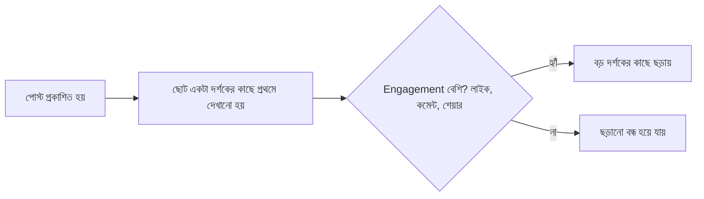

# ০৩. Social Media Growth Hacking

SEO আমাদের শেখালো একটা ধীর, দীর্ঘমেয়াদী চ্যানেল। এই লেসনে আমরা এর বিপরীত মেরুতে যাবো — সোশ্যাল মিডিয়া, যেখানে একটা ভালো পোস্ট রাতারাতি হাজার মানুষের কাছে পৌঁছাতে পারে। "Growth Hacking" শব্দটা শুনলে মনে হতে পারে এটা কোনো গোপন কৌশল বা শর্টকাট, কিন্তু বাস্তবে এটা মূলত পরীক্ষা-নিরীক্ষা (experimentation) আর প্ল্যাটফর্মের অ্যালগরিদম বোঝার সমন্বয়।

প্রতিটা সোশ্যাল মিডিয়া প্ল্যাটফর্মের নিজস্ব একটা "অ্যালগরিদম" আছে, যেটা ঠিক করে কোন কনটেন্ট বেশি মানুষের কাছে পৌঁছাবে। এই অ্যালগরিদমগুলো একটা সাধারণ নীতিতে কাজ করে — যে কনটেন্ট প্ল্যাটফর্মে বেশি মানুষকে বেশি সময় ধরে রাখে, সেটা বেশি ছড়ায়, কারণ এটা প্ল্যাটফর্মের নিজের স্বার্থে (বিজ্ঞাপন দেখানোর জন্য বেশি সময় দরকার)।

এই বোঝাপড়া থেকে একটা ব্যবহারিক শিক্ষা বের হয় — পোস্টের প্রথম কয়েক মিনিটের engagement সবচেয়ে গুরুত্বপূর্ণ। তাই একটা পোস্ট করার পর প্রথম কয়েক মিনিট নিজে সক্রিয়ভাবে কমেন্টের উত্তর দেয়া, প্রশ্ন করা, কথোপকথন চালু রাখা — এটা অ্যালগরিদমকে সংকেত দেয় যে পোস্টটা মূল্যবান।

কনটেন্ট ফরম্যাটের ক্ষেত্রে, প্রতিটা প্ল্যাটফর্মের নিজস্ব "ভাষা" আছে যেটা মেনে চলা জরুরি — LinkedIn-এ পেশাদার, বিস্তারিত গল্প ভালো কাজ করে; Twitter/X-এ সংক্ষিপ্ত, তীক্ষ্ণ থ্রেড; Instagram/TikTok-এ ভিজ্যুয়াল-নির্ভর। একজন ডেভেলপার-ফাউন্ডারের জন্য সবচেয়ে স্বাভাবিক ফিট সাধারণত Twitter/X আর LinkedIn, কারণ এখানে টেক্সট-ভিত্তিক টেকনিক্যাল কনটেন্ট ভালো কাজ করে (Twitter/X নিয়ে আমরা লেসন ০৮-এ আরো গভীরে যাবো)।

একটা কার্যকর গ্রোথ কৌশল হলো **"Give Value First, Ask Later"** — সরাসরি প্রোডাক্টের বিজ্ঞাপন দেয়ার বদলে, এমন কনটেন্ট শেয়ার করা যা নিজে থেকেই মূল্যবান, তারপর প্রাসঙ্গিক জায়গায় নিজের প্রোডাক্টের কথা উল্লেখ করা। উদাহরণ হিসেবে, "৫টা বাগ যা প্রতিটা নতুন Node.js ডেভেলপার করে" — এই ধরনের পোস্ট নিজে থেকেই useful, প্রোডাক্টের বিজ্ঞাপন না হয়েও ফাউন্ডারের দক্ষতা প্রমাণ করে।

| প্ল্যাটফর্ম | সেরা কনটেন্ট ফরম্যাট | কাদের জন্য |
|---|---|---|
| Twitter/X | সংক্ষিপ্ত থ্রেড, বিল্ড-ইন-পাবলিক আপডেট | ডেভেলপার/টেক কমিউনিটি |
| LinkedIn | পেশাদার গল্প, লম্বা পোস্ট | B2B, প্রফেশনাল নেটওয়ার্ক |
| Reddit/Facebook Groups | নির্দিষ্ট কমিউনিটিতে সরাসরি সাহায্য | Niche persona (Module 45, লেসন ০৫-এ বিস্তারিত) |

সোশ্যাল মিডিয়া গ্রোথের একটা গুরুত্বপূর্ণ ঝুঁকি আছে — একে ভ্যানিটি মেট্রিক্সের (লাইক, ফলোয়ার সংখ্যা) পেছনে দৌড়ানোর ফাঁদ হিসেবে দেখা সহজ, যেখানে আসল লক্ষ্য (গ্রাহক আর রেভিনিউ) হারিয়ে যায়। Module 45-এর শেষ লেসনে আমরা দেখবো কীভাবে সঠিক মেট্রিক্স ট্র্যাক করতে হয়, যাতে সোশ্যাল মিডিয়া প্রচেষ্টা আসলেই ব্যবসায়িক ফলাফলে রূপান্তরিত হচ্ছে কিনা তা বোঝা যায়।

সোশ্যাল মিডিয়ায় ফলোয়ার পাওয়া একটা জিনিস, কিন্তু সেই ফলোয়ারদের একটা এমন মাধ্যমে ধরে রাখা যেটা কোনো প্ল্যাটফর্মের অ্যালগরিদমের উপর নির্ভরশীল না — সেটাই সবচেয়ে মূল্যবান সম্পদ। পরের লেসনে আমরা দেখবো কীভাবে শূন্য থেকে একটা ইমেইল লিস্ট তৈরি করা যায়, যেটা তোমার নিজের, কোনো প্ল্যাটফর্মের দয়ার উপর নির্ভর করে না।
