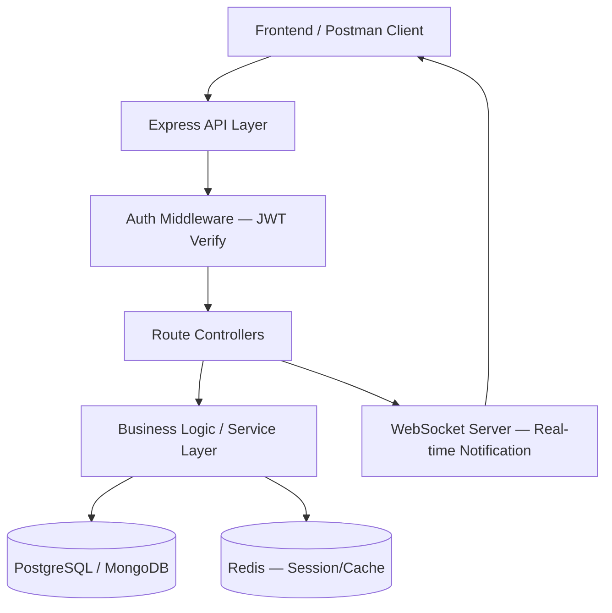

# ০১. Capstone Project Brief — একটা পূর্ণাঙ্গ ব্যাকএন্ড সিস্টেম বানানো

এতদূর পর্যন্ত আমরা টুকরো টুকরো করে অনেক কিছু শিখেছি — Node.js আর Express দিয়ে সার্ভার বানানো (Module 4-5), কুকি-সেশন আর JWT দিয়ে অথেন্টিকেশন (Module 11-12), TypeScript দিয়ে টাইপ-সেফ কোড (Module 13-14), ডাটাবেজ, আর্কিটেকচার প্যাটার্ন (Module 40) — প্রতিটা লেসন একটা নির্দিষ্ট ইট গেঁথেছে। কিন্তু বাস্তব জীবনে কেউ তোমাকে "এই একটা ইট বসাও" বলে কাজ দেবে না — তারা বলবে "একটা বাড়ি বানাও।" এই মডিউলে আমরা ঠিক সেটাই করবো — সব ইট একসাথে জোড়া দিয়ে একটা সম্পূর্ণ, প্রোডাকশন-মানের ব্যাকএন্ড সিস্টেম বানানো।

এই লেসনটা একটা সাধারণ লেসনের মতো না — এটা একটা **ওপেন প্রজেক্ট ব্রিফ**। মানে এখানে ধাপে ধাপে কোড দেয়া নেই, বরং একটা বাস্তব প্রজেক্টের রিকোয়ারমেন্ট আর দিকনির্দেশনা দেয়া আছে, যেটা তুমি নিজে হাতে-কলমে বানাবে — ঠিক যেভাবে একজন জুনিয়র ডেভেলপার তার প্রথম রিয়েল প্রজেক্ট পায়।

## প্রজেক্ট: TaskFlow — একটা টিম-বেজড টাস্ক ম্যানেজমেন্ট API

কল্পনা করো তুমি একটা স্টার্টআপে জয়েন করেছো, আর তোমাকে বলা হয়েছে একটা Trello-স্টাইল টাস্ক ম্যানেজমেন্ট সিস্টেমের ব্যাকএন্ড বানাতে, যেটা একাধিক টিম, একাধিক প্রজেক্ট, আর রিয়েল-টাইম নোটিফিকেশন সাপোর্ট করবে।

**মূল রিকোয়ারমেন্ট:**

- **User System**: রেজিস্ট্রেশন, লগইন, JWT-বেজড অথেন্টিকেশন (Module 12), পাসওয়ার্ড হ্যাশিং (bcrypt)
- **Workspace ও Team**: একজন ইউজার একাধিক ওয়ার্কস্পেসে থাকতে পারবে, প্রতিটা ওয়ার্কস্পেসে রোল-বেজড পারমিশন (Admin/Member/Viewer) থাকবে
- **Project ও Task**: প্রতিটা ওয়ার্কস্পেসের নিচে প্রজেক্ট, প্রতিটা প্রজেক্টের নিচে টাস্ক (স্ট্যাটাস: Todo/In Progress/Done, ডেডলাইন, অ্যাসাইনি)
- **Real-time Update**: কেউ টাস্ক আপডেট করলে টিমের অন্যরা রিয়েল-টাইমে নোটিফিকেশন পাবে (WebSocket দিয়ে)
- **Database**: PostgreSQL বা MongoDB — ORM/ODM ব্যবহার করে (Prisma বা Mongoose)
- **Testing**: অন্তত মূল এন্ডপয়েন্টগুলোর জন্য ইউনিট ও ইন্টিগ্রেশন টেস্ট
- **Deployment**: Docker কন্টেইনারে প্যাকেজ করে একটা ক্লাউড প্ল্যাটফর্মে ডেপ্লয় করা

## প্রস্তাবিত আর্কিটেকচার

এই স্তরবিন্যাসটা লক্ষ্য করো — এটা ঠিক Module 40-এ শেখা লেয়ার্ড আর্কিটেকচারের প্র্যাকটিক্যাল প্রয়োগ। Controller শুধু রিকোয়েস্ট গ্রহণ করে, Service লেয়ার আসল যুক্তি চালায়, আর ডাটাবেজ লেয়ার আলাদা থাকে — যাতে কাল যদি PostgreSQL থেকে MongoDB-তে যেতেও হয়, Controller-এর কোড না বদলাতে হয়।

## মাইলস্টোন (ধাপে ধাপে বানানোর পরিকল্পনা)

1. **সপ্তাহ ১ — ফাউন্ডেশন**: Express প্রজেক্ট সেটআপ, ডাটাবেজ কানেকশন, User মডেল, রেজিস্ট্রেশন/লগইন API, JWT মিডলওয়্যার।
2. **সপ্তাহ ২ — কোর ফিচার**: Workspace, Team, Project, Task মডেল আর CRUD API। রোল-বেজড অ্যাক্সেস কন্ট্রোল যোগ করা।
3. **সপ্তাহ ৩ — রিয়েল-টাইম ও পলিশ**: WebSocket দিয়ে নোটিফিকেশন, ইনপুট ভ্যালিডেশন, এরর হ্যান্ডলিং মিডলওয়্যার, রেট লিমিটিং।
4. **সপ্তাহ ৪ — টেস্টিং ও ডেপ্লয়মেন্ট**: Jest/Mocha দিয়ে টেস্ট লেখা, Dockerfile বানানো, CI/CD পাইপলাইন সেটআপ (GitHub Actions), একটা ক্লাউড সার্ভারে লাইভ ডেপ্লয়।

প্রতিটা মাইলস্টোন শেষে নিজেকে প্রশ্ন করো — "এই অংশটা যদি হাজার ইউজার একসাথে ব্যবহার করে, তাহলে কী ভেঙে পড়বে?" এই প্রশ্নটাই তোমাকে জুনিয়র থেকে সিনিয়র চিন্তার দিকে নিয়ে যায়।

এই প্রজেক্টটা শেষ করার পর তুমি প্রমাণ করবে যে আধুনিক Node.js ব্যাকএন্ড ইকোসিস্টেমের মূল স্তম্ভগুলো — অথেন্টিকেশন, ডাটাবেজ ডিজাইন, রিয়েল-টাইম কমিউনিকেশন, টেস্টিং, ডেপ্লয়মেন্ট — সবই তোমার হাতে আছে। এরপর আমরা ঢুকবো সম্পূর্ণ ভিন্ন একটা জগতে — নিজের ব্যবসা হিসেবে একটা SaaS প্রোডাক্ট বানানোর চিন্তা, যেখানে কোড লেখার পাশাপাশি ব্যবসার যুক্তিও সমান গুরুত্বপূর্ণ হয়ে উঠবে।
